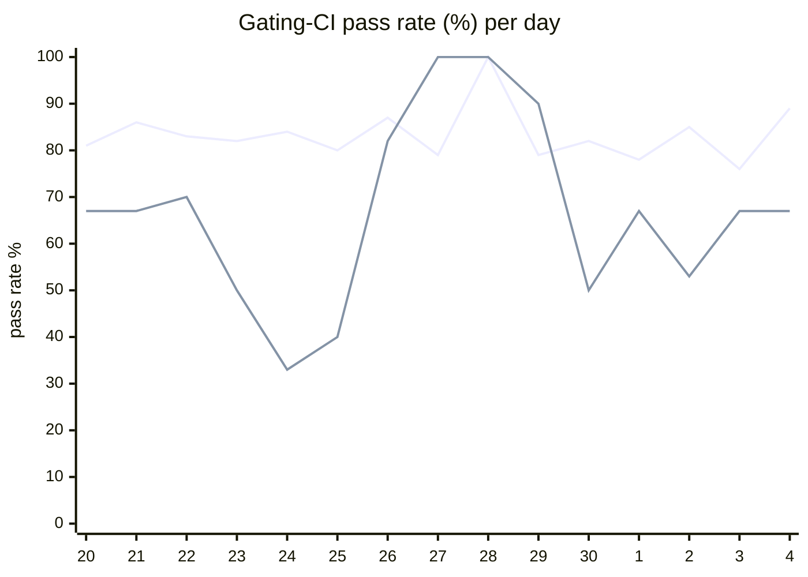

# CI Health Dashboard

_Window: last 14 days (trend + pass rate) · tables: last 24h · updated 2026-07-04T07:05:13Z · auto-generated, do not edit by hand._

**Gating-CI pass rate** — PR: 82% (1569/1915) · main: 63% (64/102)

## Gating-CI pass-rate trend

_X-axis = day of month (Jun 20 → Jul 04). Two lines: **CI** (PR gating-CI runs, generally the upper line) and **main** (post-merge main runs, lower). Y-axis = % of that day's gating-CI runs that passed._

## Top 10 failing jobs (last 24h)

| # | job | workflow | fails | recovered | runs | fail rate | flaky? | scope | cause |
| --- | --- | --- | --- | --- | --- | --- | --- | --- | --- |
| 1 | `lint` | frontend / docs | 7 | 0 | 9 | 78% | flaky | PR | **infra/CI** — Docs lint: prettier --list-different found unformatted MDX on PR |
| 2 | `generate` | test | 7 | 0 | 18 | 39% | flaky | PR | **infra/CI** — Generate job: committed docs/codegen output drift on git diff check |
| 3 | `authdisabled` | build | 6 | 0 | 19 | 32% | flaky | PR | **product bug** — Auth-disabled API docker build: go build exits 1 on local-no-auth PR branches |
| 4 | `cypress` | frontend / app | 4 | 0 | 17 | 24% | flaky | PR | **flaky test** — Cypress tenant-invite-decline: Decline dialog button not found within 15s |
| 5 | `test-templates` | cli-e2e-tests | 2 | 0 | 6 | 33% | flaky | PR | **timeout** — CLI quickstart templates: parent test killed after ~5min template E2E wait |
| 6 | `rampup` | test | 2 | 0 | 18 | 11% | flaky | main + PR | **infra/CI** — Install Task step: GitHub API request timeout fetching go-task/task refs |
| 7 | `old-engine-new-sdk` | ruby | 1 | 0 | 10 | 10% | flaky | PR | **infra/CI** — Ruby old-engine-new-sdk: docker pull manifest unknown for release hatchet images |
| 8 | `old-engine-new-sdk` | python | 1 | 0 | 11 | 9% | flaky | PR | **infra/CI** — Python old-engine-new-sdk: docker pull manifest unknown for release hatchet images |
| 9 | `old-engine-new-sdk` | typescript | 1 | 0 | 11 | 9% | flaky | PR | **infra/CI** — TypeScript old-engine-new-sdk: docker pull manifest unknown for release hatchet images |
| 10 | `unit` | test | 1 | 0 | 18 | 6% | flaky | PR | **flaky test** — TestMsgIdBufferMemoryLeak: mq sub-buffer send timeouts under race detector |

## Top 10 failing tests (last 24h)

| # | test | job | fails | runs | fail rate | flaky? | scope | cause |
| --- | --- | --- | --- | --- | --- | --- | --- | --- |
| 1 | `(unparsed)` | `lint` | 7 | 9 | 78% | flaky | PR | **infra/CI** — Docs lint: prettier --list-different found unformatted MDX on PR |
| 2 | `(unparsed)` | `generate` | 7 | 18 | 39% | flaky | PR | **infra/CI** — Generate job: committed docs/codegen output drift on git diff check |
| 3 | `(unparsed)` | `authdisabled` | 6 | 19 | 32% | flaky | PR | **product bug** — Auth-disabled API docker build: go build exits 1 on local-no-auth PR branches |
| 4 | `(unparsed)` | `cypress` | 4 | 17 | 24% | flaky | PR | **flaky test** — Cypress tenant-invite-decline: Decline dialog button not found within 15s |
| 5 | `TestQuickstartTemplates` | `test-templates` | 2 | 6 | 33% | flaky | PR | **timeout** — CLI quickstart templates: parent test killed after ~5min template E2E wait |
| 6 | `TestQuickstartTemplates/go_go` | `test-templates` | 2 | 6 | 33% | flaky | PR | **timeout** — CLI quickstart go_go template: subtest exceeded ~300s workflow trigger wait |
| 7 | `(unparsed)` | `old-engine-new-sdk` | 1 | 10 | 10% | flaky | PR | **infra/CI** — Ruby old-engine-new-sdk: docker pull manifest unknown for release hatchet images |
| 8 | `(unparsed)` | `old-engine-new-sdk` | 1 | 11 | 9% | flaky | PR | **infra/CI** — Python old-engine-new-sdk: docker pull manifest unknown for release hatchet images |
| 9 | `(unparsed)` | `old-engine-new-sdk` | 1 | 11 | 9% | flaky | PR | **infra/CI** — TypeScript old-engine-new-sdk: docker pull manifest unknown for release hatchet images |
| 10 | `(unparsed)` | `rampup` | 1 | 18 | 6% | flaky | main | **infra/CI** — Install Task step: GitHub API request timeout fetching go-task/task refs |

## Recent CI-health wins (`ci-health`)

**Recently merged**

- https://github.com/hatchet-dev/hatchet/pull/4239
- https://github.com/hatchet-dev/hatchet/pull/4238
- https://github.com/hatchet-dev/hatchet/pull/4218
- https://github.com/hatchet-dev/hatchet/pull/4213
- https://github.com/hatchet-dev/hatchet/pull/4165

**Open**

_No open `ci-health` PRs yet._

---
_Trend and pass-rate totals cover the last 14 days; job/test tables cover the last 24h._ **fails** = gating runs where the job/test failed · **recovered** = failed on a first attempt but passed on re-run (a flakiness signal) · **runs** = total gating runs of that workflow · **fail rate** = fails ÷ runs · **flaky** = recovered on re-run or intermittent across runs; **deterministic** = fails every time it runs · **scope** = whether failures were seen on PR, main, or main + PR.
