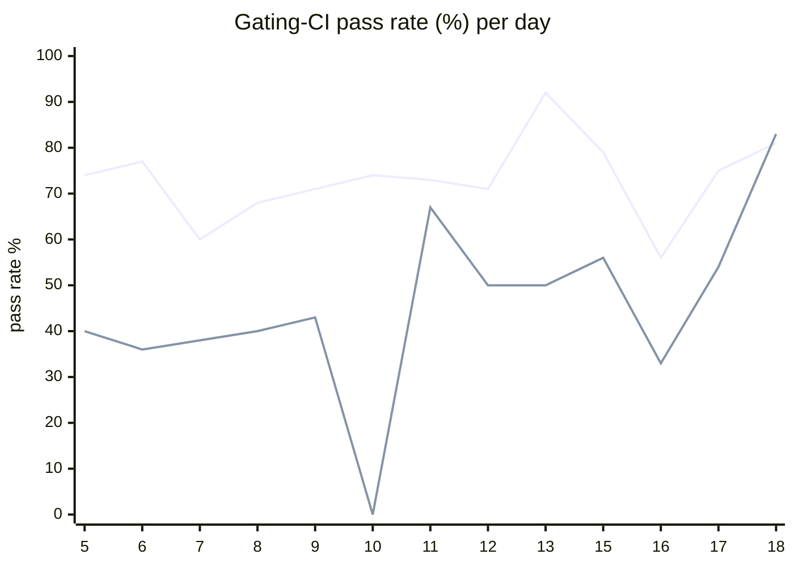

# CI Health Dashboard

_Window: last 14 days (trend + pass rate) · tables: last 24h · updated 2026-06-19T07:08:50Z · auto-generated, do not edit by hand._

**Gating-CI pass rate** — PR: 73% (1229/1691) · main: 48% (73/151)

## Gating-CI pass-rate trend

_X-axis = day of month (Jun 05 → Jun 18). Two lines: **CI** (PR gating-CI runs, generally the upper line) and **main** (post-merge main runs, lower). Y-axis = % of that day's gating-CI runs that passed._

## Top 10 failing jobs (last 24h)

| # | job | workflow | fails | recovered | runs | fail rate | flaky? | scope | cause |
| --- | --- | --- | --- | --- | --- | --- | --- | --- | --- |
| 1 | `old-engine-new-sdk` | typescript | 2 | 0 | 6 | 33% | flaky | PR | **flaky test** — durable e2e child run still QUEUED when test expects FAILED status |
| 2 | `old-engine-new-sdk` | python | 2 | 0 | 11 | 18% | flaky | PR | **flaky test** — same bulk_replay retry exhaustion in old-engine-new-sdk matrix job |
| 3 | `generate` | test | 2 | 0 | 11 | 18% | flaky | PR | **infra/CI** — generate Check for diff step failed (codegen drift); sample line is unchanged file noise |
| 4 | `old-engine-new-sdk` | ruby | 1 | 0 | 3 | 33% | flaky | PR | **unknown** — git fetch branch line noise; actual Pull release images failure not captured |
| 5 | `lint` | frontend / app | 1 | 0 | 5 | 20% | flaky | PR | **infra/CI** — prettier/prettier lint gate failed on unformatted frontend code |
| 6 | `cypress` | frontend / app | 1 | 0 | 5 | 20% | flaky | PR | **unknown** — set -x env trace noise; Cypress failure not captured in sample |
| 7 | `api` | build | 1 | 0 | 9 | 11% | flaky | PR | **unknown** — docker apk install log noise; build failure not captured in sample |

## Top 10 failing tests (last 24h)

| # | test | job | fails | runs | fail rate | flaky? | scope | cause |
| --- | --- | --- | --- | --- | --- | --- | --- | --- |
| 1 | `(unparsed)` | `generate` | 2 | 11 | 18% | flaky | PR | **infra/CI** — generate Check for diff step failed (codegen drift); sample line is unchanged file noise |
| 2 | `examples/bulk_operations/test_bulk_replay.py::test_bulk_replay` | `test` | 2 | 11 | 18% | flaky | main + PR | **flaky test** — test_bulk_replay exhausts tenacity retries waiting for replay completion |
| 3 | `(unparsed)` | `old-engine-new-sdk` | 1 | 3 | 33% | flaky | PR | **unknown** — git fetch branch line noise; actual Pull release images failure not captured |
| 4 | `(unparsed)` | `lint` | 1 | 5 | 20% | flaky | PR | **infra/CI** — prettier/prettier lint gate failed on unformatted frontend code |
| 5 | `(unparsed)` | `cypress` | 1 | 5 | 20% | flaky | PR | **unknown** — set -x env trace noise; Cypress failure not captured in sample |
| 6 | `durable-e2e › durable parent catches error from failed child run` | `old-engine-new-sdk` | 1 | 6 | 17% | flaky | PR | **flaky test** — durable e2e child run still QUEUED when test expects FAILED status |
| 7 | `(unparsed)` | `old-engine-new-sdk` | 1 | 6 | 17% | flaky | PR | **unknown** — git fetch branch line noise; actual Pull release images failure not captured |
| 8 | `(unparsed)` | `api` | 1 | 9 | 11% | flaky | PR | **unknown** — docker apk install log noise; build failure not captured in sample |
| 9 | `TestDurableEventsListenerDeliversEventAfterReconnectDuringRetryBackoff` | `load-deadlock` | 1 | 11 | 9% | flaky | PR | **flaky test** — durable events listener reconnect test fails under deadlock instrumentation timing |
| 10 | `examples/bulk_operations/test_bulk_replay.py::test_bulk_replay` | `old-engine-new-sdk` | 1 | 11 | 9% | flaky | PR | **flaky test** — same bulk_replay retry exhaustion in old-engine-new-sdk matrix job |

## Recent CI-health wins (`ci-health`)

**Recently merged**

- https://github.com/hatchet-dev/hatchet/pull/4218
- https://github.com/hatchet-dev/hatchet/pull/4213
- https://github.com/hatchet-dev/hatchet/pull/4165
- https://github.com/hatchet-dev/hatchet/pull/4159
- https://github.com/hatchet-dev/hatchet/pull/4156

**Open**

- https://github.com/hatchet-dev/hatchet/pull/4212

---
_Trend and pass-rate totals cover the last 14 days; job/test tables cover the last 24h._ **fails** = gating runs where the job/test failed · **recovered** = failed on a first attempt but passed on re-run (a flakiness signal) · **runs** = total gating runs of that workflow · **fail rate** = fails ÷ runs · **flaky** = recovered on re-run or intermittent across runs; **deterministic** = fails every time it runs · **scope** = whether failures were seen on PR, main, or main + PR.
