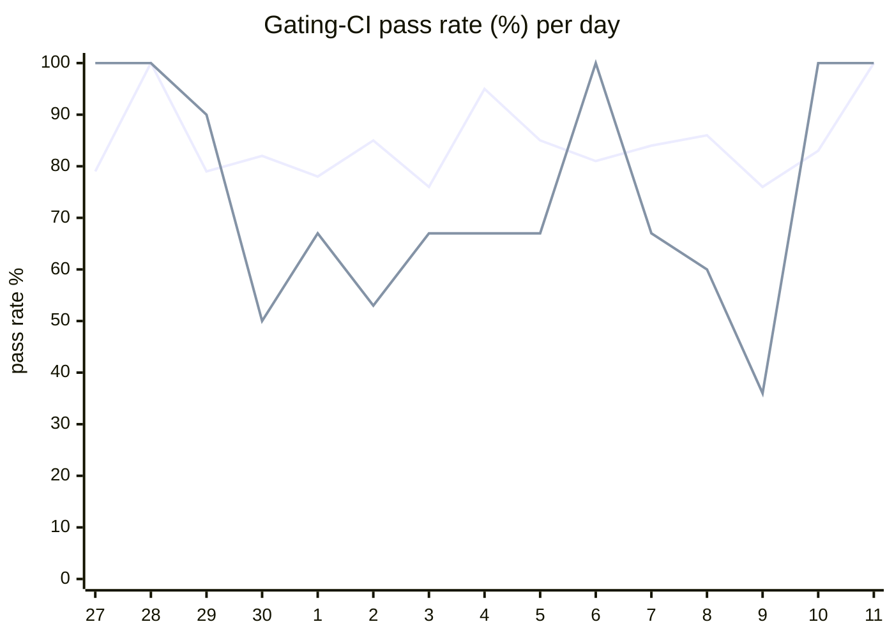

# CI Health Dashboard

_Window: last 14 days (trend + pass rate) · tables: last 24h · updated 2026-07-11T07:06:58Z · auto-generated, do not edit by hand._

**Gating-CI pass rate** — PR: 82% (1907/2329) · main: 64% (73/114)

## Gating-CI pass-rate trend

_X-axis = day of month (Jun 27 → Jul 11). Two lines: **CI** (PR gating-CI runs, generally the upper line) and **main** (post-merge main runs, lower). Y-axis = % of that day's gating-CI runs that passed._

## Top 10 failing jobs (last 24h)

| # | job | workflow | fails | recovered | runs | fail rate | flaky? | scope | cause |
| --- | --- | --- | --- | --- | --- | --- | --- | --- | --- |
| 1 | `e2e-pgmq` | test | 9 | 0 | 44 | 20% | flaky | PR | **infra/CI** — Hatchet engine/API readiness timeout in e2e-pgmq job |
| 2 | `test-templates` | cli-e2e-tests | 8 | 0 | 15 | 53% | flaky | PR | **timeout** — CLI quickstart template E2E suite exceeded ~540s budget |
| 3 | `e2e` | test | 8 | 0 | 44 | 18% | flaky | PR | **infra/CI** — Hatchet engine/API readiness timeout in e2e job |
| 4 | `unit` | test | 8 | 0 | 44 | 18% | flaky | PR | **product bug** — RBAC spec drift: V1HttpOperator* in rbac.yaml missing from OpenAPI specs |
| 5 | `integration` | test | 7 | 0 | 44 | 16% | flaky | PR | **product bug** — RBAC spec drift: V1HttpOperator* in rbac.yaml missing from OpenAPI specs |
| 6 | `generate` | test | 6 | 0 | 44 | 14% | flaky | PR | **infra/CI** — generate job check-for-diff: openapi.gen.go and python example codegen drift |
| 7 | `cypress` | frontend / app | 5 | 0 | 20 | 25% | flaky | PR | **product bug** — Cypress AxiosError from broken org-invite API on durable-tasks-as-operator PR |
| 8 | `rampup` | test | 5 | 0 | 44 | 11% | flaky | PR | **product bug** — RBAC spec drift: V1HttpOperator* in rbac.yaml missing from OpenAPI specs |
| 9 | `lite-arm` | build | 4 | 0 | 40 | 10% | flaky | PR | **product bug** — lite-arm/docker build fails on frontend TS errors from org-invites API changes |
| 10 | `load` | test | 4 | 0 | 44 | 9% | flaky | PR | **product bug** — RBAC spec drift: V1HttpOperator* in rbac.yaml missing from OpenAPI specs |

## Top 10 failing tests (last 24h)

| # | test | job | fails | runs | fail rate | flaky? | scope | cause |
| --- | --- | --- | --- | --- | --- | --- | --- | --- |
| 1 | `TestQuickstartTemplates` | `test-templates` | 8 | 15 | 53% | flaky | PR | **timeout** — CLI quickstart template E2E suite exceeded ~540s budget |
| 2 | `TestQuickstartTemplates/go_go` | `test-templates` | 7 | 15 | 47% | flaky | PR | **timeout** — CLI quickstart go_go template E2E exceeded ~320s budget |
| 3 | `(unparsed)` | `lite-arm` | 4 | 40 | 10% | flaky | PR | **product bug** — lite-arm/docker build fails on frontend TS errors from org-invites API changes |
| 4 | `(unparsed)` | `build` | 3 | 20 | 15% | flaky | PR | **product bug** — Frontend TS2345 type mismatch in new-organization-saver-form on org-invites PR |
| 5 | `examples/conditions/test_conditions.py::test_waits` | `test` | 3 | 37 | 8% | flaky | PR | **flaky test** — test_waits non-deterministic random_number vs skipped assertion |
| 6 | `examples/bug_tests/durable_child_key_duplicate_child/test_durable_child_key_duped_child.py::test_durable_child_key_duplicate_bug_all_duped` | `test` | 3 | 37 | 8% | flaky | PR | **infra/CI** — RestConnectionError — engine/API not reachable during durable child-key tests |
| 7 | `examples/bug_tests/durable_child_key_duplicate_child/test_durable_child_key_duped_child.py::test_durable_child_key_duplicate_bug_second_unique` | `test` | 3 | 37 | 8% | flaky | PR | **infra/CI** — RestConnectionError — engine/API not reachable during durable child-key tests |
| 8 | `examples/bug_tests/durable_child_key_duplicate_child/test_durable_child_key_duped_child.py::test_durable_child_key_duplicate_bug_third_unique` | `test` | 3 | 37 | 8% | flaky | PR | **infra/CI** — RestConnectionError — engine/API not reachable during durable child-key tests |
| 9 | `examples/bug_tests/durable_spawn_index_collision/test_durable_spawn_index_collision.py::test_spawn_index_collision_fails_loudly` | `test` | 3 | 37 | 8% | flaky | PR | **infra/CI** — RestConnectionError — engine/API not reachable during spawn-index collision test |
| 10 | `examples/durable/test_durable.py::test_durable_workflow` | `test` | 3 | 37 | 8% | flaky | PR | **infra/CI** — RestConnectionError — engine/API not reachable during python durable tests |

## Recent CI-health wins (`ci-health`)

**Recently merged**

- https://github.com/hatchet-dev/hatchet/pull/4239
- https://github.com/hatchet-dev/hatchet/pull/4238
- https://github.com/hatchet-dev/hatchet/pull/4218
- https://github.com/hatchet-dev/hatchet/pull/4213
- https://github.com/hatchet-dev/hatchet/pull/4165

**Open**

_No open `ci-health` PRs yet._

---
_Trend and pass-rate totals cover the last 14 days; job/test tables cover the last 24h._ **fails** = gating runs where the job/test failed · **recovered** = failed on a first attempt but passed on re-run (a flakiness signal) · **runs** = total gating runs of that workflow · **fail rate** = fails ÷ runs · **flaky** = recovered on re-run or intermittent across runs; **deterministic** = fails every time it runs · **scope** = whether failures were seen on PR, main, or main + PR.
