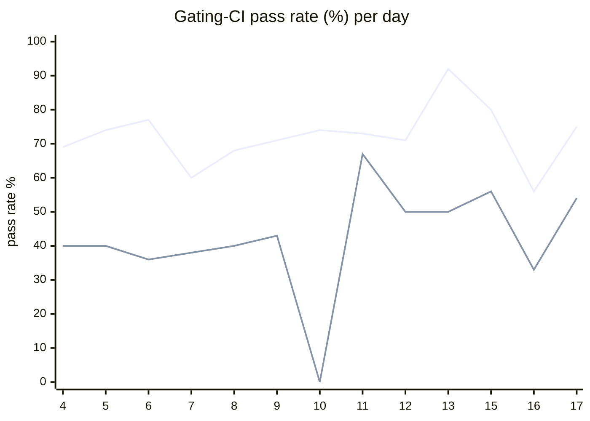

# CI Health Dashboard

_Window: last 14 days (trend + pass rate) · tables: last 24h · updated 2026-06-18T07:07:13Z · auto-generated, do not edit by hand._

**Gating-CI pass rate** — PR: 72% (1261/1744) · main: 46% (72/155)

## Gating-CI pass-rate trend

_X-axis = day of month (Jun 04 → Jun 17). Two lines: **CI** (PR gating-CI runs, generally the upper line) and **main** (post-merge main runs, lower). Y-axis = % of that day's gating-CI runs that passed._

## Top 10 failing jobs (last 24h)

| # | job | workflow | fails | recovered | runs | fail rate | flaky? | scope | cause |
| --- | --- | --- | --- | --- | --- | --- | --- | --- | --- |
| 1 | `cypress` | frontend / app | 8 | 0 | 16 | 50% | flaky | PR | **unknown** — Cypress job failed but log parser only captured engine env setup noise |
| 2 | `test` | python | 5 | 0 | 16 | 31% | flaky | PR | **infra/CI** — Python SDK worker did not become ready within the 25s CI startup budget |
| 3 | `integration` | test | 5 | 0 | 19 | 26% | flaky | main + PR | **infra/CI** — TestMessageQueueIntegration fails immediately; MQ/service not ready in CI |
| 4 | `old-engine-new-sdk` | typescript | 4 | 0 | 16 | 25% | flaky | PR | **product bug** — TypeScript durable e2e: child run status not FAILED as expected |
| 5 | `e2e` | test | 4 | 0 | 19 | 21% | flaky | main + PR | **infra/CI** — e2e job timed out waiting for Hatchet engine/API readiness |
| 6 | `load-pgbouncer` | test | 4 | 0 | 19 | 21% | flaky | main + PR | **timeout** — TestLoadCLI parent fails when DAG subtest exceeds its time budget |
| 7 | `unit` | test | 3 | 0 | 19 | 16% | flaky | main + PR | **flaky test** — OLAP status-update replay test intermittently errors on mq_path subtest |
| 8 | `test` | ruby | 2 | 0 | 4 | 50% | flaky | PR | **infra/CI** — Ruby events integration specs fail when Hatchet API is unreachable in CI |
| 9 | `lint` | frontend / docs | 2 | 0 | 14 | 14% | flaky | PR | **unknown** — frontend/docs lint failed with generic exit code; no actionable lint output in sample |
| 10 | `lint` | lint all | 2 | 0 | 23 | 9% | flaky | PR | **infra/CI** — pre-commit sync typescript changelog docs hook reported uncommitted drift |

## Top 10 failing tests (last 24h)

| # | test | job | fails | runs | fail rate | flaky? | scope | cause |
| --- | --- | --- | --- | --- | --- | --- | --- | --- |
| 1 | `TestLoadCLI` | `load-pgbouncer` | 6 | 19 | 32% | flaky | main + PR | **timeout** — TestLoadCLI parent fails when DAG subtest exceeds its time budget |
| 2 | `TestLoadCLI/test_with_DAG` | `load-pgbouncer` | 6 | 19 | 32% | flaky | main + PR | **timeout** — TestLoadCLI/test_with_DAG hit the ~400s subtest timeout in load-pgbouncer CI |
| 3 | `(unparsed)` | `cypress` | 5 | 16 | 31% | flaky | PR | **unknown** — Cypress job failed but log parser only captured engine env setup noise |
| 4 | `examples/conditions/test_conditions.py::test_waits` | `test` | 4 | 16 | 25% | flaky | PR | **infra/CI** — Python SDK worker did not become ready within the 25s CI startup budget |
| 5 | `durable-e2e › durable parent catches error from failed child run` | `old-engine-new-sdk` | 4 | 16 | 25% | flaky | PR | **product bug** — TypeScript durable e2e: child run status not FAILED as expected |
| 6 | `(unparsed)` | `e2e` | 4 | 19 | 21% | flaky | main + PR | **infra/CI** — e2e job timed out waiting for Hatchet engine/API readiness |
| 7 | `TestMessageQueueIntegration` | `integration` | 4 | 19 | 21% | flaky | main + PR | **infra/CI** — TestMessageQueueIntegration fails immediately; MQ/service not ready in CI |
| 8 | `examples/durable/test_durable.py::test_two_event_waits_second_pushed_first` | `test` | 3 | 16 | 19% | flaky | PR | **infra/CI** — Python SDK worker did not become ready within the 25s CI startup budget |
| 9 | `examples/durable_eviction/test_durable_eviction.py::test_evictable_wait_for_event_restore` | `test` | 3 | 16 | 19% | flaky | PR | **infra/CI** — Python SDK worker did not become ready within the 25s CI startup budget |
| 10 | `examples/dependency_injection/test_dependency_injection.py::test_di_workflows` | `test` | 3 | 16 | 19% | flaky | PR | **infra/CI** — Python SDK worker did not become ready within the 25s CI startup budget |

## Recent CI-health wins (`ci-health`)

**Recently merged**

- https://github.com/hatchet-dev/hatchet/pull/4218
- https://github.com/hatchet-dev/hatchet/pull/4213
- https://github.com/hatchet-dev/hatchet/pull/4165
- https://github.com/hatchet-dev/hatchet/pull/4159
- https://github.com/hatchet-dev/hatchet/pull/4156

**Open**

- https://github.com/hatchet-dev/hatchet/pull/4212

---
_Trend and pass-rate totals cover the last 14 days; job/test tables cover the last 24h._ **fails** = gating runs where the job/test failed · **recovered** = failed on a first attempt but passed on re-run (a flakiness signal) · **runs** = total gating runs of that workflow · **fail rate** = fails ÷ runs · **flaky** = recovered on re-run or intermittent across runs; **deterministic** = fails every time it runs · **scope** = whether failures were seen on PR, main, or main + PR.
