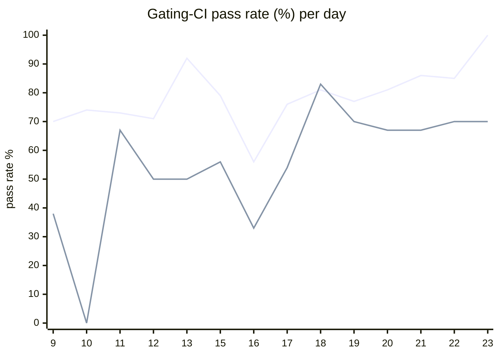

# CI Health Dashboard

_Window: last 14 days (trend + pass rate) · tables: last 24h · updated 2026-06-23T07:10:33Z · auto-generated, do not edit by hand._

**Gating-CI pass rate** — PR: 75% (1239/1659) · main: 58% (81/139)

## Gating-CI pass-rate trend

_X-axis = day of month (Jun 09 → Jun 23). Two lines: **CI** (PR gating-CI runs, generally the upper line) and **main** (post-merge main runs, lower). Y-axis = % of that day's gating-CI runs that passed._

## Top 10 failing jobs (last 24h)

| # | job | workflow | fails | recovered | runs | fail rate | flaky? | scope | cause |
| --- | --- | --- | --- | --- | --- | --- | --- | --- | --- |
| 1 | `unit` | test | 7 | 0 | 25 | 28% | flaky | main + PR | **flaky test** — MsgIdBuffer memory-leak guard fails on marginal heap growth in unit CI |
| 2 | `load-pgbouncer` | test | 7 | 0 | 25 | 28% | flaky | main + PR | **flaky test** — TestLoadCLI parent fails when perf-threshold subtests breach CI latency budget |
| 3 | `rampup` | test | 7 | 0 | 25 | 28% | flaky | PR | **data/env** — Rampup harness: pgoutbox migration fails because v1_runs_olap relation is missing |
| 4 | `generate` | test | 6 | 0 | 25 | 24% | flaky | PR | **infra/CI** — Generate check-for-diff: go generate/fmt drift in pkg/client/dispatcher_test.go |
| 5 | `load` | test | 4 | 0 | 25 | 16% | flaky | PR | **data/env** — Load job test harness setup fails on pgoutbox migration (v1_runs_olap missing) |
| 6 | `cypress` | frontend / app | 3 | 0 | 8 | 38% | flaky | PR | **flaky test** — Cypress invite flow: timed out waiting for Decline button to render |
| 7 | `publish` | typescript | 2 | 0 | 20 | 10% | flaky | main | **infra/CI** — TypeScript publish step copies dist/package.json before SDK build produces dist/ |
| 8 | `integration` | test | 2 | 0 | 25 | 8% | flaky | PR | **flaky test** — CLI profile lock test: 2/50 concurrent updates failed to acquire lock under CI contention |
| 9 | `e2e-pgmq` | test | 2 | 0 | 25 | 8% | flaky | PR | **data/env** — e2e-pgmq Generate: pgoutbox migration fails because v1_runs_olap relation is missing |
| 10 | `e2e` | test | 2 | 0 | 25 | 8% | flaky | PR | **flaky test** — Worker actions e2e: timed out waiting for action after simulated transient gRPC failures |

## Top 10 failing tests (last 24h)

| # | test | job | fails | runs | fail rate | flaky? | scope | cause |
| --- | --- | --- | --- | --- | --- | --- | --- | --- |
| 1 | `TestLoadCLI` | `load-pgbouncer` | 7 | 25 | 28% | flaky | main + PR | **flaky test** — TestLoadCLI parent fails when perf-threshold subtests breach CI latency budget |
| 2 | `TestLoadCLI/test_with_DAG` | `load-pgbouncer` | 7 | 25 | 28% | flaky | main + PR | **flaky test** — Load CLI DAG subtest exceeds 300ms avg-duration threshold on shared CI runners |
| 3 | `(unparsed)` | `rampup` | 6 | 25 | 24% | flaky | PR | **data/env** — Rampup harness: pgoutbox migration fails because v1_runs_olap relation is missing |
| 4 | `TestMsgIdBufferMemoryLeak` | `unit` | 5 | 25 | 20% | flaky | main + PR | **flaky test** — MsgIdBuffer memory-leak guard fails on marginal heap growth in unit CI |
| 5 | `(unparsed)` | `generate` | 5 | 25 | 20% | flaky | PR | **infra/CI** — Generate check-for-diff: go generate/fmt drift in pkg/client/dispatcher_test.go |
| 6 | `(unparsed)` | `load-pgbouncer` | 5 | 25 | 20% | flaky | PR | **data/env** — Load-pgbouncer harness setup fails on pgoutbox migration (v1_runs_olap missing) |
| 7 | `(unparsed)` | `load` | 4 | 25 | 16% | flaky | PR | **data/env** — Load job test harness setup fails on pgoutbox migration (v1_runs_olap missing) |
| 8 | `(unparsed)` | `cypress` | 3 | 8 | 38% | flaky | PR | **flaky test** — Cypress invite flow: timed out waiting for Decline button to render |
| 9 | `TestLoadCLI/test_with_global_concurrency_key` | `load-pgbouncer` | 3 | 25 | 12% | flaky | main + PR | **flaky test** — Load CLI global-concurrency subtest exceeds 300ms avg-duration threshold in CI |
| 10 | `TestLoadCLI/test_with_rate_limits` | `load-pgbouncer` | 3 | 25 | 12% | flaky | main + PR | **flaky test** — Load CLI rate_limits subtest exceeds 300ms avg-duration threshold on shared CI runners |

## Recent CI-health wins (`ci-health`)

**Recently merged**

- https://github.com/hatchet-dev/hatchet/pull/4239
- https://github.com/hatchet-dev/hatchet/pull/4238
- https://github.com/hatchet-dev/hatchet/pull/4218
- https://github.com/hatchet-dev/hatchet/pull/4213
- https://github.com/hatchet-dev/hatchet/pull/4165

**Open**

_No open `ci-health` PRs yet._

---
_Trend and pass-rate totals cover the last 14 days; job/test tables cover the last 24h._ **fails** = gating runs where the job/test failed · **recovered** = failed on a first attempt but passed on re-run (a flakiness signal) · **runs** = total gating runs of that workflow · **fail rate** = fails ÷ runs · **flaky** = recovered on re-run or intermittent across runs; **deterministic** = fails every time it runs · **scope** = whether failures were seen on PR, main, or main + PR.
