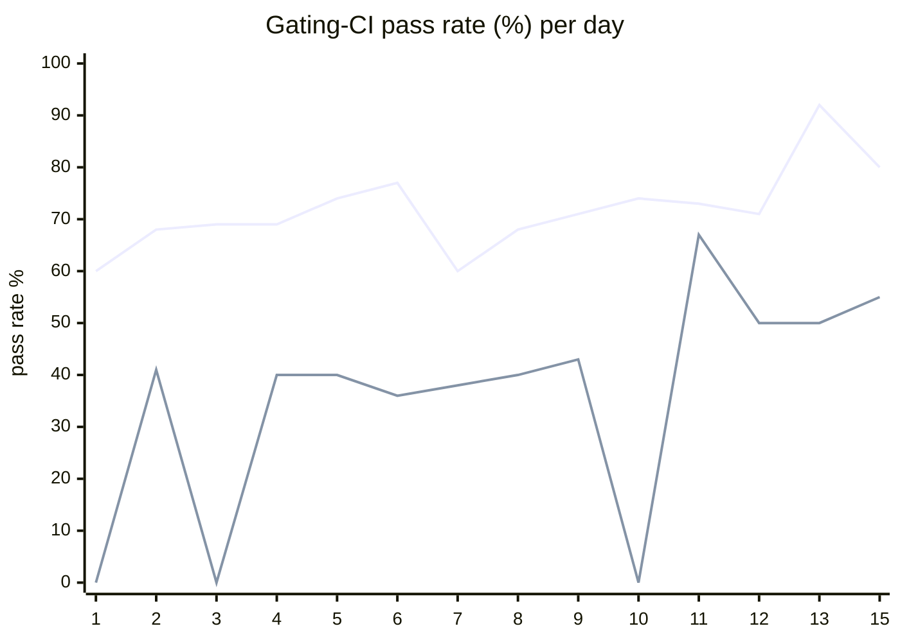

# CI Health Dashboard

_Window: last 14 days · updated 2026-06-15T21:19:10Z · auto-generated, do not edit by hand._

**Gating-CI pass rate** — PR: 72% (1543/2152) · main: 43% (70/164)

## Gating-CI pass-rate trend

_X-axis = day of month (Jun 01 → Jun 15). Two lines: **CI** (PR gating-CI runs, generally the upper line) and **main** (post-merge main runs, lower). Y-axis = % of that day's gating-CI runs that passed._

## Top 10 failing jobs

| # | job | workflow | fails | recovered | runs | fail rate | flaky? | scope | cause |
| --- | --- | --- | --- | --- | --- | --- | --- | --- | --- |
| 1 | `load-online-migrate` | test | 179 | 0 | 371 | 48% | flaky | main + PR | **infra/CI** — Hatchet engine not ready; worker dial to [::1]:7077 refused |
| 2 | `old-engine-new-sdk` | typescript | 147 | 3 | 267 | 55% | flaky | main + PR | **product bug** — old-engine-new-sdk bulk-replay e2e assertion failure |
| 3 | `generate` | test | 125 | 0 | 371 | 34% | flaky | main + PR | **infra/CI** — generate job Check for diff failed on unstaged SDK changelog MDX |
| 4 | `e2e-pgmq` | test | 94 | 1 | 371 | 25% | flaky | main + PR | **product bug** — PGMQ e2e TestDurableErrorOnErrorInChild failing deterministically |
| 5 | `e2e` | test | 66 | 4 | 371 | 18% | flaky | main + PR | **timeout** — TestEvictableTaskRestoreCompletes exceeded ~300s test timeout |
| 6 | `old-engine-new-sdk` | python | 62 | 1 | 279 | 22% | flaky | main + PR | **product bug** — old-engine-new-sdk batch_assign pytest fails with FailedTaskRunExceptionGroup |
| 7 | `old-engine-new-sdk` | ruby | 38 | 0 | 113 | 34% | flaky | PR | **infra/CI** — old-engine-new-sdk Ruby setup: bundle install failed (exit 16) |
| 8 | `load-pgbouncer` | test | 32 | 2 | 371 | 9% | flaky | main + PR | **timeout** — TestLoadCLI parent failed after DAG subtest timed out |
| 9 | `load-deadlock` | test | 28 | 1 | 371 | 8% | flaky | main + PR | **flaky test** — Durable events listener reconnect/backoff timing race in load-deadlock |
| 10 | `cypress` | frontend / app | 28 | 0 | 169 | 17% | flaky | PR | **flaky test** — Cypress auth/08-tenant-invite-decline.cy.ts intermittently fails |

## Top 10 failing tests

| # | test | job | fails | runs | fail rate | flaky? | scope | cause |
| --- | --- | --- | --- | --- | --- | --- | --- | --- |
| 1 | `(unparsed)` | `generate` | 115 | 371 | 31% | flaky | main + PR | **infra/CI** — generate job Check for diff failed on unstaged SDK changelog MDX |
| 2 | `bulk-replay-e2e › bulk replays matching runs and increments retry count` | `old-engine-new-sdk` | 103 | 267 | 39% | flaky | main + PR | **product bug** — old-engine-new-sdk bulk-replay e2e assertion failure |
| 3 | `(unparsed)` | `load-online-migrate` | 82 | 371 | 22% | flaky | main + PR | **infra/CI** — Hatchet engine not ready; worker dial to [::1]:7077 refused |
| 4 | `(unparsed)` | `load-online-migrate` | 55 | 371 | 15% | flaky | PR | **data/env** — Online-migrate load test hit missing v1_operator table during migration |
| 5 | `(unparsed)` | `load-online-migrate` | 37 | 371 | 10% | flaky | main + PR | **infra/CI** — Hatchet engine not ready; worker dial to localhost:7077 refused |
| 6 | `TestLoadCLI` | `load-pgbouncer` | 34 | 371 | 9% | flaky | main + PR | **timeout** — TestLoadCLI parent failed after DAG subtest timed out |
| 7 | `TestLoadCLI/test_with_DAG` | `load-pgbouncer` | 32 | 371 | 9% | flaky | main + PR | **timeout** — TestLoadCLI/test_with_DAG exceeded 340s CI test budget |
| 8 | `TestDurableEventsListenerDeliversEventAfterReconnectDuringRetryBackoff` | `load-deadlock` | 30 | 371 | 8% | flaky | main + PR | **flaky test** — Durable events listener reconnect/backoff timing race in load-deadlock |
| 9 | `TestDurableErrorOnErrorInChild` | `e2e-pgmq` | 29 | 371 | 8% | flaky | main + PR | **product bug** — PGMQ e2e TestDurableErrorOnErrorInChild failing deterministically |
| 10 | `(unparsed)` | `cypress` | 27 | 169 | 16% | flaky | PR | **flaky test** — Cypress auth/08-tenant-invite-decline.cy.ts intermittently fails |

## Recent CI-health wins (`ci-health`)

**Recently merged**

- https://github.com/hatchet-dev/hatchet/pull/4165
- https://github.com/hatchet-dev/hatchet/pull/4159
- https://github.com/hatchet-dev/hatchet/pull/4156
- https://github.com/hatchet-dev/hatchet/pull/4146
- https://github.com/hatchet-dev/hatchet/pull/4145

**Open**

_No open `ci-health` PRs yet._

---
_All counts cover the window above (last 14 days)._ **fails** = gating runs where the job/test failed · **recovered** = failed on a first attempt but passed on re-run (a flakiness signal) · **runs** = total gating runs of that workflow · **fail rate** = fails ÷ runs · **flaky** = recovered on re-run or intermittent across runs; **deterministic** = fails every time it runs · **scope** = whether failures were seen on PR, main, or main + PR.
