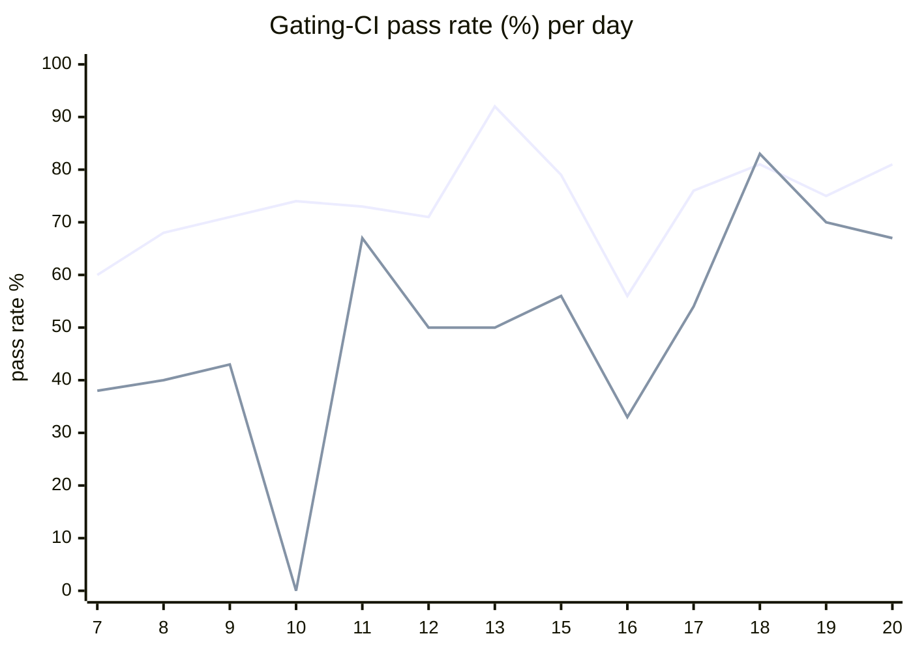

# CI Health Dashboard

_Window: last 14 days (trend + pass rate) · tables: last 24h · updated 2026-06-21T07:04:51Z · auto-generated, do not edit by hand._

**Gating-CI pass rate** — PR: 73% (1210/1662) · main: 52% (83/158)

## Gating-CI pass-rate trend

_X-axis = day of month (Jun 07 → Jun 20). Two lines: **CI** (PR gating-CI runs, generally the upper line) and **main** (post-merge main runs, lower). Y-axis = % of that day's gating-CI runs that passed._

## Top 10 failing jobs (last 24h)

| # | job | workflow | fails | recovered | runs | fail rate | flaky? | scope | cause |
| --- | --- | --- | --- | --- | --- | --- | --- | --- | --- |
| 1 | `lint` | lint all | 3 | 0 | 8 | 38% | flaky | PR | **infra/CI** — pre-commit sync-python-changelog hook modified python.mdx — changelog docs not synced before push |
| 2 | `cypress` | frontend / app | 2 | 0 | 5 | 40% | flaky | PR | **flaky test** — Cypress auth/08-tenant-invite-decline timed out waiting for Decline button (15s) |
| 3 | `load-pgbouncer` | test | 1 | 0 | 2 | 50% | flaky | main | **flaky test** — goleak reports unexpected goroutines in cmd/hatchet-loadtest load tests despite passing assertions |
| 4 | `lint` | frontend / docs | 1 | 0 | 5 | 20% | flaky | PR | **infra/CI** — docs prettier:check failed on autogenerated python.mdx changelog out of sync with SDK |

## Top 10 failing tests (last 24h)

| # | test | job | fails | runs | fail rate | flaky? | scope | cause |
| --- | --- | --- | --- | --- | --- | --- | --- | --- |
| 1 | `(unparsed)` | `lint` | 3 | 8 | 38% | flaky | PR | **infra/CI** — pre-commit sync-python-changelog hook modified python.mdx — changelog docs not synced before push |
| 2 | `(unparsed)` | `cypress` | 2 | 5 | 40% | flaky | PR | **flaky test** — Cypress auth/08-tenant-invite-decline timed out waiting for Decline button (15s) |
| 3 | `(unparsed)` | `load-pgbouncer` | 1 | 2 | 50% | flaky | main | **flaky test** — goleak reports unexpected goroutines in cmd/hatchet-loadtest load tests despite passing assertions |
| 4 | `(unparsed)` | `lint` | 1 | 5 | 20% | flaky | PR | **infra/CI** — docs prettier:check failed on autogenerated python.mdx changelog out of sync with SDK |

## Recent CI-health wins (`ci-health`)

**Recently merged**

- https://github.com/hatchet-dev/hatchet/pull/4239
- https://github.com/hatchet-dev/hatchet/pull/4238
- https://github.com/hatchet-dev/hatchet/pull/4218
- https://github.com/hatchet-dev/hatchet/pull/4213
- https://github.com/hatchet-dev/hatchet/pull/4165

**Open**

- https://github.com/hatchet-dev/hatchet/pull/4212

---
_Trend and pass-rate totals cover the last 14 days; job/test tables cover the last 24h._ **fails** = gating runs where the job/test failed · **recovered** = failed on a first attempt but passed on re-run (a flakiness signal) · **runs** = total gating runs of that workflow · **fail rate** = fails ÷ runs · **flaky** = recovered on re-run or intermittent across runs; **deterministic** = fails every time it runs · **scope** = whether failures were seen on PR, main, or main + PR.
