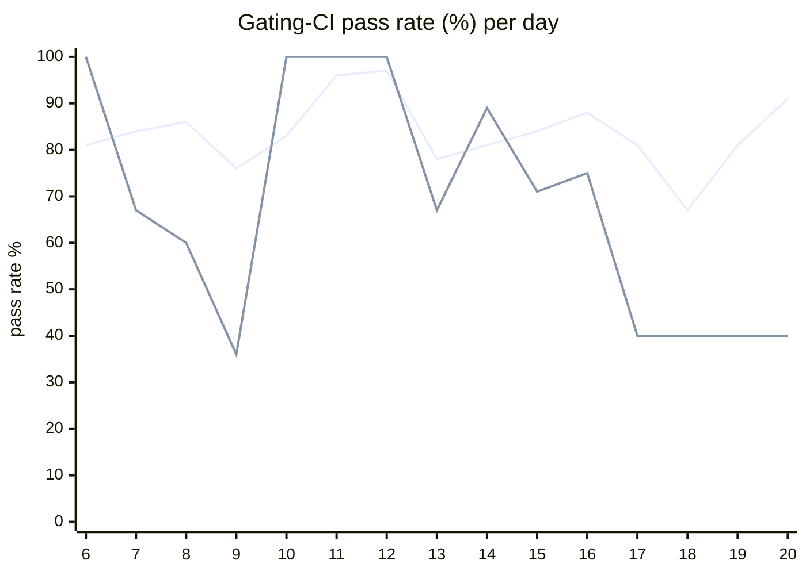

# CI Health Dashboard

_Window: last 14 days (trend + pass rate) · tables: last 24h · updated 2026-07-20T07:07:59Z · auto-generated, do not edit by hand._

**Gating-CI pass rate** — PR: 82% (2177/2645) · main: 70% (88/126)

## Gating-CI pass-rate trend

_X-axis = day of month (Jul 06 → Jul 20). Two lines: **CI** (PR gating-CI runs, generally the upper line) and **main** (post-merge main runs, lower). Y-axis = % of that day's gating-CI runs that passed._

## Top 10 failing jobs (last 24h)

| # | job | workflow | fails | recovered | runs | fail rate | flaky? | scope | cause |
| --- | --- | --- | --- | --- | --- | --- | --- | --- | --- |
| 1 | `generate` | test | 2 | 0 | 5 | 40% | flaky | PR | **infra/CI** — generate check-for-diff: idempotency Go examples not regenerated on mk/idempotency-release PR |
| 2 | `test-templates` | cli-e2e-tests | 1 | 0 | 1 | 100% | deterministic | PR | **flaky test** — TestQuickstartTemplates parent failure from simple_go_go subtest killed |
| 3 | `cypress` | frontend / app | 1 | 0 | 2 | 50% | flaky | PR | **flaky test** — Cypress UI timeouts waiting for tenant selector, v1-sidebar, and error pages |

## Top 10 failing tests (last 24h)

| # | test | job | fails | runs | fail rate | flaky? | scope | cause |
| --- | --- | --- | --- | --- | --- | --- | --- | --- |
| 1 | `(unparsed)` | `generate` | 2 | 5 | 40% | flaky | PR | **infra/CI** — generate check-for-diff: idempotency Go examples not regenerated on mk/idempotency-release PR |
| 2 | `TestQuickstartTemplates` | `test-templates` | 1 | 1 | 100% | deterministic | PR | **flaky test** — TestQuickstartTemplates parent failure from simple_go_go subtest killed |
| 3 | `TestQuickstartTemplates/simple_go_go` | `test-templates` | 1 | 1 | 100% | deterministic | PR | **flaky test** — CLI quickstart simple_go_go: workflow trigger killed (signal) during worker dev test |
| 4 | `(unparsed)` | `cypress` | 1 | 2 | 50% | flaky | PR | **flaky test** — Cypress UI timeouts waiting for tenant selector, v1-sidebar, and error pages |
| 5 | `examples/conditions/test_conditions.py::test_waits` | `test` | 1 | 5 | 20% | flaky | PR | **flaky test** — test_waits race: expected skipped branch but got random_number result |

## Recent CI-health wins (`ci-health`)

**Recently merged**

- https://github.com/hatchet-dev/hatchet/pull/4239
- https://github.com/hatchet-dev/hatchet/pull/4238
- https://github.com/hatchet-dev/hatchet/pull/4218
- https://github.com/hatchet-dev/hatchet/pull/4213
- https://github.com/hatchet-dev/hatchet/pull/4165

**Open**

_No open `ci-health` PRs yet._

---
_Trend and pass-rate totals cover the last 14 days; job/test tables cover the last 24h._ **fails** = gating runs where the job/test failed · **recovered** = failed on a first attempt but passed on re-run (a flakiness signal) · **runs** = total gating runs of that workflow · **fail rate** = fails ÷ runs · **flaky** = recovered on re-run or intermittent across runs; **deterministic** = fails every time it runs · **scope** = whether failures were seen on PR, main, or main + PR.
