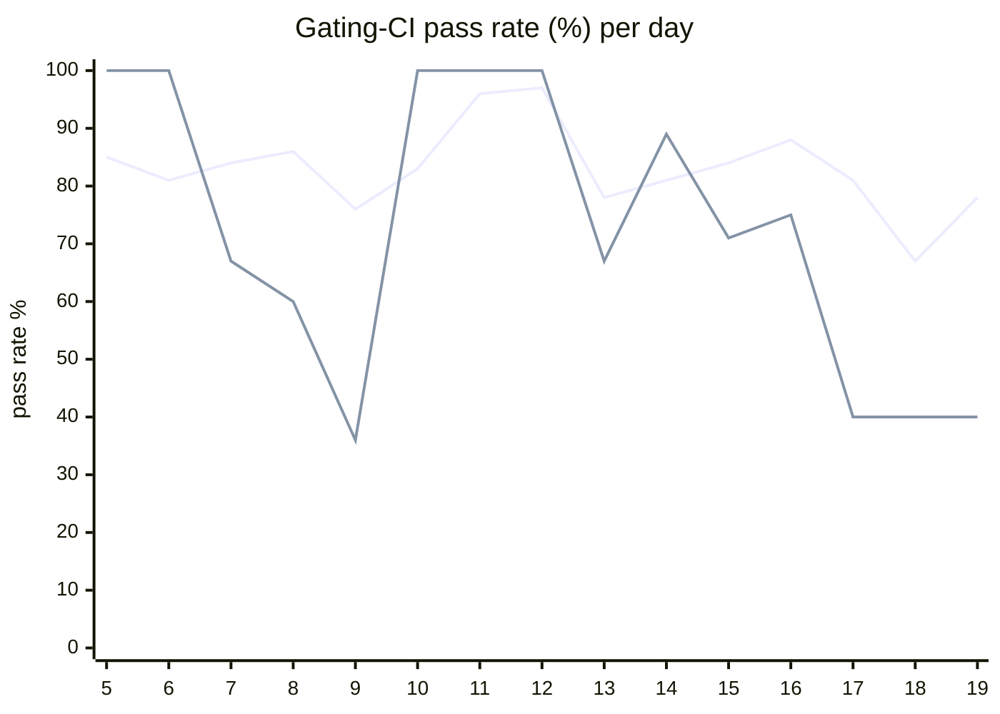

# CI Health Dashboard

_Window: last 14 days (trend + pass rate) · tables: last 24h · updated 2026-07-19T07:06:32Z · auto-generated, do not edit by hand._

**Gating-CI pass rate** — PR: 82% (2203/2678) · main: 70% (88/126)

## Gating-CI pass-rate trend

_X-axis = day of month (Jul 05 → Jul 19). Two lines: **CI** (PR gating-CI runs, generally the upper line) and **main** (post-merge main runs, lower). Y-axis = % of that day's gating-CI runs that passed._

## Top 10 failing jobs (last 24h)

| # | job | workflow | fails | recovered | runs | fail rate | flaky? | scope | cause |
| --- | --- | --- | --- | --- | --- | --- | --- | --- | --- |
| 1 | `generate` | test | 5 | 0 | 7 | 71% | flaky | PR | **infra/CI** — generate check-for-diff drift on PR (python examples + proto not regenerated) |
| 2 | `unit` | test | 2 | 0 | 7 | 29% | flaky | PR | **flaky test** — scheduler TryAssign replenish-timeout starvation test timing-sensitive |
| 3 | `e2e-pgmq` | test | 1 | 0 | 7 | 14% | flaky | PR | **flaky test** — e2e durable sleep cancel replay timing race in TestDurableSleepCancelReplay |

## Top 10 failing tests (last 24h)

| # | test | job | fails | runs | fail rate | flaky? | scope | cause |
| --- | --- | --- | --- | --- | --- | --- | --- | --- |
| 1 | `(unparsed)` | `generate` | 5 | 7 | 71% | flaky | PR | **infra/CI** — generate check-for-diff drift on PR (python examples + proto not regenerated) |
| 2 | `TestScheduler_TryAssign_NotStarvedByRepeatedReplenishTimeouts` | `unit` | 2 | 7 | 29% | flaky | PR | **flaky test** — scheduler TryAssign replenish-timeout starvation test timing-sensitive |
| 3 | `examples/cron/test_cron_input.py::test_cron_input_workflow_running_options` | `test` | 2 | 7 | 29% | flaky | PR | **flaky test** — cron input workflow returns None instead of expected output intermittently |
| 4 | `examples/conditions/test_conditions.py::test_waits` | `test` | 1 | 7 | 14% | flaky | PR | **flaky test** — conditions test_waits random_number branch races with skip assertion |
| 5 | `TestDurableSleepCancelReplay` | `e2e-pgmq` | 1 | 7 | 14% | flaky | PR | **flaky test** — e2e durable sleep cancel replay timing race in TestDurableSleepCancelReplay |

## Recent CI-health wins (`ci-health`)

**Recently merged**

- https://github.com/hatchet-dev/hatchet/pull/4239
- https://github.com/hatchet-dev/hatchet/pull/4238
- https://github.com/hatchet-dev/hatchet/pull/4218
- https://github.com/hatchet-dev/hatchet/pull/4213
- https://github.com/hatchet-dev/hatchet/pull/4165

**Open**

_No open `ci-health` PRs yet._

---
_Trend and pass-rate totals cover the last 14 days; job/test tables cover the last 24h._ **fails** = gating runs where the job/test failed · **recovered** = failed on a first attempt but passed on re-run (a flakiness signal) · **runs** = total gating runs of that workflow · **fail rate** = fails ÷ runs · **flaky** = recovered on re-run or intermittent across runs; **deterministic** = fails every time it runs · **scope** = whether failures were seen on PR, main, or main + PR.
