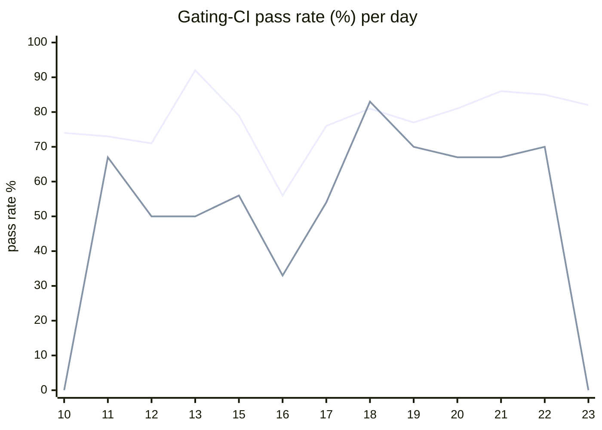

# CI Health Dashboard

_Window: last 14 days (trend + pass rate) · tables: last 24h · updated 2026-06-24T07:11:28Z · auto-generated, do not edit by hand._

**Gating-CI pass rate** — PR: 76% (1322/1746) · main: 59% (76/128)

## Gating-CI pass-rate trend

_X-axis = day of month (Jun 10 → Jun 23). Two lines: **CI** (PR gating-CI runs, generally the upper line) and **main** (post-merge main runs, lower). Y-axis = % of that day's gating-CI runs that passed._

## Top 10 failing jobs (last 24h)

| # | job | workflow | fails | recovered | runs | fail rate | flaky? | scope | cause |
| --- | --- | --- | --- | --- | --- | --- | --- | --- | --- |
| 1 | `generate` | test | 12 | 0 | 29 | 41% | flaky | PR | **infra/CI** — generate job git diff found stale generated contracts and frontend files |
| 2 | `load-pgbouncer` | test | 7 | 1 | 29 | 24% | flaky | main + PR | **timeout** — TestLoadCLI parent fails when DAG subtest times out at 400s |
| 3 | `cypress` | frontend / app | 4 | 0 | 15 | 27% | flaky | PR | **flaky test** — Cypress auth invite test timed out waiting for Decline button |
| 4 | `lint` | frontend / app | 4 | 0 | 15 | 27% | flaky | PR | **infra/CI** — frontend/app prettier lint caught unformatted tenant-settings code |
| 5 | `dashboard-arm` | build | 3 | 0 | 27 | 11% | flaky | PR | **infra/CI** — dashboard-arm Docker build failed fetching golang.org/x/sys from module proxy |
| 6 | `integration` | test | 3 | 0 | 29 | 10% | flaky | PR | **timeout** — integration harness package exceeded ~660s test budget |
| 7 | `e2e` | test | 3 | 0 | 29 | 10% | flaky | PR | **infra/CI** — Hatchet engine/API failed readiness wait in e2e CI setup |
| 8 | `e2e-pgmq` | test | 3 | 0 | 29 | 10% | flaky | PR | **infra/CI** — Hatchet engine/API failed readiness wait in e2e-pgmq CI setup |
| 9 | `unit` | test | 2 | 1 | 29 | 7% | flaky | PR | **product bug** — TestMsgIdBufferMemoryLeak failing in internal/msgqueue |
| 10 | `lint` | frontend / docs | 2 | 0 | 6 | 33% | flaky | PR | **infra/CI** — frontend/docs prettier:check found unformatted MDX/TS files |

## Top 10 failing tests (last 24h)

| # | test | job | fails | runs | fail rate | flaky? | scope | cause |
| --- | --- | --- | --- | --- | --- | --- | --- | --- |
| 1 | `(unparsed)` | `generate` | 12 | 29 | 41% | flaky | PR | **infra/CI** — generate job git diff found stale generated contracts and frontend files |
| 2 | `TestLoadCLI` | `load-pgbouncer` | 9 | 29 | 31% | flaky | main + PR | **timeout** — TestLoadCLI parent fails when DAG subtest times out at 400s |
| 3 | `TestLoadCLI/test_with_DAG` | `load-pgbouncer` | 9 | 29 | 31% | flaky | main + PR | **timeout** — TestLoadCLI/test_with_DAG hit 400s subtest timeout under load |
| 4 | `(unparsed)` | `cypress` | 4 | 15 | 27% | flaky | PR | **flaky test** — Cypress auth invite test timed out waiting for Decline button |
| 5 | `(unparsed)` | `lint` | 3 | 15 | 20% | flaky | PR | **infra/CI** — frontend/app prettier lint caught unformatted tenant-settings code |
| 6 | `(unparsed)` | `test` | 3 | 27 | 11% | flaky | PR | **flaky test** — Python SDK durable test_dag_spawn_returns_full_output intermittently fails |
| 7 | `(unparsed)` | `lint` | 3 | 27 | 11% | flaky | PR | **dependency** — Black 26.x output not parseable by Python 3.11 in lint job |
| 8 | `(unparsed)` | `dashboard-arm` | 3 | 27 | 11% | flaky | PR | **infra/CI** — dashboard-arm Docker build failed fetching golang.org/x/sys from module proxy |
| 9 | `(unparsed)` | `load-pgbouncer` | 3 | 29 | 10% | flaky | PR | **unknown** — Sample is go test shell invocation trace, not the failure line |
| 10 | `(unparsed)` | `lint` | 2 | 6 | 33% | flaky | PR | **infra/CI** — frontend/docs prettier:check found unformatted MDX/TS files |

## Recent CI-health wins (`ci-health`)

**Recently merged**

- https://github.com/hatchet-dev/hatchet/pull/4239
- https://github.com/hatchet-dev/hatchet/pull/4238
- https://github.com/hatchet-dev/hatchet/pull/4218
- https://github.com/hatchet-dev/hatchet/pull/4213
- https://github.com/hatchet-dev/hatchet/pull/4165

**Open**

_No open `ci-health` PRs yet._

---
_Trend and pass-rate totals cover the last 14 days; job/test tables cover the last 24h._ **fails** = gating runs where the job/test failed · **recovered** = failed on a first attempt but passed on re-run (a flakiness signal) · **runs** = total gating runs of that workflow · **fail rate** = fails ÷ runs · **flaky** = recovered on re-run or intermittent across runs; **deterministic** = fails every time it runs · **scope** = whether failures were seen on PR, main, or main + PR.
