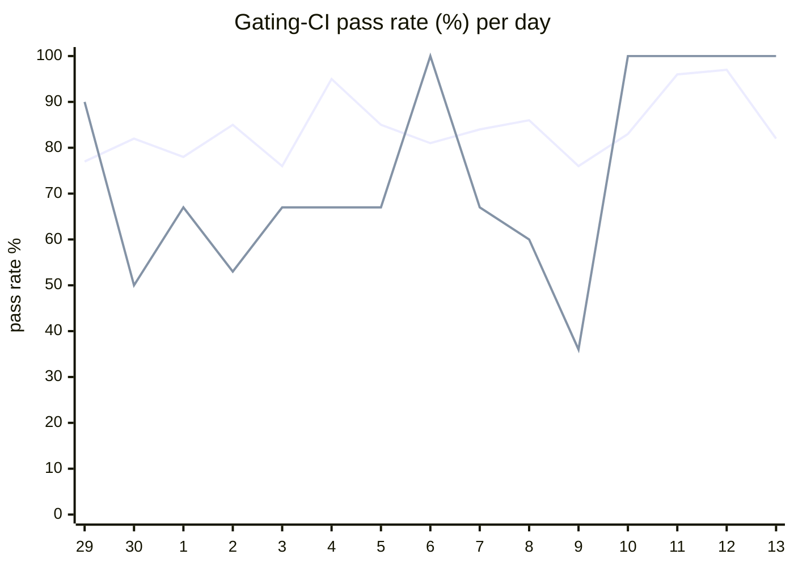

# CI Health Dashboard

_Window: last 14 days (trend + pass rate) · tables: last 24h · updated 2026-07-13T07:08:01Z · auto-generated, do not edit by hand._

**Gating-CI pass rate** — PR: 82% (1932/2356) · main: 64% (72/113)

## Gating-CI pass-rate trend

_X-axis = day of month (Jun 29 → Jul 13). Two lines: **CI** (PR gating-CI runs, generally the upper line) and **main** (post-merge main runs, lower). Y-axis = % of that day's gating-CI runs that passed._

## Top 10 failing jobs (last 24h)

| # | job | workflow | fails | recovered | runs | fail rate | flaky? | scope | cause |
| --- | --- | --- | --- | --- | --- | --- | --- | --- | --- |
| 1 | `cypress` | frontend / app | 1 | 0 | 3 | 33% | flaky | PR | **flaky test** — Cypress UI element timeouts (tenant switcher, new-tenant) in frontend E2E |
| 2 | `unit` | test | 1 | 0 | 5 | 20% | flaky | PR | **flaky test** — msgqueue TestMsgIdBufferMemoryLeak times out sending messages under CI concurrency |
| 3 | `test` | python | 1 | 0 | 5 | 20% | flaky | PR | **flaky test** — test_waits races on random_number vs skipped condition |
| 4 | `api` | build | 1 | 0 | 7 | 14% | flaky | PR | **infra/CI** — Alpine apk mirror TLS error during api Docker build |
| 5 | `migrate-arm` | build | 1 | 0 | 7 | 14% | flaky | PR | **infra/CI** — Alpine apk mirror TLS error during migrate-arm Docker build |

## Top 10 failing tests (last 24h)

| # | test | job | fails | runs | fail rate | flaky? | scope | cause |
| --- | --- | --- | --- | --- | --- | --- | --- | --- |
| 1 | `(unparsed)` | `cypress` | 1 | 3 | 33% | flaky | PR | **flaky test** — Cypress UI element timeouts (tenant switcher, new-tenant) in frontend E2E |
| 2 | `TestMsgIdBufferMemoryLeak` | `unit` | 1 | 5 | 20% | flaky | PR | **flaky test** — msgqueue TestMsgIdBufferMemoryLeak times out sending messages under CI concurrency |
| 3 | `examples/conditions/test_conditions.py::test_waits` | `test` | 1 | 5 | 20% | flaky | PR | **flaky test** — test_waits races on random_number vs skipped condition |
| 4 | `(unparsed)` | `api` | 1 | 7 | 14% | flaky | PR | **infra/CI** — Alpine apk mirror TLS error during api Docker build |
| 5 | `(unparsed)` | `migrate-arm` | 1 | 7 | 14% | flaky | PR | **infra/CI** — Alpine apk mirror TLS error during migrate-arm Docker build |

## Recent CI-health wins (`ci-health`)

**Recently merged**

- https://github.com/hatchet-dev/hatchet/pull/4239
- https://github.com/hatchet-dev/hatchet/pull/4238
- https://github.com/hatchet-dev/hatchet/pull/4218
- https://github.com/hatchet-dev/hatchet/pull/4213
- https://github.com/hatchet-dev/hatchet/pull/4165

**Open**

_No open `ci-health` PRs yet._

---
_Trend and pass-rate totals cover the last 14 days; job/test tables cover the last 24h._ **fails** = gating runs where the job/test failed · **recovered** = failed on a first attempt but passed on re-run (a flakiness signal) · **runs** = total gating runs of that workflow · **fail rate** = fails ÷ runs · **flaky** = recovered on re-run or intermittent across runs; **deterministic** = fails every time it runs · **scope** = whether failures were seen on PR, main, or main + PR.
