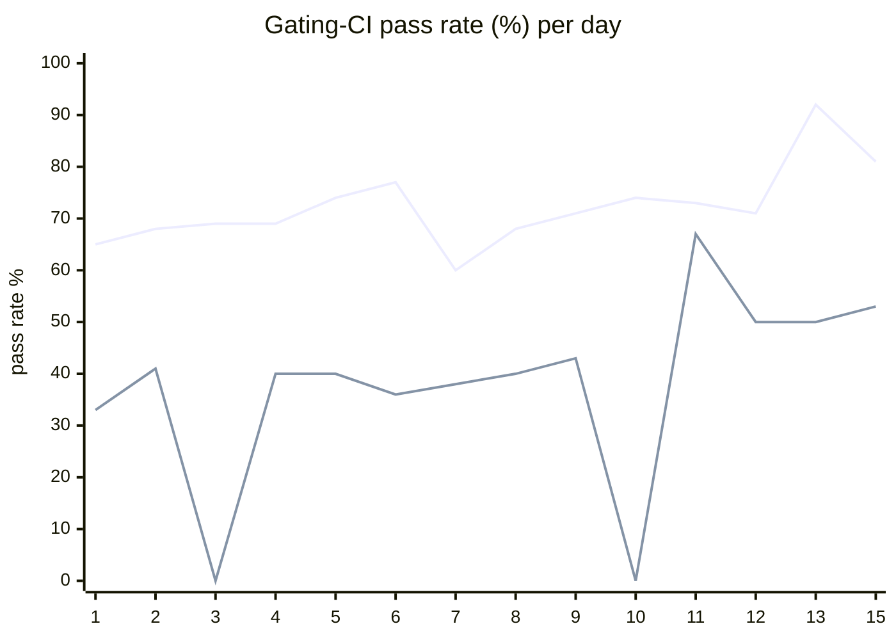

# CI Health Dashboard

_Window: last 14 days · updated 2026-06-15T19:34:09Z · auto-generated, do not edit by hand._

**Gating-CI pass rate** — PR: 72% (1552/2166) · main: 42% (71/167)

## Gating-CI pass-rate trend

_X-axis = day of month (Jun 01 → Jun 15). Two lines: **CI** (PR gating-CI runs, generally the upper line) and **main** (post-merge main runs, lower). Y-axis = % of that day's gating-CI runs that passed._

## Top 10 failing jobs

| # | job | workflow | fails | recovered | runs | fail rate | flaky? | scope | cause |
| --- | --- | --- | --- | --- | --- | --- | --- | --- | --- |
| 1 | `load-online-migrate` | test | 186 | 0 | 371 | 50% | flaky | main + PR | **infra/CI** — Worker cannot dial Hatchet engine on [::1]:7077 — engine not ready at load-test start |
| 2 | `old-engine-new-sdk` | typescript | 150 | 3 | 271 | 55% | flaky | main + PR | **flaky test** — bulk-replay e2e retry-count assertion races in old-engine compat matrix |
| 3 | `generate` | test | 127 | 0 | 371 | 34% | flaky | main + PR | **infra/CI** — generate job Check-for-diff fails on uncommitted changelog MDX codegen drift |
| 4 | `e2e-pgmq` | test | 95 | 1 | 371 | 26% | flaky | main + PR | **flaky test** — TestDurableErrorOnErrorInChild intermittently fails durable child-error propagation timing |
| 5 | `e2e` | test | 65 | 4 | 371 | 18% | flaky | main + PR | **timeout** — TestEvictableTaskRestoreCompletes exceeds ~300s evictable-task restore budget |
| 6 | `old-engine-new-sdk` | python | 64 | 1 | 284 | 22% | flaky | main + PR | **flaky test** — old-engine/new-SDK batch_assign flush timing is intermittent in compat matrix |
| 7 | `old-engine-new-sdk` | ruby | 40 | 0 | 116 | 34% | flaky | PR | **unknown** — Noisy git-fetch trace from Ruby setup step; actual failure line not captured |
| 8 | `load-pgbouncer` | test | 30 | 2 | 371 | 8% | flaky | main + PR | **timeout** — TestLoadCLI parent fails when DAG subtest times out at 340s |
| 9 | `load-deadlock` | test | 27 | 1 | 371 | 7% | flaky | main + PR | **flaky test** — Reconnect-during-backoff listener test races on event delivery timing |
| 10 | `cypress` | frontend / app | 27 | 0 | 171 | 16% | flaky | PR | **flaky test** — Cypress auth/08-tenant-invite-decline spec fails intermittently (1 of 12 specs) |

## Top 10 failing tests

| # | test | job | fails | runs | fail rate | flaky? | scope | cause |
| --- | --- | --- | --- | --- | --- | --- | --- | --- |
| 1 | `(unparsed)` | `generate` | 117 | 371 | 32% | flaky | main + PR | **infra/CI** — generate job Check-for-diff fails on uncommitted changelog MDX codegen drift |
| 2 | `bulk-replay-e2e › bulk replays matching runs and increments retry count` | `old-engine-new-sdk` | 105 | 271 | 39% | flaky | main + PR | **flaky test** — bulk-replay e2e retry-count assertion races in old-engine compat matrix |
| 3 | `(unparsed)` | `load-online-migrate` | 86 | 371 | 23% | flaky | main + PR | **infra/CI** — Worker cannot dial Hatchet engine on [::1]:7077 — engine not ready at load-test start |
| 4 | `(unparsed)` | `load-online-migrate` | 57 | 371 | 15% | flaky | PR | **infra/CI** — load-online-migrate panics after engine/worker setup failure during load test |
| 5 | `(unparsed)` | `load-online-migrate` | 38 | 371 | 10% | flaky | main + PR | **infra/CI** — Worker cannot dial Hatchet engine on localhost:7077 — engine not ready at load-test start |
| 6 | `TestLoadCLI` | `load-pgbouncer` | 33 | 371 | 9% | flaky | main + PR | **timeout** — TestLoadCLI parent fails when DAG subtest times out at 340s |
| 7 | `TestLoadCLI/test_with_DAG` | `load-pgbouncer` | 31 | 371 | 8% | flaky | main + PR | **timeout** — TestLoadCLI/test_with_DAG hits the 340s job timeout budget |
| 8 | `TestDurableEventsListenerDeliversEventAfterReconnectDuringRetryBackoff` | `load-deadlock` | 29 | 371 | 8% | flaky | main + PR | **flaky test** — Reconnect-during-backoff listener test races on event delivery timing |
| 9 | `TestDurableErrorOnErrorInChild` | `e2e-pgmq` | 28 | 371 | 8% | flaky | main + PR | **flaky test** — TestDurableErrorOnErrorInChild intermittently fails durable child-error propagation timing |
| 10 | `(unparsed)` | `cypress` | 26 | 171 | 15% | flaky | PR | **flaky test** — Cypress auth/08-tenant-invite-decline spec fails intermittently (1 of 12 specs) |

## Recent CI-health wins (`ci-health`)

**Recently merged**

- https://github.com/hatchet-dev/hatchet/pull/4165
- https://github.com/hatchet-dev/hatchet/pull/4159
- https://github.com/hatchet-dev/hatchet/pull/4156
- https://github.com/hatchet-dev/hatchet/pull/4146
- https://github.com/hatchet-dev/hatchet/pull/4145

**Open**

_No open `ci-health` PRs yet._

---
_All counts cover the window above (last 14 days)._ **fails** = gating runs where the job/test failed · **recovered** = failed on a first attempt but passed on re-run (a flakiness signal) · **runs** = total gating runs of that workflow · **fail rate** = fails ÷ runs · **flaky** = recovered on re-run or intermittent across runs; **deterministic** = fails every time it runs · **scope** = whether failures were seen on PR, main, or main + PR.
