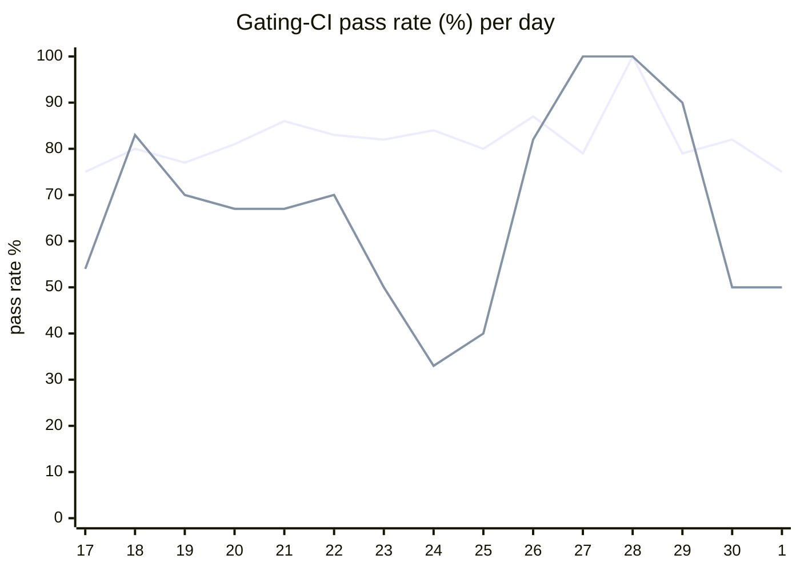

# CI Health Dashboard

_Window: last 14 days (trend + pass rate) · tables: last 24h · updated 2026-07-01T07:08:30Z · auto-generated, do not edit by hand._

**Gating-CI pass rate** — PR: 81% (1323/1626) · main: 65% (76/117)

## Gating-CI pass-rate trend

_X-axis = day of month (Jun 17 → Jul 01). Two lines: **CI** (PR gating-CI runs, generally the upper line) and **main** (post-merge main runs, lower). Y-axis = % of that day's gating-CI runs that passed._

## Top 10 failing jobs (last 24h)

| # | job | workflow | fails | recovered | runs | fail rate | flaky? | scope | cause |
| --- | --- | --- | --- | --- | --- | --- | --- | --- | --- |
| 1 | `load-pgbouncer` | test | 9 | 0 | 37 | 24% | flaky | main + PR | **flaky test** — TestLoadCLI load E2E: subtest duration thresholds exceeded on shared CI runners |
| 2 | `unit` | test | 6 | 0 | 37 | 16% | flaky | main + PR | **product bug** — Populator middleware returns 403 instead of expected populate error on parent disagreement |
| 3 | `integration` | test | 5 | 0 | 37 | 14% | flaky | main + PR | **flaky test** — Integration teardown race: server maintenance scan gets context canceled |
| 4 | `cypress` | frontend / app | 4 | 0 | 17 | 24% | flaky | PR | **flaky test** — Cypress tenant-switching: login redirect assertion times out after 30s |
| 5 | `build` | frontend / app | 4 | 0 | 17 | 24% | flaky | PR | **product bug** — Frontend queries.ts TS2554: API call arity mismatch breaks app build job |
| 6 | `generate` | test | 4 | 0 | 37 | 11% | flaky | main + PR | **infra/CI** — generate job Check for diff: committed artifacts out of sync with codegen output |
| 7 | `frontend` | build | 3 | 0 | 37 | 8% | flaky | PR | **product bug** — Frontend queries.ts TS2554: API call arity mismatch breaks Docker frontend build |
| 8 | `lite-amd` | build | 3 | 0 | 37 | 8% | flaky | PR | **product bug** — Docker lite-amd build fails on same frontend queries.ts TS2554 compile error |
| 9 | `dashboard-amd` | build | 3 | 0 | 37 | 8% | flaky | PR | **product bug** — Docker dashboard-amd build fails on same frontend queries.ts TS2554 compile error |
| 10 | `dashboard-arm` | build | 3 | 0 | 37 | 8% | flaky | PR | **product bug** — Docker dashboard-arm build fails on same frontend queries.ts TS2554 compile error |

## Top 10 failing tests (last 24h)

| # | test | job | fails | runs | fail rate | flaky? | scope | cause |
| --- | --- | --- | --- | --- | --- | --- | --- | --- |
| 1 | `TestLoadCLI` | `load-pgbouncer` | 13 | 37 | 35% | flaky | main + PR | **flaky test** — TestLoadCLI load E2E: subtest duration thresholds exceeded on shared CI runners |
| 2 | `TestLoadCLI/test_with_DAG` | `load-pgbouncer` | 13 | 37 | 35% | flaky | main + PR | **flaky test** — TestLoadCLI/test_with_DAG: avg event duration exceeds perf threshold on CI |
| 3 | `(unparsed)` | `cypress` | 4 | 17 | 24% | flaky | PR | **flaky test** — Cypress tenant-switching: login redirect assertion times out after 30s |
| 4 | `(unparsed)` | `build` | 4 | 17 | 24% | flaky | PR | **product bug** — Frontend queries.ts TS2554: API call arity mismatch breaks app build job |
| 5 | `TestLoadCLI/test_with_rate_limits` | `load-pgbouncer` | 4 | 37 | 11% | flaky | PR | **flaky test** — TestLoadCLI/test_with_rate_limits: load test perf sensitivity on CI runners |
| 6 | `(unparsed)` | `load-pgbouncer` | 4 | 37 | 11% | flaky | main + PR | **unknown** — Log captures go test invocation only; actual failure is load CLI threshold/timeout |
| 7 | `TestPopulatorMiddlewareParentDisagreement` | `unit` | 4 | 37 | 11% | flaky | main + PR | **product bug** — Populator middleware returns 403 instead of expected populate error on parent disagreement |
| 8 | `(unparsed)` | `generate` | 4 | 37 | 11% | flaky | main + PR | **infra/CI** — generate job Check for diff: committed artifacts out of sync with codegen output |
| 9 | `(unparsed)` | `frontend` | 3 | 37 | 8% | flaky | PR | **product bug** — Frontend queries.ts TS2554: API call arity mismatch breaks Docker frontend build |
| 10 | `(unparsed)` | `dashboard-amd` | 3 | 37 | 8% | flaky | PR | **product bug** — Docker dashboard-amd build fails on same frontend queries.ts TS2554 compile error |

## Recent CI-health wins (`ci-health`)

**Recently merged**

- https://github.com/hatchet-dev/hatchet/pull/4239
- https://github.com/hatchet-dev/hatchet/pull/4238
- https://github.com/hatchet-dev/hatchet/pull/4218
- https://github.com/hatchet-dev/hatchet/pull/4213
- https://github.com/hatchet-dev/hatchet/pull/4165

**Open**

_No open `ci-health` PRs yet._

---
_Trend and pass-rate totals cover the last 14 days; job/test tables cover the last 24h._ **fails** = gating runs where the job/test failed · **recovered** = failed on a first attempt but passed on re-run (a flakiness signal) · **runs** = total gating runs of that workflow · **fail rate** = fails ÷ runs · **flaky** = recovered on re-run or intermittent across runs; **deterministic** = fails every time it runs · **scope** = whether failures were seen on PR, main, or main + PR.
