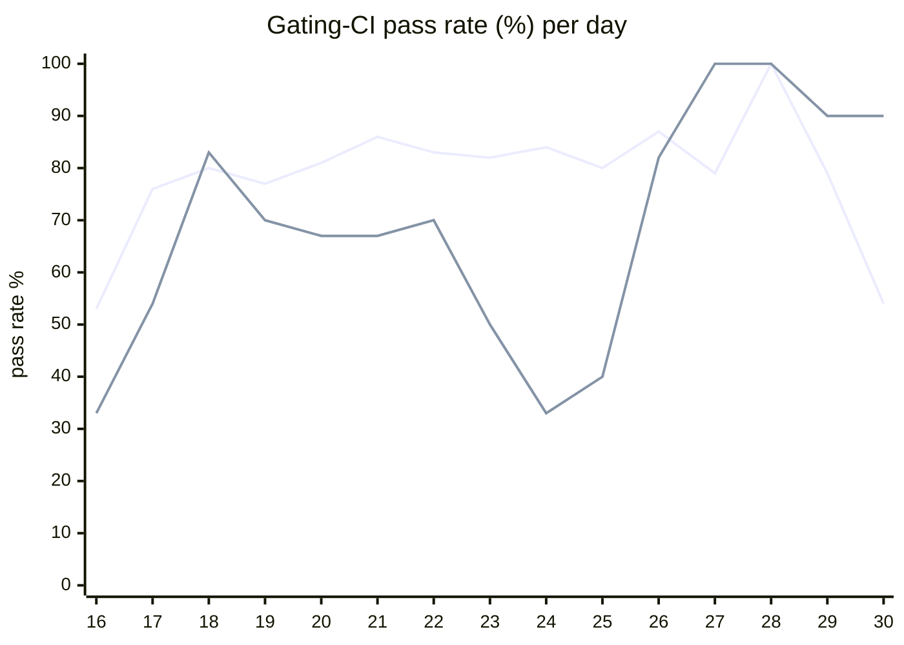

# CI Health Dashboard

_Window: last 14 days (trend + pass rate) · tables: last 24h · updated 2026-06-30T07:06:50Z · auto-generated, do not edit by hand._

**Gating-CI pass rate** — PR: 78% (1229/1571) · main: 67% (68/102)

## Gating-CI pass-rate trend

_X-axis = day of month (Jun 16 → Jun 30). Two lines: **CI** (PR gating-CI runs, generally the upper line) and **main** (post-merge main runs, lower). Y-axis = % of that day's gating-CI runs that passed._

## Top 10 failing jobs (last 24h)

| # | job | workflow | fails | recovered | runs | fail rate | flaky? | scope | cause |
| --- | --- | --- | --- | --- | --- | --- | --- | --- | --- |
| 1 | `integration` | test | 14 | 0 | 32 | 44% | flaky | PR | **product bug** — scheduling concurrency: is_dag_orchestrator NOT NULL constraint violation |
| 2 | `generate` | test | 13 | 0 | 32 | 41% | flaky | PR | **infra/CI** — generate: committed codegen out of sync (git diff after task generate) |
| 3 | `cypress` | frontend / app | 7 | 0 | 22 | 32% | flaky | PR | **flaky test** — Cypress auth/06-tenant-switching: login-with-different-user race/timing flake |
| 4 | `lint` | lint all | 7 | 0 | 37 | 19% | flaky | PR | **infra/CI** — lint all: pre-commit end-of-files hook drift (fix end of files) |
| 5 | `unit` | test | 5 | 0 | 32 | 16% | flaky | PR | **flaky test** — TestMsgIdBufferMemoryLeak intermittently fails under race detector |
| 6 | `test` | python | 4 | 0 | 23 | 17% | flaky | PR | **product bug** — durable sleep/cancel replay: workflow run fails (FailedTaskRunExceptionGroup) |
| 7 | `load-pgbouncer` | test | 4 | 0 | 32 | 12% | flaky | PR | **timeout** — load-pgbouncer load tests exceed time budget (failfast after subtest timeout) |
| 8 | `e2e-pgmq` | test | 4 | 0 | 32 | 12% | flaky | PR | **infra/CI** — e2e-pgmq: Hatchet engine/API not ready within startup timeout |
| 9 | `e2e` | test | 3 | 0 | 32 | 9% | flaky | PR | **infra/CI** — e2e: Hatchet engine/API not ready within startup timeout |
| 10 | `lint` | frontend / app | 2 | 0 | 22 | 9% | flaky | PR | **infra/CI** — frontend/app lint: Prettier formatting drift (TagBadge/TagList imports) |

## Top 10 failing tests (last 24h)

| # | test | job | fails | runs | fail rate | flaky? | scope | cause |
| --- | --- | --- | --- | --- | --- | --- | --- | --- |
| 1 | `(unparsed)` | `generate` | 12 | 32 | 38% | flaky | PR | **infra/CI** — generate: committed codegen out of sync (git diff after task generate) |
| 2 | `examples/durable/test_durable.py::test_durable_sleep_cancel_replay` | `test` | 10 | 23 | 44% | flaky | PR | **product bug** — durable sleep/cancel replay: workflow run fails (FailedTaskRunExceptionGroup) |
| 3 | `examples/bug_tests/payload_bug_on_replay/test_payload_replay_bug.py::test_payload_replay_bug` | `test` | 10 | 23 | 44% | flaky | PR | **product bug** — Durable replay payload bug: workflow run fails on replay (FailedTaskRunExceptionGroup) |
| 4 | `TestConcurrency_GroupRoundRobin` | `integration` | 10 | 32 | 31% | flaky | PR | **product bug** — scheduling concurrency: is_dag_orchestrator NOT NULL constraint violation |
| 5 | `(unparsed)` | `cypress` | 7 | 22 | 32% | flaky | PR | **flaky test** — Cypress auth/06-tenant-switching: login-with-different-user race/timing flake |
| 6 | `(unparsed)` | `lint` | 7 | 37 | 19% | flaky | PR | **infra/CI** — lint all: pre-commit end-of-files hook drift (fix end of files) |
| 7 | `(unparsed)` | `load-pgbouncer` | 4 | 32 | 12% | flaky | PR | **timeout** — load-pgbouncer load tests exceed time budget (failfast after subtest timeout) |
| 8 | `examples/conditions/test_conditions.py::test_waits` | `test` | 3 | 23 | 13% | flaky | PR | **flaky test** — conditions test_waits: non-deterministic random_number vs skipped assertion |
| 9 | `TestLoadCLI` | `load-pgbouncer` | 3 | 32 | 9% | flaky | PR | **timeout** — load-pgbouncer TestLoadCLI parent fails when subtest times out at 400s |
| 10 | `TestLoadCLI/test_with_DAG` | `load-pgbouncer` | 3 | 32 | 9% | flaky | PR | **timeout** — load-pgbouncer TestLoadCLI/test_with_DAG hits 400s test timeout |

## Recent CI-health wins (`ci-health`)

**Recently merged**

- https://github.com/hatchet-dev/hatchet/pull/4239
- https://github.com/hatchet-dev/hatchet/pull/4238
- https://github.com/hatchet-dev/hatchet/pull/4218
- https://github.com/hatchet-dev/hatchet/pull/4213
- https://github.com/hatchet-dev/hatchet/pull/4165

**Open**

_No open `ci-health` PRs yet._

---
_Trend and pass-rate totals cover the last 14 days; job/test tables cover the last 24h._ **fails** = gating runs where the job/test failed · **recovered** = failed on a first attempt but passed on re-run (a flakiness signal) · **runs** = total gating runs of that workflow · **fail rate** = fails ÷ runs · **flaky** = recovered on re-run or intermittent across runs; **deterministic** = fails every time it runs · **scope** = whether failures were seen on PR, main, or main + PR.
