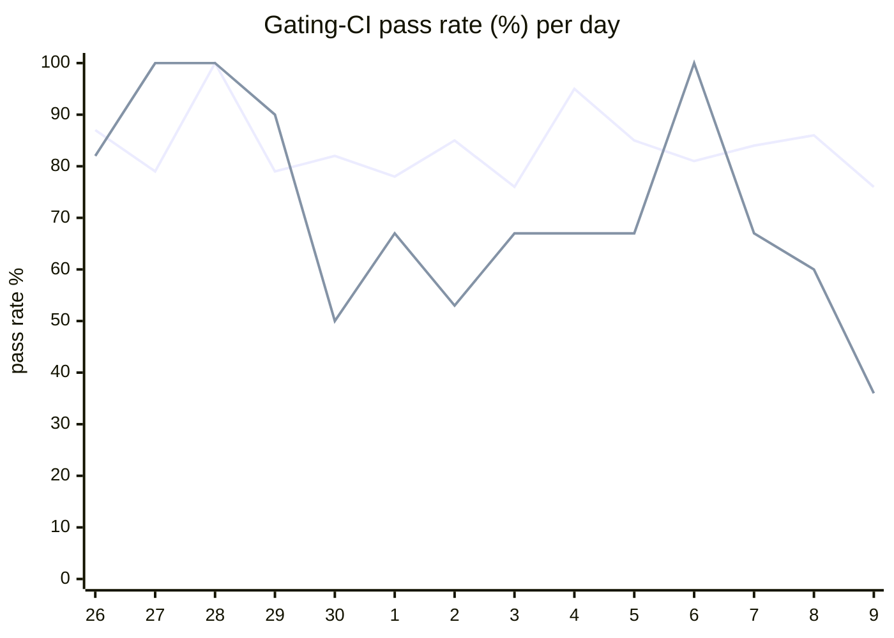

# CI Health Dashboard

_Window: last 14 days (trend + pass rate) · tables: last 24h · updated 2026-07-10T07:08:13Z · auto-generated, do not edit by hand._

**Gating-CI pass rate** — PR: 82% (1780/2171) · main: 64% (77/120)

## Gating-CI pass-rate trend

_X-axis = day of month (Jun 26 → Jul 09). Two lines: **CI** (PR gating-CI runs, generally the upper line) and **main** (post-merge main runs, lower). Y-axis = % of that day's gating-CI runs that passed._

## Top 10 failing jobs (last 24h)

| # | job | workflow | fails | recovered | runs | fail rate | flaky? | scope | cause |
| --- | --- | --- | --- | --- | --- | --- | --- | --- | --- |
| 1 | `e2e` | test | 12 | 0 | 40 | 30% | flaky | main + PR | **timeout** — TestEvictableTaskRestoreCompletes hits 300s task timeout during durable eviction replay |
| 2 | `unit` | test | 10 | 1 | 40 | 25% | flaky | main + PR | **flaky test** — scheduler latency threshold flake: max 2.147s vs 2.1s budget on replenish timeouts |
| 3 | `test-templates` | cli-e2e-tests | 10 | 0 | 13 | 77% | flaky | main + PR | **timeout** — CLI quickstart template E2E suite exceeds time budget (551s) |
| 4 | `e2e-pgmq` | test | 9 | 0 | 40 | 22% | flaky | PR | **timeout** — TestEvictableTaskRestoreCompletes hits 300s task timeout during durable eviction replay |
| 5 | `lint` | lint all | 6 | 0 | 36 | 17% | flaky | PR | **infra/CI** — pre-commit sync-python/typescript-changelog hooks leave unstaged changelog diffs |
| 6 | `generate` | test | 6 | 0 | 40 | 15% | flaky | PR | **infra/CI** — generate check-for-diff: changelog python/typescript.mdx drift after codegen |
| 7 | `rampup` | test | 5 | 0 | 40 | 12% | flaky | main + PR | **product bug** — rbac.yaml lists V1HttpOperatorList missing from specs; test panics on nil authorizer |
| 8 | `old-engine-new-sdk` | typescript | 4 | 0 | 29 | 14% | flaky | PR | **infra/CI** — old-engine-new-sdk docker pull fails: manifest unknown for hatchet-api release image |
| 9 | `old-engine-new-sdk` | python | 4 | 0 | 33 | 12% | flaky | PR | **infra/CI** — old-engine-new-sdk docker pull fails: manifest unknown for hatchet-api release image |
| 10 | `test` | python | 4 | 0 | 33 | 12% | flaky | PR | **flaky test** — test_waits asserts skipped=True but gets random_number from race/timing |

## Top 10 failing tests (last 24h)

| # | test | job | fails | runs | fail rate | flaky? | scope | cause |
| --- | --- | --- | --- | --- | --- | --- | --- | --- |
| 1 | `TestQuickstartTemplates` | `test-templates` | 10 | 13 | 77% | flaky | main + PR | **timeout** — CLI quickstart template E2E suite exceeds time budget (551s) |
| 2 | `TestQuickstartTemplates/go_go` | `test-templates` | 10 | 13 | 77% | flaky | main + PR | **timeout** — CLI quickstart go_go template E2E exceeds ~300s job budget (319s) |
| 3 | `examples/conditions/test_conditions.py::test_waits` | `test` | 7 | 33 | 21% | flaky | PR | **flaky test** — test_waits asserts skipped=True but gets random_number from race/timing |
| 4 | `TestScheduler_TryAssign_NotStarvedByRepeatedReplenishTimeouts` | `unit` | 7 | 40 | 18% | flaky | main + PR | **flaky test** — scheduler latency threshold flake: max 2.147s vs 2.1s budget on replenish timeouts |
| 5 | `(unparsed)` | `lint` | 6 | 36 | 17% | flaky | PR | **infra/CI** — pre-commit sync-python/typescript-changelog hooks leave unstaged changelog diffs |
| 6 | `TestEvictableTaskRestoreCompletes` | `e2e` | 6 | 40 | 15% | flaky | PR | **timeout** — TestEvictableTaskRestoreCompletes hits 300s task timeout during durable eviction replay |
| 7 | `TestEvictableTaskRestoreCompletes` | `e2e-pgmq` | 6 | 40 | 15% | flaky | PR | **timeout** — TestEvictableTaskRestoreCompletes hits 300s task timeout during durable eviction replay |
| 8 | `(unparsed)` | `generate` | 5 | 40 | 12% | flaky | PR | **infra/CI** — generate check-for-diff: changelog python/typescript.mdx drift after codegen |
| 9 | `(unparsed)` | `old-engine-new-sdk` | 4 | 29 | 14% | flaky | PR | **infra/CI** — old-engine-new-sdk docker pull fails: manifest unknown for hatchet-api release image |
| 10 | `(unparsed)` | `old-engine-new-sdk` | 4 | 33 | 12% | flaky | PR | **infra/CI** — old-engine-new-sdk docker pull fails: manifest unknown for hatchet-api release image |

## Recent CI-health wins (`ci-health`)

**Recently merged**

- https://github.com/hatchet-dev/hatchet/pull/4239
- https://github.com/hatchet-dev/hatchet/pull/4238
- https://github.com/hatchet-dev/hatchet/pull/4218
- https://github.com/hatchet-dev/hatchet/pull/4213
- https://github.com/hatchet-dev/hatchet/pull/4165

**Open**

_No open `ci-health` PRs yet._

---
_Trend and pass-rate totals cover the last 14 days; job/test tables cover the last 24h._ **fails** = gating runs where the job/test failed · **recovered** = failed on a first attempt but passed on re-run (a flakiness signal) · **runs** = total gating runs of that workflow · **fail rate** = fails ÷ runs · **flaky** = recovered on re-run or intermittent across runs; **deterministic** = fails every time it runs · **scope** = whether failures were seen on PR, main, or main + PR.
