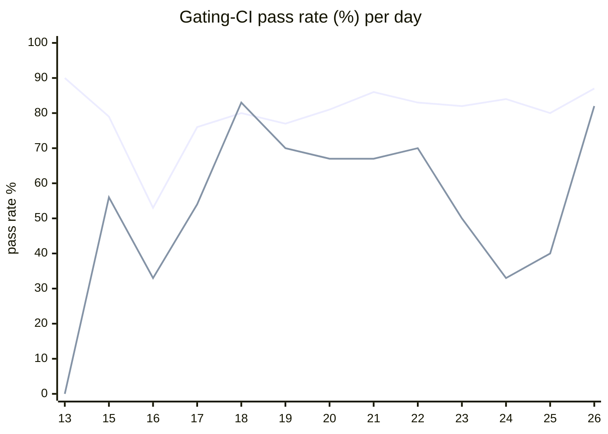

# CI Health Dashboard

_Window: last 14 days (trend + pass rate) · tables: last 24h · updated 2026-06-27T07:08:59Z · auto-generated, do not edit by hand._

**Gating-CI pass rate** — PR: 79% (1304/1648) · main: 61% (76/124)

## Gating-CI pass-rate trend

_X-axis = day of month (Jun 13 → Jun 26). Two lines: **CI** (PR gating-CI runs, generally the upper line) and **main** (post-merge main runs, lower). Y-axis = % of that day's gating-CI runs that passed._

## Top 10 failing jobs (last 24h)

| # | job | workflow | fails | recovered | runs | fail rate | flaky? | scope | cause |
| --- | --- | --- | --- | --- | --- | --- | --- | --- | --- |
| 1 | `generate` | test | 5 | 0 | 24 | 21% | flaky | PR | **infra/CI** — generate job: git diff failed — controller.go codegen not committed |
| 2 | `cypress` | frontend / app | 2 | 0 | 6 | 33% | flaky | PR | **flaky test** — Cypress auth/08-tenant-invite-decline: UI timeout waiting for Decline button |
| 3 | `old-engine-new-sdk` | python | 2 | 0 | 22 | 9% | flaky | PR | **product bug** — Python SDK: offset-naive vs offset-aware datetime comparison in workflow-level concurrency test |
| 4 | `integration` | test | 2 | 0 | 24 | 8% | flaky | PR | **product bug** — Concurrency scheduler: cold strategy manager still leased at pool start when it should be inactive |
| 5 | `test` | python | 1 | 0 | 22 | 4% | flaky | PR | **flaky test** — test_waits: non-deterministic output (random_number vs skipped) in conditions example |
| 6 | `e2e-pgmq` | test | 1 | 0 | 24 | 4% | flaky | PR | **flaky test** — TestMultipleEvictionCycle: second eviction assertion failed (durable e2e timing) |
| 7 | `load-pgbouncer` | test | 1 | 0 | 24 | 4% | flaky | PR | **timeout** — TestLoadCLI subtests exceed 400s budget and perf thresholds in load-pgbouncer CI |
| 8 | `unit` | test | 1 | 0 | 24 | 4% | flaky | PR | **flaky test** — TestMsgIdBufferMemoryLeak: timeout sending message in msgqueue buffer test |

## Top 10 failing tests (last 24h)

| # | test | job | fails | runs | fail rate | flaky? | scope | cause |
| --- | --- | --- | --- | --- | --- | --- | --- | --- |
| 1 | `TestLoadCLI` | `load-pgbouncer` | 6 | 24 | 25% | flaky | main + PR | **timeout** — TestLoadCLI subtests exceed 400s budget and perf thresholds in load-pgbouncer CI |
| 2 | `TestLoadCLI/test_with_DAG` | `load-pgbouncer` | 6 | 24 | 25% | flaky | main + PR | **timeout** — TestLoadCLI/test_with_DAG hit 400s subtest timeout in load-pgbouncer job |
| 3 | `(unparsed)` | `generate` | 5 | 24 | 21% | flaky | PR | **infra/CI** — generate job: git diff failed — controller.go codegen not committed |
| 4 | `(unparsed)` | `cypress` | 2 | 6 | 33% | flaky | PR | **flaky test** — Cypress auth/08-tenant-invite-decline: UI timeout waiting for Decline button |
| 5 | `TestConcurrency_ColdStrategyScheduledPromptly` | `integration` | 2 | 24 | 8% | flaky | PR | **product bug** — Concurrency scheduler: cold strategy manager still leased at pool start when it should be inactive |
| 6 | `examples/concurrency_workflow_level/test_workflow_level_concurrency.py::test_workflow_level_concurrency` | `old-engine-new-sdk` | 1 | 22 | 4% | flaky | PR | **product bug** — Python SDK: offset-naive vs offset-aware datetime comparison in workflow-level concurrency test |
| 7 | `examples/conditions/test_conditions.py::test_waits` | `test` | 1 | 22 | 4% | flaky | PR | **flaky test** — test_waits: non-deterministic output (random_number vs skipped) in conditions example |
| 8 | `(unparsed)` | `lint` | 1 | 22 | 4% | flaky | PR | **infra/CI** — Black safety check: CI Python 3.13 cannot parse code formatted for Python 3.14 |
| 9 | `(unparsed)` | `old-engine-new-sdk` | 1 | 22 | 4% | flaky | PR | **infra/CI** — poetry.lock out of sync with pyproject.toml during dependency install |
| 10 | `(unparsed)` | `test` | 1 | 22 | 4% | flaky | PR | **infra/CI** — poetry install failed: pyproject.toml changed since poetry.lock was generated |

## Recent CI-health wins (`ci-health`)

**Recently merged**

- https://github.com/hatchet-dev/hatchet/pull/4239
- https://github.com/hatchet-dev/hatchet/pull/4238
- https://github.com/hatchet-dev/hatchet/pull/4218
- https://github.com/hatchet-dev/hatchet/pull/4213
- https://github.com/hatchet-dev/hatchet/pull/4165

**Open**

_No open `ci-health` PRs yet._

---
_Trend and pass-rate totals cover the last 14 days; job/test tables cover the last 24h._ **fails** = gating runs where the job/test failed · **recovered** = failed on a first attempt but passed on re-run (a flakiness signal) · **runs** = total gating runs of that workflow · **fail rate** = fails ÷ runs · **flaky** = recovered on re-run or intermittent across runs; **deterministic** = fails every time it runs · **scope** = whether failures were seen on PR, main, or main + PR.
