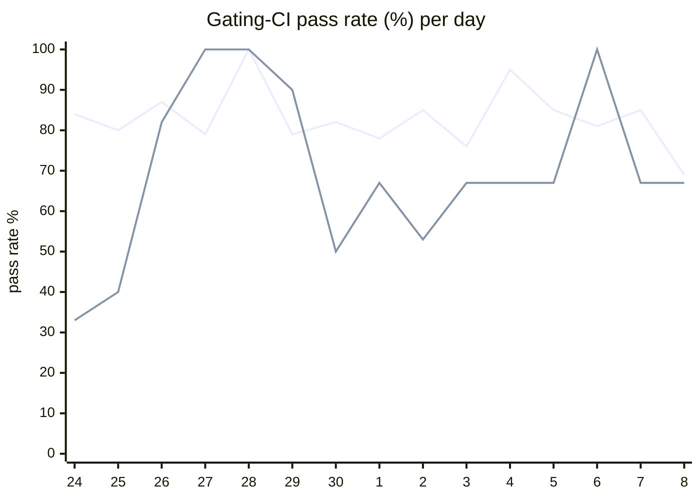

# CI Health Dashboard

_Window: last 14 days (trend + pass rate) · tables: last 24h · updated 2026-07-08T07:07:34Z · auto-generated, do not edit by hand._

**Gating-CI pass rate** — PR: 82% (1692/2060) · main: 66% (65/99)

## Gating-CI pass-rate trend

_X-axis = day of month (Jun 24 → Jul 08). Two lines: **CI** (PR gating-CI runs, generally the upper line) and **main** (post-merge main runs, lower). Y-axis = % of that day's gating-CI runs that passed._

## Top 10 failing jobs (last 24h)

| # | job | workflow | fails | recovered | runs | fail rate | flaky? | scope | cause |
| --- | --- | --- | --- | --- | --- | --- | --- | --- | --- |
| 1 | `generate` | test | 19 | 0 | 42 | 45% | flaky | main + PR | **infra/CI** — generate job check-for-diff: docs/codegen drift (child-spawning.mdx) |
| 2 | `e2e` | test | 8 | 0 | 42 | 19% | flaky | main + PR | **timeout** — e2e TestEvictableTaskRestoreCompletes hits ~300s cap (307s) |
| 3 | `e2e-pgmq` | test | 7 | 0 | 42 | 17% | flaky | PR | **timeout** — e2e-pgmq TestEvictableTaskRestoreCompletes hits ~300s cap (307s) |
| 4 | `test-templates` | cli-e2e-tests | 3 | 0 | 8 | 38% | flaky | PR | **timeout** — CLI quickstart template E2E suite exceeds time budget (517s) |
| 5 | `lint` | frontend / docs | 3 | 0 | 15 | 20% | flaky | PR | **infra/CI** — Frontend docs lint/prettier check failed |
| 6 | `lint` | frontend / app | 2 | 0 | 23 | 9% | flaky | PR | **infra/CI** — Frontend app prettier/eslint import-order drift on PR |
| 7 | `test` | python | 2 | 0 | 37 | 5% | flaky | PR | **product bug** — Durable child key dedup replay fails with FailedTaskRunExceptionGroup |
| 8 | `load` | test | 2 | 0 | 42 | 5% | flaky | PR | **flaky test** — TestFlush_ConcurrentCountsKeepMarkerInvariants race under load tag |
| 9 | `unit` | test | 2 | 0 | 42 | 5% | flaky | PR | **flaky test** — TestMsgIdBufferMemoryLeak intermittently fails under race detector |
| 10 | `rampup` | test | 2 | 0 | 42 | 5% | flaky | main + PR | **flaky test** — TestInterval_RunInterval_WithJitter timing sensitivity in rampup harness |

## Top 10 failing tests (last 24h)

| # | test | job | fails | runs | fail rate | flaky? | scope | cause |
| --- | --- | --- | --- | --- | --- | --- | --- | --- |
| 1 | `(unparsed)` | `generate` | 19 | 42 | 45% | flaky | main + PR | **infra/CI** — generate job check-for-diff: docs/codegen drift (child-spawning.mdx) |
| 2 | `TestEvictableTaskRestoreCompletes` | `e2e-pgmq` | 5 | 42 | 12% | flaky | PR | **timeout** — e2e-pgmq TestEvictableTaskRestoreCompletes hits ~300s cap (307s) |
| 3 | `TestEvictableTaskRestoreCompletes` | `e2e` | 5 | 42 | 12% | flaky | PR | **timeout** — e2e TestEvictableTaskRestoreCompletes hits ~300s cap (307s) |
| 4 | `(unparsed)` | `load-deadlock` | 4 | 42 | 10% | flaky | PR | **unknown** — load-deadlock failure parsed from Comment-on-PR step noise |
| 5 | `TestQuickstartTemplates` | `test-templates` | 3 | 8 | 38% | flaky | PR | **timeout** — CLI quickstart template E2E suite exceeds time budget (517s) |
| 6 | `TestQuickstartTemplates/go_go` | `test-templates` | 3 | 8 | 38% | flaky | PR | **timeout** — CLI quickstart go_go template E2E exceeds ~300s budget (311s) |
| 7 | `(unparsed)` | `lint` | 3 | 15 | 20% | flaky | PR | **infra/CI** — Frontend docs lint/prettier check failed |
| 8 | `examples/durable/test_durable.py::test_durable_child_key_dedup_replay` | `test` | 3 | 37 | 8% | flaky | PR | **product bug** — Durable child key dedup replay fails with FailedTaskRunExceptionGroup |
| 9 | `(unparsed)` | `e2e` | 3 | 42 | 7% | flaky | main + PR | **infra/CI** — e2e job timed out waiting for Hatchet engine/API readiness |
| 10 | `TestMultipleEvictionCycle` | `e2e-pgmq` | 2 | 42 | 5% | flaky | PR | **flaky test** — e2e-pgmq TestMultipleEvictionCycle second eviction race |

## Recent CI-health wins (`ci-health`)

**Recently merged**

- https://github.com/hatchet-dev/hatchet/pull/4239
- https://github.com/hatchet-dev/hatchet/pull/4238
- https://github.com/hatchet-dev/hatchet/pull/4218
- https://github.com/hatchet-dev/hatchet/pull/4213
- https://github.com/hatchet-dev/hatchet/pull/4165

**Open**

_No open `ci-health` PRs yet._

---
_Trend and pass-rate totals cover the last 14 days; job/test tables cover the last 24h._ **fails** = gating runs where the job/test failed · **recovered** = failed on a first attempt but passed on re-run (a flakiness signal) · **runs** = total gating runs of that workflow · **fail rate** = fails ÷ runs · **flaky** = recovered on re-run or intermittent across runs; **deterministic** = fails every time it runs · **scope** = whether failures were seen on PR, main, or main + PR.
