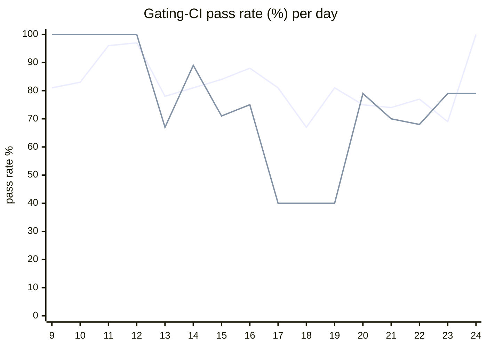

# CI Health Dashboard

_Window: last 14 days (trend + pass rate) · tables: last 24h · updated 2026-07-24T07:08:44Z · auto-generated, do not edit by hand._

**Gating-CI pass rate** — PR: 79% (2169/2746) · main: 75% (111/148)

## Gating-CI pass-rate trend

_X-axis = day of month (Jul 09 → Jul 24). Two lines: **CI** (PR gating-CI runs, generally the upper line) and **main** (post-merge main runs, lower). Y-axis = % of that day's gating-CI runs that passed._

## Top 10 failing jobs (last 24h)

| # | job | workflow | fails | recovered | runs | fail rate | flaky? | scope | cause |
| --- | --- | --- | --- | --- | --- | --- | --- | --- | --- |
| 1 | `compile` | go | 13 | 0 | 31 | 42% | flaky | PR | **product bug** — Go SDK examples compile fails: missing go.sum entry for github.com/doyensec/safeurl |
| 2 | `generate` | test | 11 | 0 | 44 | 25% | flaky | PR | **infra/CI** — Generate check-for-diff: Python examples missing EvictionPolicy import after codegen drift |
| 3 | `integration` | test | 10 | 0 | 44 | 23% | flaky | PR | **product bug** — Scheduling integration: v1_task is_dag_orchestrator NOT NULL constraint violation |
| 4 | `lint` | ruby | 9 | 0 | 30 | 30% | flaky | PR | **infra/CI** — Ruby SDK generated bindings out of date (RuboCop validation fails) |
| 5 | `unit` | test | 6 | 1 | 44 | 14% | flaky | main + PR | **flaky test** — TestMsgIdBufferMemoryLeak fails intermittently in unit job (msgqueue timeout) |
| 6 | `test` | python | 4 | 1 | 30 | 13% | flaky | PR | **flaky test** — Python conditions test_waits assertion mismatch (random_number vs skipped) |
| 7 | `rampup` | test | 5 | 0 | 44 | 11% | flaky | main + PR | **flaky test** — TestMsgIdBufferMemoryLeak fails intermittently in rampup job (msgqueue timeout) |
| 8 | `lint` | frontend / docs | 4 | 0 | 22 | 18% | flaky | PR | **infra/CI** — Frontend docs prettier check failed on pages/self-hosting/configuration-options.mdx |
| 9 | `lint` | typescript | 4 | 0 | 33 | 12% | flaky | PR | **infra/CI** — TypeScript SDK generated bindings out of date (check step throws) |
| 10 | `authdisabled` | build | 4 | 0 | 36 | 11% | flaky | PR | **product bug** — Frontend org-invites TypeScript errors break Docker dashboard build (npm run build exit 2) |

## Top 10 failing tests (last 24h)

| # | test | job | fails | runs | fail rate | flaky? | scope | cause |
| --- | --- | --- | --- | --- | --- | --- | --- | --- |
| 1 | `(unparsed)` | `generate` | 10 | 44 | 23% | flaky | PR | **infra/CI** — Generate check-for-diff: Python examples missing EvictionPolicy import after codegen drift |
| 2 | `examples/conditions/test_conditions.py::test_waits` | `test` | 9 | 30 | 30% | flaky | main + PR | **flaky test** — Python conditions test_waits assertion mismatch (random_number vs skipped) |
| 3 | `(unparsed)` | `compile` | 9 | 31 | 29% | flaky | PR | **product bug** — Go SDK examples compile fails: missing go.sum entry for github.com/doyensec/safeurl |
| 4 | `(unparsed)` | `lint` | 8 | 30 | 27% | flaky | PR | **infra/CI** — Ruby SDK generated bindings out of date (RuboCop validation fails) |
| 5 | `(unparsed)` | `lint` | 8 | 30 | 27% | flaky | PR | **infra/CI** — Python SDK generated bindings out of date (ruff format check fails despite some files passing) |
| 6 | `(unparsed)` | `lint` | 8 | 33 | 24% | flaky | PR | **infra/CI** — TypeScript SDK generated bindings out of date (check step throws) |
| 7 | `TestConcurrency_GroupRoundRobin` | `integration` | 6 | 44 | 14% | flaky | PR | **product bug** — Scheduling integration: v1_task is_dag_orchestrator NOT NULL constraint violation |
| 8 | `(unparsed)` | `lint` | 4 | 22 | 18% | flaky | PR | **infra/CI** — Frontend docs prettier check failed on pages/self-hosting/configuration-options.mdx |
| 9 | `examples/conditions/test_conditions.py::test_cancel_if_user_event` | `test` | 4 | 30 | 13% | flaky | PR | **flaky test** — Python conditions test_cancel_if_user_event: run COMPLETED instead of expected CANCELLED |
| 10 | `(unparsed)` | `compile` | 4 | 31 | 13% | flaky | PR | **product bug** — Go SDK examples compile fails: missing go.sum entry for github.com/nats-io/nats.go |

## Recent CI-health wins (`ci-health`)

**Recently merged**

- https://github.com/hatchet-dev/hatchet/pull/4239
- https://github.com/hatchet-dev/hatchet/pull/4238
- https://github.com/hatchet-dev/hatchet/pull/4218
- https://github.com/hatchet-dev/hatchet/pull/4213
- https://github.com/hatchet-dev/hatchet/pull/4165

**Open**

_No open `ci-health` PRs yet._

---
_Trend and pass-rate totals cover the last 14 days; job/test tables cover the last 24h._ **fails** = gating runs where the job/test failed · **recovered** = failed on a first attempt but passed on re-run (a flakiness signal) · **runs** = total gating runs of that workflow · **fail rate** = fails ÷ runs · **flaky** = recovered on re-run or intermittent across runs; **deterministic** = fails every time it runs · **scope** = whether failures were seen on PR, main, or main + PR.
