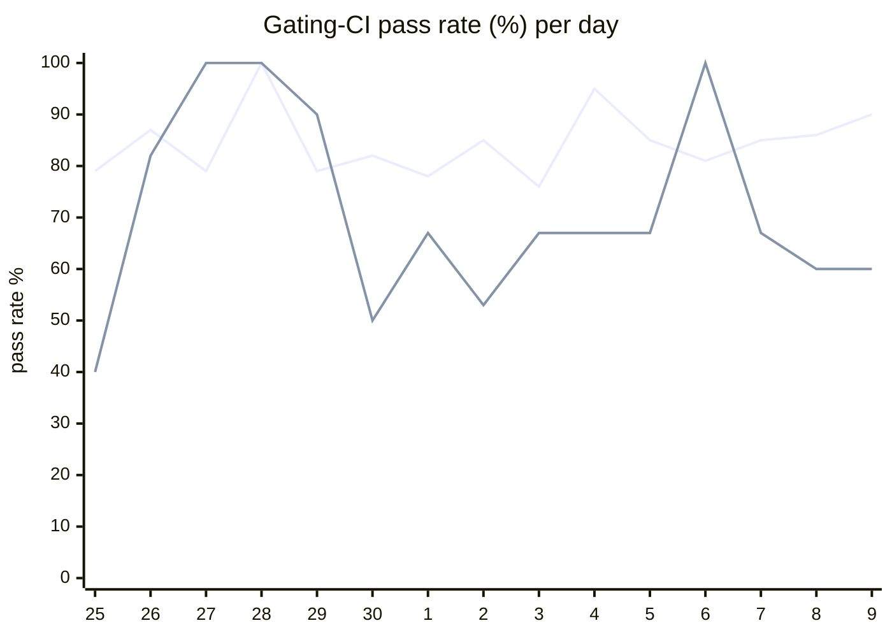

# CI Health Dashboard

_Window: last 14 days (trend + pass rate) · tables: last 24h · updated 2026-07-09T07:06:46Z · auto-generated, do not edit by hand._

**Gating-CI pass rate** — PR: 83% (1748/2113) · main: 66% (76/116)

## Gating-CI pass-rate trend

_X-axis = day of month (Jun 25 → Jul 09). Two lines: **CI** (PR gating-CI runs, generally the upper line) and **main** (post-merge main runs, lower). Y-axis = % of that day's gating-CI runs that passed._

## Top 10 failing jobs (last 24h)

| # | job | workflow | fails | recovered | runs | fail rate | flaky? | scope | cause |
| --- | --- | --- | --- | --- | --- | --- | --- | --- | --- |
| 1 | `test-templates` | cli-e2e-tests | 5 | 0 | 6 | 83% | flaky | main + PR | **timeout** — CLI quickstart template E2E suite exceeded time budget (524s) |
| 2 | `lint` | frontend / app | 5 | 0 | 37 | 14% | flaky | PR | **infra/CI** — Frontend lint: prettier formatting drift on settings nav tabs |
| 3 | `integration` | test | 5 | 0 | 38 | 13% | flaky | PR | **product bug** — Scheduling integration: is_dag_orchestrator NOT NULL constraint on v1_task partition |
| 4 | `test` | python | 4 | 0 | 36 | 11% | flaky | main + PR | **infra/CI** — Python test job: poetry.lock out of sync with pyproject.toml |
| 5 | `old-engine-new-sdk` | python | 4 | 0 | 36 | 11% | flaky | PR | **infra/CI** — Python old-engine-new-sdk: poetry.lock out of sync with pyproject.toml |
| 6 | `generate` | test | 4 | 0 | 38 | 10% | flaky | PR | **infra/CI** — Codegen check-for-diff: generated Python examples differ from committed files |
| 7 | `unit` | test | 4 | 0 | 38 | 10% | flaky | main + PR | **flaky test** — TestMsgIdBufferMemoryLeak intermittently fails under load |
| 8 | `e2e-pgmq` | test | 3 | 0 | 38 | 8% | flaky | main + PR | **flaky test** — TestMultipleEvictionCycle e2e-pgmq eviction timing race |
| 9 | `test` | ruby | 2 | 0 | 11 | 18% | flaky | PR | **data/env** — Ruby integration tests skip when no recent workflow runs exist in test namespace |
| 10 | `old-engine-new-sdk` | ruby | 2 | 0 | 11 | 18% | flaky | PR | **infra/CI** — Ruby examples Gemfile.lock frozen; gemspec changed without lockfile update on old-engine-new-sdk job |

## Top 10 failing tests (last 24h)

| # | test | job | fails | runs | fail rate | flaky? | scope | cause |
| --- | --- | --- | --- | --- | --- | --- | --- | --- |
| 1 | `TestQuickstartTemplates` | `test-templates` | 5 | 6 | 83% | flaky | main + PR | **timeout** — CLI quickstart template E2E suite exceeded time budget (524s) |
| 2 | `TestQuickstartTemplates/go_go` | `test-templates` | 5 | 6 | 83% | flaky | main + PR | **timeout** — CLI quickstart go_go template E2E exceeded ~300s job budget (315s) |
| 3 | `(unparsed)` | `lint` | 5 | 37 | 14% | flaky | PR | **infra/CI** — Frontend lint: prettier formatting drift on settings nav tabs |
| 4 | `(unparsed)` | `generate` | 4 | 38 | 10% | flaky | PR | **infra/CI** — Codegen check-for-diff: generated Python examples differ from committed files |
| 5 | `TestConcurrency_GroupRoundRobin` | `integration` | 4 | 38 | 10% | flaky | PR | **product bug** — Scheduling integration: is_dag_orchestrator NOT NULL constraint on v1_task partition |
| 6 | `(unparsed)` | `test` | 3 | 36 | 8% | flaky | PR | **infra/CI** — Python test job: poetry.lock out of sync with pyproject.toml |
| 7 | `(unparsed)` | `lint` | 3 | 36 | 8% | flaky | PR | **infra/CI** — Python lint: poetry.lock out of sync with pyproject.toml |
| 8 | `(unparsed)` | `old-engine-new-sdk` | 3 | 36 | 8% | flaky | PR | **infra/CI** — Python old-engine-new-sdk: poetry.lock out of sync with pyproject.toml |
| 9 | `TestMultipleEvictionCycle` | `e2e-pgmq` | 3 | 38 | 8% | flaky | main + PR | **flaky test** — TestMultipleEvictionCycle e2e-pgmq eviction timing race |
| 10 | `(unparsed)` | `test` | 2 | 11 | 18% | flaky | PR | **data/env** — Ruby integration tests skip when no recent workflow runs exist in test namespace |

## Recent CI-health wins (`ci-health`)

**Recently merged**

- https://github.com/hatchet-dev/hatchet/pull/4239
- https://github.com/hatchet-dev/hatchet/pull/4238
- https://github.com/hatchet-dev/hatchet/pull/4218
- https://github.com/hatchet-dev/hatchet/pull/4213
- https://github.com/hatchet-dev/hatchet/pull/4165

**Open**

_No open `ci-health` PRs yet._

---
_Trend and pass-rate totals cover the last 14 days; job/test tables cover the last 24h._ **fails** = gating runs where the job/test failed · **recovered** = failed on a first attempt but passed on re-run (a flakiness signal) · **runs** = total gating runs of that workflow · **fail rate** = fails ÷ runs · **flaky** = recovered on re-run or intermittent across runs; **deterministic** = fails every time it runs · **scope** = whether failures were seen on PR, main, or main + PR.
