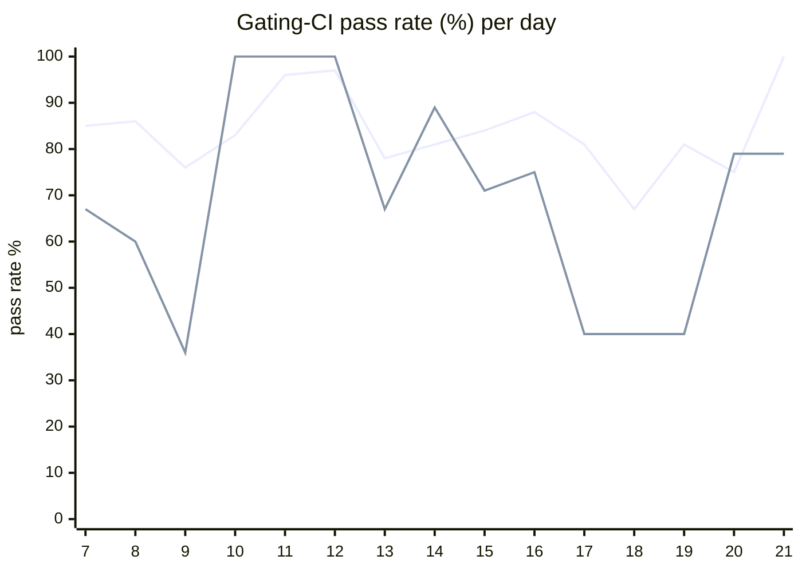

# CI Health Dashboard

_Window: last 14 days (trend + pass rate) · tables: last 24h · updated 2026-07-21T07:07:56Z · auto-generated, do not edit by hand._

**Gating-CI pass rate** — PR: 82% (2236/2741) · main: 69% (97/140)

## Gating-CI pass-rate trend

_X-axis = day of month (Jul 07 → Jul 21). Two lines: **CI** (PR gating-CI runs, generally the upper line) and **main** (post-merge main runs, lower). Y-axis = % of that day's gating-CI runs that passed._

## Top 10 failing jobs (last 24h)

| # | job | workflow | fails | recovered | runs | fail rate | flaky? | scope | cause |
| --- | --- | --- | --- | --- | --- | --- | --- | --- | --- |
| 1 | `lint` | ruby | 11 | 0 | 16 | 69% | flaky | PR | **infra/CI** — Ruby generated protobuf/REST bindings out of date (check-for-diff on sdks/ruby/generate.sh). |
| 2 | `test-templates` | cli-e2e-tests | 9 | 0 | 17 | 53% | flaky | main + PR | **flaky test** — TestQuickstartTemplates fails when simple_go_go subtest is killed (parent aggregate). |
| 3 | `unit` | test | 8 | 0 | 40 | 20% | flaky | PR | **flaky test** — Scheduler unit test NotStarvedByRepeatedReplenishTimeouts timing-sensitive assignment race. |
| 4 | `integration` | test | 7 | 0 | 40 | 18% | flaky | PR | **product bug** — Scheduling integration: v1_task is_dag_orchestrator NOT NULL constraint violation. |
| 5 | `e2e-pgmq` | test | 6 | 0 | 40 | 15% | flaky | PR | **product bug** — e2e-pgmq Generate: dispatcher server_v1.go uuid.UUID vs durableInvocationsKey type mismatch. |
| 6 | `build` | frontend / app | 5 | 0 | 22 | 23% | flaky | PR | **product bug** — Frontend org-invites TypeScript type errors in new-organization-saver-form and related modals. |
| 7 | `frontend` | build | 5 | 0 | 34 | 15% | flaky | PR | **product bug** — Frontend org-invites TypeScript errors fail the Docker frontend build (noisy sample is a passing subtest). |
| 8 | `lite-amd` | build | 5 | 0 | 34 | 15% | flaky | PR | **product bug** — lite-amd image build fails on frontend TypeScript compile; Alpine apk line is log noise. |
| 9 | `lite-arm` | build | 5 | 0 | 34 | 15% | flaky | PR | **product bug** — lite-arm image build fails on frontend TypeScript compile; Alpine apk line is log noise. |
| 10 | `dashboard-amd` | build | 5 | 0 | 34 | 15% | flaky | PR | **product bug** — dashboard-amd image build fails on frontend TypeScript compile; Alpine apk line is log noise. |

## Top 10 failing tests (last 24h)

| # | test | job | fails | runs | fail rate | flaky? | scope | cause |
| --- | --- | --- | --- | --- | --- | --- | --- | --- |
| 1 | `TestQuickstartTemplates` | `test-templates` | 9 | 17 | 53% | flaky | main + PR | **flaky test** — TestQuickstartTemplates fails when simple_go_go subtest is killed (parent aggregate). |
| 2 | `TestQuickstartTemplates/simple_go_go` | `test-templates` | 9 | 17 | 53% | flaky | main + PR | **flaky test** — CLI quickstart simple_go_go: workflow trigger command killed after ~5m (signal: killed). |
| 3 | `examples/conditions/test_conditions.py::test_waits` | `test` | 8 | 35 | 23% | flaky | main + PR | **flaky test** — Python conditions test_waits races on random_number vs skipped assertion. |
| 4 | `(unparsed)` | `build` | 5 | 22 | 23% | flaky | PR | **product bug** — Frontend org-invites TypeScript type errors in new-organization-saver-form and related modals. |
| 5 | `(unparsed)` | `frontend` | 5 | 34 | 15% | flaky | PR | **product bug** — Frontend org-invites TypeScript errors fail the Docker frontend build (noisy sample is a passing subtest). |
| 6 | `(unparsed)` | `lite-amd` | 5 | 34 | 15% | flaky | PR | **product bug** — lite-amd image build fails on frontend TypeScript compile; Alpine apk line is log noise. |
| 7 | `(unparsed)` | `dashboard-amd` | 5 | 34 | 15% | flaky | PR | **product bug** — dashboard-amd image build fails on frontend TypeScript compile; Alpine apk line is log noise. |
| 8 | `(unparsed)` | `dashboard-arm` | 5 | 34 | 15% | flaky | PR | **product bug** — dashboard-arm image build fails on frontend TypeScript compile; Alpine apk line is log noise. |
| 9 | `TestConcurrency_GroupRoundRobin` | `integration` | 5 | 40 | 12% | flaky | PR | **product bug** — Scheduling integration: v1_task is_dag_orchestrator NOT NULL constraint violation. |
| 10 | `(unparsed)` | `lint` | 4 | 16 | 25% | flaky | PR | **infra/CI** — Ruby generated protobuf/REST bindings out of date (check-for-diff on sdks/ruby/generate.sh). |

## Recent CI-health wins (`ci-health`)

**Recently merged**

- https://github.com/hatchet-dev/hatchet/pull/4239
- https://github.com/hatchet-dev/hatchet/pull/4238
- https://github.com/hatchet-dev/hatchet/pull/4218
- https://github.com/hatchet-dev/hatchet/pull/4213
- https://github.com/hatchet-dev/hatchet/pull/4165

**Open**

_No open `ci-health` PRs yet._

---
_Trend and pass-rate totals cover the last 14 days; job/test tables cover the last 24h._ **fails** = gating runs where the job/test failed · **recovered** = failed on a first attempt but passed on re-run (a flakiness signal) · **runs** = total gating runs of that workflow · **fail rate** = fails ÷ runs · **flaky** = recovered on re-run or intermittent across runs; **deterministic** = fails every time it runs · **scope** = whether failures were seen on PR, main, or main + PR.
