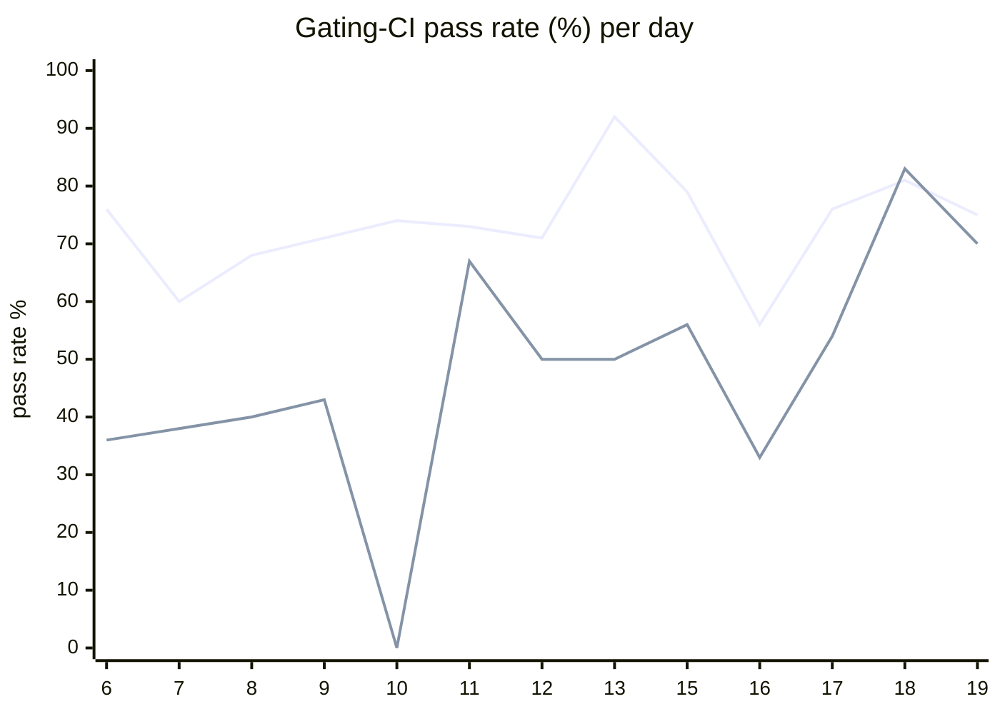

# CI Health Dashboard

_Window: last 14 days (trend + pass rate) · tables: last 24h · updated 2026-06-20T07:09:35Z · auto-generated, do not edit by hand._

**Gating-CI pass rate** — PR: 73% (1211/1665) · main: 51% (85/166)

## Gating-CI pass-rate trend

_X-axis = day of month (Jun 06 → Jun 19). Two lines: **CI** (PR gating-CI runs, generally the upper line) and **main** (post-merge main runs, lower). Y-axis = % of that day's gating-CI runs that passed._

## Top 10 failing jobs (last 24h)

| # | job | workflow | fails | recovered | runs | fail rate | flaky? | scope | cause |
| --- | --- | --- | --- | --- | --- | --- | --- | --- | --- |
| 1 | `e2e-pgmq` | test | 5 | 0 | 17 | 29% | flaky | main + PR | **flaky test** — e2e durable eviction: intermittent 404 polling evicted step runs |
| 2 | `cypress` | frontend / app | 3 | 0 | 5 | 60% | flaky | PR | **flaky test** — Cypress tenant-invite specs timeout on redirect/Decline button |
| 3 | `generate` | test | 3 | 0 | 17 | 18% | flaky | PR | **infra/CI** — task generate output differs from committed tree (git diff --exit-code) |
| 4 | `test` | python | 2 | 0 | 14 | 14% | flaky | PR | **flaky test** — conditions test_waits: random_number output races with skipped branch |
| 5 | `lint` | frontend / docs | 1 | 0 | 4 | 25% | flaky | PR | **unknown** — PR lint: docs MDX files fail prettier --list-different |
| 6 | `lint` | frontend / app | 1 | 0 | 5 | 20% | flaky | PR | **unknown** — PR lint: Prettier quote-style violation in frontend app |
| 7 | `old-engine-new-sdk` | typescript | 1 | 0 | 6 | 17% | flaky | PR | **flaky test** — TS durable e2e: child run status not FAILED before assertion (timing) |
| 8 | `publish` | typescript | 1 | 0 | 6 | 17% | flaky | main | **infra/CI** — typescript publish: dist/ missing when cp package.json runs after build |
| 9 | `load-pgbouncer` | test | 1 | 0 | 17 | 6% | flaky | PR | **flaky test** — TestLoadCLI parent failure from DAG subtest duration threshold flake |
| 10 | `integration` | test | 1 | 0 | 17 | 6% | flaky | PR | **product bug** — scheduling/v1: snapshot still emitted after tenant removed from pool |

## Top 10 failing tests (last 24h)

| # | test | job | fails | runs | fail rate | flaky? | scope | cause |
| --- | --- | --- | --- | --- | --- | --- | --- | --- |
| 1 | `(unparsed)` | `cypress` | 3 | 5 | 60% | flaky | PR | **flaky test** — Cypress tenant-invite specs timeout on redirect/Decline button |
| 2 | `TestLoadCLI` | `load-pgbouncer` | 3 | 17 | 18% | flaky | main + PR | **flaky test** — TestLoadCLI parent failure from DAG subtest duration threshold flake |
| 3 | `TestLoadCLI/test_with_DAG` | `load-pgbouncer` | 3 | 17 | 18% | flaky | main + PR | **flaky test** — load-pgbouncer DAG scenario exceeded avg-duration threshold on shared runner (379ms > 300ms) |
| 4 | `TestMultipleEvictionCycle` | `e2e-pgmq` | 3 | 17 | 18% | flaky | main + PR | **flaky test** — e2e durable eviction: intermittent 404 polling evicted step runs |
| 5 | `(unparsed)` | `generate` | 3 | 17 | 18% | flaky | PR | **infra/CI** — task generate output differs from committed tree (git diff --exit-code) |
| 6 | `examples/conditions/test_conditions.py::test_waits` | `test` | 2 | 14 | 14% | flaky | PR | **flaky test** — conditions test_waits: random_number output races with skipped branch |
| 7 | `(unparsed)` | `lint` | 1 | 4 | 25% | flaky | PR | **unknown** — PR lint: docs MDX files fail prettier --list-different |
| 8 | `(unparsed)` | `lint` | 1 | 5 | 20% | flaky | PR | **unknown** — PR lint: Prettier quote-style violation in frontend app |
| 9 | `durable-e2e › durable parent catches error from failed child run` | `old-engine-new-sdk` | 1 | 6 | 17% | flaky | PR | **flaky test** — TS durable e2e: child run status not FAILED before assertion (timing) |
| 10 | `(unparsed)` | `publish` | 1 | 6 | 17% | flaky | main | **infra/CI** — typescript publish: dist/ missing when cp package.json runs after build |

## Recent CI-health wins (`ci-health`)

**Recently merged**

- https://github.com/hatchet-dev/hatchet/pull/4239
- https://github.com/hatchet-dev/hatchet/pull/4238
- https://github.com/hatchet-dev/hatchet/pull/4218
- https://github.com/hatchet-dev/hatchet/pull/4213
- https://github.com/hatchet-dev/hatchet/pull/4165

**Open**

- https://github.com/hatchet-dev/hatchet/pull/4212

---
_Trend and pass-rate totals cover the last 14 days; job/test tables cover the last 24h._ **fails** = gating runs where the job/test failed · **recovered** = failed on a first attempt but passed on re-run (a flakiness signal) · **runs** = total gating runs of that workflow · **fail rate** = fails ÷ runs · **flaky** = recovered on re-run or intermittent across runs; **deterministic** = fails every time it runs · **scope** = whether failures were seen on PR, main, or main + PR.
