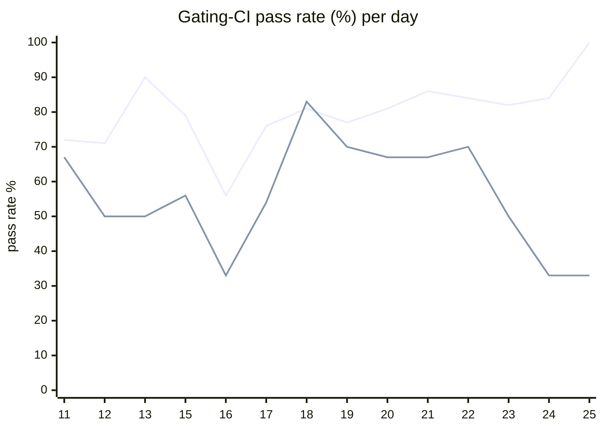

# CI Health Dashboard

_Window: last 14 days (trend + pass rate) · tables: last 24h · updated 2026-06-25T07:07:56Z · auto-generated, do not edit by hand._

**Gating-CI pass rate** — PR: 77% (1442/1883) · main: 60% (78/129)

## Gating-CI pass-rate trend

_X-axis = day of month (Jun 11 → Jun 25). Two lines: **CI** (PR gating-CI runs, generally the upper line) and **main** (post-merge main runs, lower). Y-axis = % of that day's gating-CI runs that passed._

## Top 10 failing jobs (last 24h)

| # | job | workflow | fails | recovered | runs | fail rate | flaky? | scope | cause |
| --- | --- | --- | --- | --- | --- | --- | --- | --- | --- |
| 1 | `integration` | test | 9 | 0 | 34 | 26% | flaky | PR | **product bug** — Scheduling insert omits is_dag_orchestrator NOT NULL column |
| 2 | `e2e-pgmq` | test | 9 | 0 | 34 | 26% | flaky | main + PR | **timeout** — DAG payload e2e-pgmq hits ~300s task timeout waiting for step B payload |
| 3 | `load-pgbouncer` | test | 7 | 0 | 34 | 21% | flaky | main + PR | **timeout** — TestLoadCLI parent fails when load subtest hits 400s budget |
| 4 | `e2e` | test | 6 | 0 | 34 | 18% | flaky | PR | **timeout** — DAG payload e2e hits ~300s task timeout waiting for step B payload |
| 5 | `cypress` | frontend / app | 4 | 0 | 19 | 21% | flaky | PR | **flaky test** — Cypress tenant-invite-decline times out waiting for Decline button |
| 6 | `generate` | test | 4 | 0 | 34 | 12% | flaky | PR | **infra/CI** — Codegen check-for-diff step finds uncommitted generated output |
| 7 | `build` | frontend / app | 2 | 0 | 19 | 10% | flaky | PR | **product bug** — Frontend TS build: typo manuallyadded vs manuallyAdded on TenantMember |
| 8 | `lint` | frontend / app | 2 | 0 | 19 | 10% | flaky | PR | **infra/CI** — Prettier formatting drift in frontend app lint step |
| 9 | `old-engine-new-sdk` | typescript | 2 | 0 | 28 | 7% | flaky | PR | **flaky test** — TypeScript concurrency e2e overlapping-groups assertion intermittently fails |
| 10 | `unit` | test | 2 | 0 | 34 | 6% | flaky | PR | **product bug** — Concurrency heap delete no longer panics on negative index as test expects |

## Top 10 failing tests (last 24h)

| # | test | job | fails | runs | fail rate | flaky? | scope | cause |
| --- | --- | --- | --- | --- | --- | --- | --- | --- |
| 1 | `TestLoadCLI` | `load-pgbouncer` | 12 | 34 | 35% | flaky | main + PR | **timeout** — TestLoadCLI parent fails when load subtest hits 400s budget |
| 2 | `TestLoadCLI/test_with_DAG` | `load-pgbouncer` | 12 | 34 | 35% | flaky | main + PR | **timeout** — Load test DAG subtest exhausts 400s budget on duration threshold check |
| 3 | `TestDAGPayloadFreshRunConcurrent` | `e2e` | 5 | 34 | 15% | flaky | PR | **timeout** — DAG payload e2e hits ~300s task timeout waiting for step B payload |
| 4 | `TestLoadCLI` | `load` | 5 | 34 | 15% | flaky | PR | **timeout** — TestLoadCLI parent fails when load subtest hits 400s budget |
| 5 | `TestLoadCLI/test_with_DAG` | `load` | 5 | 34 | 15% | flaky | PR | **timeout** — Load test DAG subtest exhausts 400s budget on duration threshold check |
| 6 | `TestDAGPayloadFreshRunConcurrent` | `e2e-pgmq` | 5 | 34 | 15% | flaky | PR | **timeout** — DAG payload e2e-pgmq hits ~300s task timeout waiting for step B payload |
| 7 | `TestConcurrency_GroupRoundRobin` | `integration` | 5 | 34 | 15% | flaky | PR | **product bug** — Scheduling insert omits is_dag_orchestrator NOT NULL column |
| 8 | `(unparsed)` | `cypress` | 4 | 19 | 21% | flaky | PR | **flaky test** — Cypress tenant-invite-decline times out waiting for Decline button |
| 9 | `(unparsed)` | `generate` | 4 | 34 | 12% | flaky | PR | **infra/CI** — Codegen check-for-diff step finds uncommitted generated output |
| 10 | `TestScheduler_NotifyQueuesColdStartsTenantManager` | `integration` | 3 | 34 | 9% | flaky | PR | **flaky test** — Scheduler integration test flakes on DB conn closed during teardown |

## Recent CI-health wins (`ci-health`)

**Recently merged**

- https://github.com/hatchet-dev/hatchet/pull/4239
- https://github.com/hatchet-dev/hatchet/pull/4238
- https://github.com/hatchet-dev/hatchet/pull/4218
- https://github.com/hatchet-dev/hatchet/pull/4213
- https://github.com/hatchet-dev/hatchet/pull/4165

**Open**

_No open `ci-health` PRs yet._

---
_Trend and pass-rate totals cover the last 14 days; job/test tables cover the last 24h._ **fails** = gating runs where the job/test failed · **recovered** = failed on a first attempt but passed on re-run (a flakiness signal) · **runs** = total gating runs of that workflow · **fail rate** = fails ÷ runs · **flaky** = recovered on re-run or intermittent across runs; **deterministic** = fails every time it runs · **scope** = whether failures were seen on PR, main, or main + PR.
