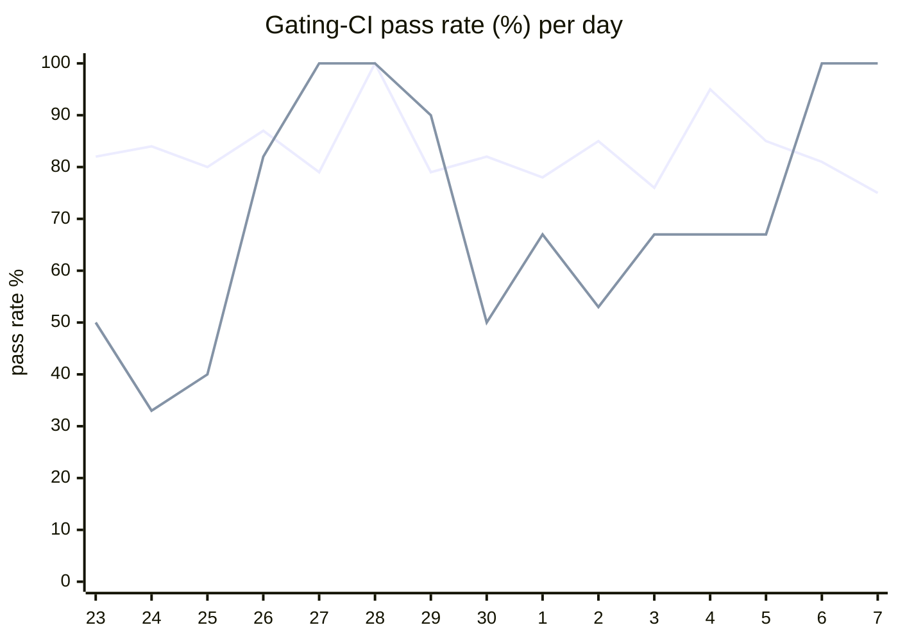

# CI Health Dashboard

_Window: last 14 days (trend + pass rate) · tables: last 24h · updated 2026-07-07T07:08:10Z · auto-generated, do not edit by hand._

**Gating-CI pass rate** — PR: 82% (1631/1991) · main: 65% (58/89)

## Gating-CI pass-rate trend

_X-axis = day of month (Jun 23 → Jul 07). Two lines: **CI** (PR gating-CI runs, generally the upper line) and **main** (post-merge main runs, lower). Y-axis = % of that day's gating-CI runs that passed._

## Top 10 failing jobs (last 24h)

| # | job | workflow | fails | recovered | runs | fail rate | flaky? | scope | cause |
| --- | --- | --- | --- | --- | --- | --- | --- | --- | --- |
| 1 | `generate` | test | 10 | 0 | 33 | 30% | flaky | PR | **infra/CI** — generate Check for diff: codegen drift in examples/python worker files |
| 2 | `integration` | test | 7 | 1 | 33 | 21% | flaky | PR | **product bug** — TestConcurrency_GroupRoundRobin: is_dag_orchestrator NOT NULL constraint on v1_task partition |
| 3 | `test` | python | 6 | 0 | 22 | 27% | flaky | PR | **product bug** — Python durable sleep/cancel/replay test fails with FailedTaskRunExceptionGroup |
| 4 | `old-engine-new-sdk` | python | 5 | 0 | 22 | 23% | flaky | PR | **infra/CI** — old-engine-new-sdk job: poetry.lock drift blocks dependency install |
| 5 | `e2e-pgmq` | test | 5 | 0 | 33 | 15% | flaky | PR | **timeout** — TestEvictableTaskRestoreCompletes hits 300s task timeout in e2e-pgmq |
| 6 | `e2e` | test | 5 | 0 | 33 | 15% | flaky | PR | **timeout** — TestEvictableTaskRestoreCompletes hits 300s task timeout in e2e job |
| 7 | `cypress` | frontend / app | 3 | 0 | 15 | 20% | flaky | PR | **flaky test** — Cypress auth/08-tenant-invite-decline: invite modal does not close after declining |
| 8 | `rampup` | test | 3 | 0 | 33 | 9% | flaky | PR | **flaky test** — Rampup harness TestStartupShutdown: engine rebalance controller exits with context canceled |
| 9 | `unit` | test | 2 | 1 | 33 | 6% | flaky | PR | **product bug** — TestOLAPStatusUpdate_ReplayOfCompletedTask fails on durable replay status handling |
| 10 | `test-templates` | cli-e2e-tests | 2 | 0 | 9 | 22% | flaky | PR | **timeout** — CLI TestQuickstartTemplates exceeds ~526s template E2E budget |

## Top 10 failing tests (last 24h)

| # | test | job | fails | runs | fail rate | flaky? | scope | cause |
| --- | --- | --- | --- | --- | --- | --- | --- | --- |
| 1 | `(unparsed)` | `generate` | 9 | 33 | 27% | flaky | PR | **infra/CI** — generate Check for diff: codegen drift in examples/python worker files |
| 2 | `examples/durable/test_durable.py::test_durable_sleep_cancel_replay` | `test` | 5 | 22 | 23% | flaky | PR | **product bug** — Python durable sleep/cancel/replay test fails with FailedTaskRunExceptionGroup |
| 3 | `examples/bug_tests/payload_bug_on_replay/test_payload_replay_bug.py::test_payload_replay_bug` | `test` | 5 | 22 | 23% | flaky | PR | **product bug** — Python durable replay payload bug test fails with FailedTaskRunExceptionGroup on durable-tasks PRs |
| 4 | `(unparsed)` | `old-engine-new-sdk` | 5 | 22 | 23% | flaky | PR | **infra/CI** — old-engine-new-sdk job: poetry.lock drift blocks dependency install |
| 5 | `(unparsed)` | `lint` | 5 | 22 | 23% | flaky | PR | **infra/CI** — Python lint job: poetry.lock out of sync with pyproject.toml on PR branches |
| 6 | `TestConcurrency_GroupRoundRobin` | `integration` | 5 | 33 | 15% | flaky | PR | **product bug** — TestConcurrency_GroupRoundRobin: is_dag_orchestrator NOT NULL constraint on v1_task partition |
| 7 | `(unparsed)` | `test` | 4 | 22 | 18% | flaky | PR | **infra/CI** — Python test job: poetry.lock out of sync with pyproject.toml |
| 8 | `TestEvictableTaskRestoreCompletes` | `e2e-pgmq` | 4 | 33 | 12% | flaky | PR | **timeout** — TestEvictableTaskRestoreCompletes hits 300s task timeout in e2e-pgmq |
| 9 | `TestEvictableTaskRestoreCompletes` | `e2e` | 4 | 33 | 12% | flaky | PR | **timeout** — TestEvictableTaskRestoreCompletes hits 300s task timeout in e2e job |
| 10 | `TestQuickstartTemplates` | `test-templates` | 2 | 9 | 22% | flaky | PR | **timeout** — CLI TestQuickstartTemplates exceeds ~526s template E2E budget |

## Recent CI-health wins (`ci-health`)

**Recently merged**

- https://github.com/hatchet-dev/hatchet/pull/4239
- https://github.com/hatchet-dev/hatchet/pull/4238
- https://github.com/hatchet-dev/hatchet/pull/4218
- https://github.com/hatchet-dev/hatchet/pull/4213
- https://github.com/hatchet-dev/hatchet/pull/4165

**Open**

_No open `ci-health` PRs yet._

---
_Trend and pass-rate totals cover the last 14 days; job/test tables cover the last 24h._ **fails** = gating runs where the job/test failed · **recovered** = failed on a first attempt but passed on re-run (a flakiness signal) · **runs** = total gating runs of that workflow · **fail rate** = fails ÷ runs · **flaky** = recovered on re-run or intermittent across runs; **deterministic** = fails every time it runs · **scope** = whether failures were seen on PR, main, or main + PR.
