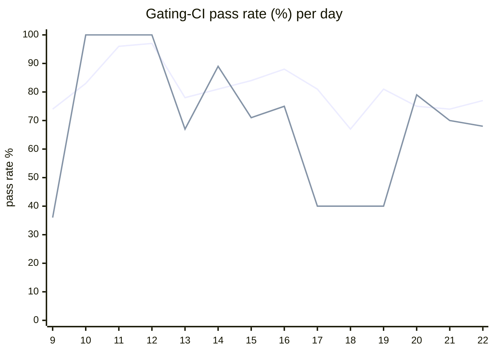

# CI Health Dashboard

_Window: last 14 days (trend + pass rate) · tables: last 24h · updated 2026-07-23T07:06:03Z · auto-generated, do not edit by hand._

**Gating-CI pass rate** — PR: 80% (2148/2698) · main: 71% (101/143)

## Gating-CI pass-rate trend

_X-axis = day of month (Jul 09 → Jul 22). Two lines: **CI** (PR gating-CI runs, generally the upper line) and **main** (post-merge main runs, lower). Y-axis = % of that day's gating-CI runs that passed._

## Top 10 failing jobs (last 24h)

| # | job | workflow | fails | recovered | runs | fail rate | flaky? | scope | cause |
| --- | --- | --- | --- | --- | --- | --- | --- | --- | --- |
| 1 | `lint` | ruby | 9 | 0 | 30 | 30% | flaky | PR | **infra/CI** — Ruby SDK generated bindings out of date |
| 2 | `generate` | test | 8 | 0 | 41 | 20% | flaky | PR | **infra/CI** — generate check-for-diff: uncommitted prettier/format drift in frontend |
| 3 | `integration` | test | 7 | 0 | 41 | 17% | flaky | main + PR | **product bug** — scheduling integration: v1_task is_dag_orchestrator NOT NULL constraint violation |
| 4 | `unit` | test | 6 | 0 | 41 | 15% | flaky | main + PR | **flaky test** — TestMsgIdBufferMemoryLeak intermittent msgqueue timeout under load |
| 5 | `compile` | go | 5 | 0 | 31 | 16% | flaky | PR | **product bug** — Go SDK compile: missing go.sum entry for github.com/doyensec/safeurl after safeclient import |
| 6 | `e2e-pgmq` | test | 5 | 0 | 41 | 12% | flaky | main + PR | **flaky test** — TestMultipleEvictionCycle intermittent poll/404 timing in pgmq e2e |
| 7 | `lint` | typescript | 4 | 0 | 30 | 13% | flaky | PR | **infra/CI** — TypeScript SDK generated bindings out of date |
| 8 | `lint` | lint all | 4 | 0 | 31 | 13% | flaky | PR | **product bug** — golangci-lint: too many arguments to newSharedRepository in olap_status_update_test.go |
| 9 | `test-templates` | cli-e2e-tests | 3 | 0 | 5 | 60% | flaky | main + PR | **flaky test** — TestQuickstartTemplates/simple_go_go workflow trigger killed (CI timeout/OOM) |
| 10 | `e2e` | test | 3 | 0 | 41 | 7% | flaky | main + PR | **flaky test** — TestListenReconnectingStreamHandlesEventsAndStopsOnEOF: condition never satisfied (timing) |

## Top 10 failing tests (last 24h)

| # | test | job | fails | runs | fail rate | flaky? | scope | cause |
| --- | --- | --- | --- | --- | --- | --- | --- | --- |
| 1 | `(unparsed)` | `lint` | 10 | 30 | 33% | flaky | PR | **infra/CI** — TypeScript SDK generated bindings out of date |
| 2 | `(unparsed)` | `lint` | 9 | 30 | 30% | flaky | PR | **infra/CI** — Ruby SDK generated bindings out of date |
| 3 | `(unparsed)` | `lint` | 6 | 30 | 20% | flaky | PR | **infra/CI** — Python SDK generated bindings out of date |
| 4 | `(unparsed)` | `compile` | 5 | 31 | 16% | flaky | PR | **product bug** — Go SDK compile: missing go.sum entry for github.com/doyensec/safeurl after safeclient import |
| 5 | `examples/conditions/test_conditions.py::test_waits` | `test` | 4 | 30 | 13% | flaky | main + PR | **flaky test** — test_waits random_number vs skipped assertion race in conditions example |
| 6 | `(unparsed)` | `generate` | 4 | 41 | 10% | flaky | PR | **infra/CI** — generate check-for-diff: uncommitted prettier/format drift in frontend |
| 7 | `TestMultipleEvictionCycle` | `e2e-pgmq` | 4 | 41 | 10% | flaky | main + PR | **flaky test** — TestMultipleEvictionCycle intermittent poll/404 timing in pgmq e2e |
| 8 | `(unparsed)` | `generate` | 4 | 41 | 10% | flaky | PR | **infra/CI** — generate step: uncommitted format drift in generated frontend files |
| 9 | `TestConcurrency_GroupRoundRobin` | `integration` | 4 | 41 | 10% | flaky | PR | **product bug** — scheduling integration: v1_task is_dag_orchestrator NOT NULL constraint violation |
| 10 | `TestQuickstartTemplates` | `test-templates` | 3 | 5 | 60% | flaky | main + PR | **flaky test** — TestQuickstartTemplates/simple_go_go workflow trigger killed (CI timeout/OOM) |

## Recent CI-health wins (`ci-health`)

**Recently merged**

- https://github.com/hatchet-dev/hatchet/pull/4239
- https://github.com/hatchet-dev/hatchet/pull/4238
- https://github.com/hatchet-dev/hatchet/pull/4218
- https://github.com/hatchet-dev/hatchet/pull/4213
- https://github.com/hatchet-dev/hatchet/pull/4165

**Open**

_No open `ci-health` PRs yet._

---
_Trend and pass-rate totals cover the last 14 days; job/test tables cover the last 24h._ **fails** = gating runs where the job/test failed · **recovered** = failed on a first attempt but passed on re-run (a flakiness signal) · **runs** = total gating runs of that workflow · **fail rate** = fails ÷ runs · **flaky** = recovered on re-run or intermittent across runs; **deterministic** = fails every time it runs · **scope** = whether failures were seen on PR, main, or main + PR.
