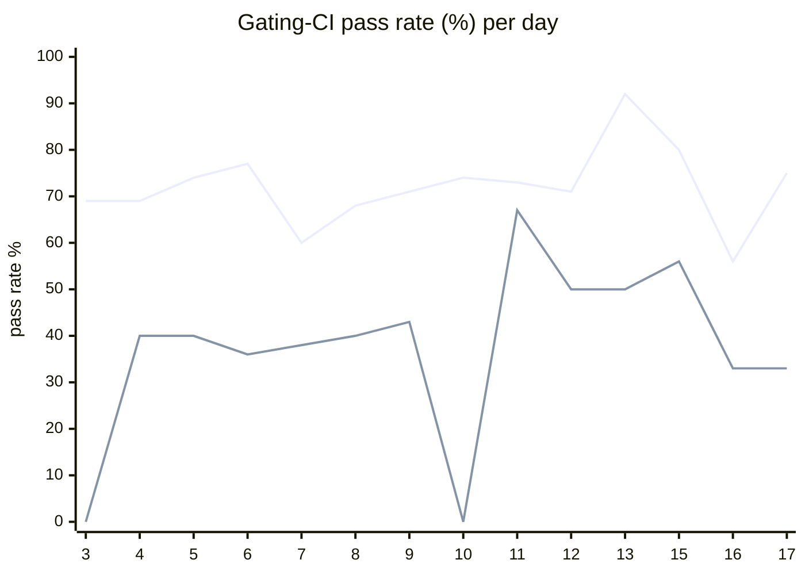

# CI Health Dashboard

_Window: last 14 days (trend + pass rate) · tables: last 24h · updated 2026-06-17T07:08:25Z · auto-generated, do not edit by hand._

**Gating-CI pass rate** — PR: 72% (1335/1861) · main: 44% (65/149)

## Gating-CI pass-rate trend

_X-axis = day of month (Jun 03 → Jun 17). Two lines: **CI** (PR gating-CI runs, generally the upper line) and **main** (post-merge main runs, lower). Y-axis = % of that day's gating-CI runs that passed._

## Top 10 failing jobs (last 24h)

| # | job | workflow | fails | recovered | runs | fail rate | flaky? | scope | cause |
| --- | --- | --- | --- | --- | --- | --- | --- | --- | --- |
| 1 | `e2e` | test | 18 | 0 | 22 | 82% | flaky | main + PR | **infra/CI** — E2E engine/API health check timed out before tests could run |
| 2 | `integration` | test | 18 | 0 | 22 | 82% | flaky | main + PR | **infra/CI** — RabbitMQ rejects x-consumer-timeout queue arg in CI image |
| 3 | `cypress` | frontend / app | 12 | 0 | 12 | 100% | deterministic | PR | **infra/CI** — Cypress job: API on port 8733 not ready (connection refused) |
| 4 | `old-engine-new-sdk` | typescript | 7 | 0 | 18 | 39% | flaky | PR | **product bug** — Durable child run stays RUNNING instead of FAILED in TS e2e |
| 5 | `test` | python | 7 | 0 | 21 | 33% | flaky | PR | **infra/CI** — Python SDK worker failed to start within 25s in CI |
| 6 | `e2e-pgmq` | test | 6 | 0 | 22 | 27% | flaky | PR | **product bug** — Durable child run stays QUEUED instead of FAILED after child task error |
| 7 | `lint` | frontend / docs | 4 | 0 | 12 | 33% | flaky | PR | **infra/CI** — Frontend docs Prettier check found unformatted files |
| 8 | `load-pgbouncer` | test | 4 | 0 | 22 | 18% | flaky | PR | **flaky test** — LoadCLI DAG subtest exceeded 300ms avg duration threshold in CI |
| 9 | `generate` | test | 4 | 0 | 22 | 18% | flaky | PR | **unknown** — Generate check-for-diff step; sample log line is prettier noise only |
| 10 | `lint` | frontend / app | 2 | 0 | 12 | 17% | flaky | PR | **infra/CI** — Frontend app Prettier lint check failed on unformatted MDX |

## Top 10 failing tests (last 24h)

| # | test | job | fails | runs | fail rate | flaky? | scope | cause |
| --- | --- | --- | --- | --- | --- | --- | --- | --- |
| 1 | `examples/concurrency_cancel_newest/test_concurrency_cancel_newest.py::test_run` | `test` | 18 | 21 | 86% | flaky | PR | **infra/CI** — Python SDK worker failed to start within 25s in CI |
| 2 | `examples/concurrency_multiple_keys/test_multiple_concurrency_keys.py::test_multi_concurrency_key` | `test` | 18 | 21 | 86% | flaky | PR | **infra/CI** — Python SDK worker failed to start within 25s in CI |
| 3 | `examples/concurrency_workflow_level/test_workflow_level_concurrency.py::test_workflow_level_concurrency` | `test` | 18 | 21 | 86% | flaky | PR | **infra/CI** — Python SDK worker failed to start within 25s in CI |
| 4 | `examples/durable/test_durable.py::test_durable_spawn_dag` | `test` | 18 | 21 | 86% | flaky | PR | **infra/CI** — Python SDK worker failed to start within 25s in CI |
| 5 | `examples/events/test_event.py::test_filtering_by_event_key` | `test` | 18 | 21 | 86% | flaky | PR | **infra/CI** — Python SDK worker failed to start within 25s in CI |
| 6 | `examples/durable_eviction/test_durable_eviction.py::test_evictable_wait_for_event_restore` | `test` | 18 | 21 | 86% | flaky | PR | **infra/CI** — Python SDK worker failed to start within 25s in CI |
| 7 | `examples/durable/test_durable.py::test_two_event_waits_second_pushed_first` | `test` | 18 | 21 | 86% | flaky | PR | **infra/CI** — Python SDK worker failed to start within 25s in CI |
| 8 | `examples/dependency_injection/test_dependency_injection.py::test_di_workflows` | `test` | 18 | 21 | 86% | flaky | PR | **infra/CI** — Python SDK worker failed to start within 25s in CI |
| 9 | `examples/conditions/test_conditions.py::test_waits` | `test` | 18 | 21 | 86% | flaky | PR | **infra/CI** — Python SDK worker failed to start within 25s in CI |
| 10 | `examples/durable_eviction/test_durable_eviction.py::test_capacity_eviction_restore_completes[on_demand_worker0]` | `test` | 18 | 21 | 86% | flaky | PR | **infra/CI** — Python SDK worker failed to start within 25s in CI |

## Recent CI-health wins (`ci-health`)

**Recently merged**

- https://github.com/hatchet-dev/hatchet/pull/4165
- https://github.com/hatchet-dev/hatchet/pull/4159
- https://github.com/hatchet-dev/hatchet/pull/4156
- https://github.com/hatchet-dev/hatchet/pull/4146
- https://github.com/hatchet-dev/hatchet/pull/4145

**Open**

_No open `ci-health` PRs yet._

---
_Trend and pass-rate totals cover the last 14 days; job/test tables cover the last 24h._ **fails** = gating runs where the job/test failed · **recovered** = failed on a first attempt but passed on re-run (a flakiness signal) · **runs** = total gating runs of that workflow · **fail rate** = fails ÷ runs · **flaky** = recovered on re-run or intermittent across runs; **deterministic** = fails every time it runs · **scope** = whether failures were seen on PR, main, or main + PR.
