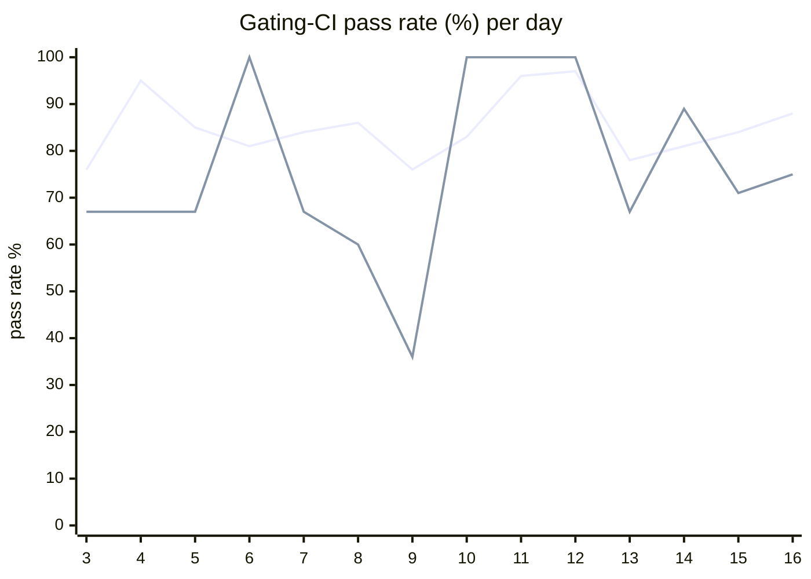

# CI Health Dashboard

_Window: last 14 days (trend + pass rate) · tables: last 24h · updated 2026-07-17T07:14:50Z · auto-generated, do not edit by hand._

**Gating-CI pass rate** — PR: 82% (2125/2577) · main: 71% (88/124)

## Gating-CI pass-rate trend

_X-axis = day of month (Jul 03 → Jul 16). Two lines: **CI** (PR gating-CI runs, generally the upper line) and **main** (post-merge main runs, lower). Y-axis = % of that day's gating-CI runs that passed._

## Top 10 failing jobs (last 24h)

| # | job | workflow | fails | recovered | runs | fail rate | flaky? | scope | cause |
| --- | --- | --- | --- | --- | --- | --- | --- | --- | --- |
| 1 | `generate` | test | 8 | 1 | 39 | 20% | flaky | main + PR | **infra/CI** — generate job Check for diff: prettier/codegen drift |
| 2 | `unit` | test | 6 | 0 | 39 | 15% | flaky | main + PR | **flaky test** — Scheduler latency 2.110s exceeded 2.1s threshold on CI runner |
| 3 | `test` | python | 3 | 0 | 34 | 9% | flaky | PR | **product bug** — Cancel-in-progress task-level ordering: expected cancellation did not occur |
| 4 | `rampup` | test | 3 | 0 | 39 | 8% | flaky | PR | **flaky test** — Analytics flush race: expected count 10000, got 9996 under concurrency |
| 5 | `e2e-pgmq` | test | 2 | 0 | 39 | 5% | flaky | main + PR | **infra/CI** — GitHub API timeout fetching go-task/task refs during Install Task |
| 6 | `lint` | ruby | 1 | 0 | 18 | 6% | flaky | PR | **infra/CI** — RuboCop style offenses on idempotency PR Ruby SDK |
| 7 | `dashboard-amd` | build | 1 | 0 | 32 | 3% | flaky | PR | **unknown** — dashboard-amd job failed but logs expired/unavailable |
| 8 | `load` | test | 1 | 0 | 39 | 3% | flaky | PR | **timeout** — TestStartupShutdown hit 120s job time budget |
| 9 | `lint` | lint all | 1 | 0 | 38 | 3% | flaky | PR | **infra/CI** — pre-commit failed: autogenerated typescript changelog MDX out of sync |
| 10 | `lite-arm` | build | 0 | 1 | 32 | 0% | flaky | - | **unknown** — lite-arm Docker build sample is Alpine apk noise; job recovered on re-run |

## Top 10 failing tests (last 24h)

| # | test | job | fails | runs | fail rate | flaky? | scope | cause |
| --- | --- | --- | --- | --- | --- | --- | --- | --- |
| 1 | `(unparsed)` | `generate` | 7 | 39 | 18% | flaky | main + PR | **infra/CI** — generate job Check for diff: prettier/codegen drift |
| 2 | `examples/concurrency_cancel_in_progress_task_level/test_concurrency_cancel_in_progress_task_level.py::test_run` | `test` | 6 | 34 | 18% | flaky | PR | **product bug** — Cancel-in-progress task-level ordering: expected cancellation did not occur |
| 3 | `examples/events/test_event.py::test_multiple_runs_for_multiple_scope_matches` | `test` | 3 | 34 | 9% | flaky | PR | **infra/CI** — Python SDK worker failed to start within 25s in CI |
| 4 | `examples/events/test_event.py::test_async_event_push` | `test` | 3 | 34 | 9% | flaky | PR | **infra/CI** — Python SDK worker failed to start within 25s in CI |
| 5 | `TestScheduler_TryAssign_NotStarvedByRepeatedReplenishTimeouts` | `unit` | 3 | 39 | 8% | flaky | main + PR | **flaky test** — Scheduler latency 2.110s exceeded 2.1s threshold on CI runner |
| 6 | `examples/conditions/test_conditions.py::test_waits` | `test` | 2 | 34 | 6% | flaky | main + PR | **flaky test** — Conditions test_waits race: task ran instead of being skipped |
| 7 | `examples/cancellation/test_cancellation.py::test_cancellation` | `test` | 2 | 34 | 6% | flaky | PR | **infra/CI** — Python SDK worker failed to start within 25s in CI |
| 8 | `examples/durable/test_durable.py::test_durable_completed_replay` | `test` | 2 | 34 | 6% | flaky | PR | **infra/CI** — Python SDK worker failed to start within 25s in CI |
| 9 | `examples/concurrency_cancel_in_progress/test_concurrency_cancel_in_progress.py::test_run` | `test` | 2 | 34 | 6% | flaky | PR | **infra/CI** — Python SDK worker failed to start within 25s in CI |
| 10 | `examples/concurrency_cancel_newest/test_concurrency_cancel_newest.py::test_run` | `test` | 2 | 34 | 6% | flaky | PR | **infra/CI** — Python SDK worker failed to start within 25s in CI |

## Recent CI-health wins (`ci-health`)

**Recently merged**

- https://github.com/hatchet-dev/hatchet/pull/4239
- https://github.com/hatchet-dev/hatchet/pull/4238
- https://github.com/hatchet-dev/hatchet/pull/4218
- https://github.com/hatchet-dev/hatchet/pull/4213
- https://github.com/hatchet-dev/hatchet/pull/4165

**Open**

_No open `ci-health` PRs yet._

---
_Trend and pass-rate totals cover the last 14 days; job/test tables cover the last 24h._ **fails** = gating runs where the job/test failed · **recovered** = failed on a first attempt but passed on re-run (a flakiness signal) · **runs** = total gating runs of that workflow · **fail rate** = fails ÷ runs · **flaky** = recovered on re-run or intermittent across runs; **deterministic** = fails every time it runs · **scope** = whether failures were seen on PR, main, or main + PR.
