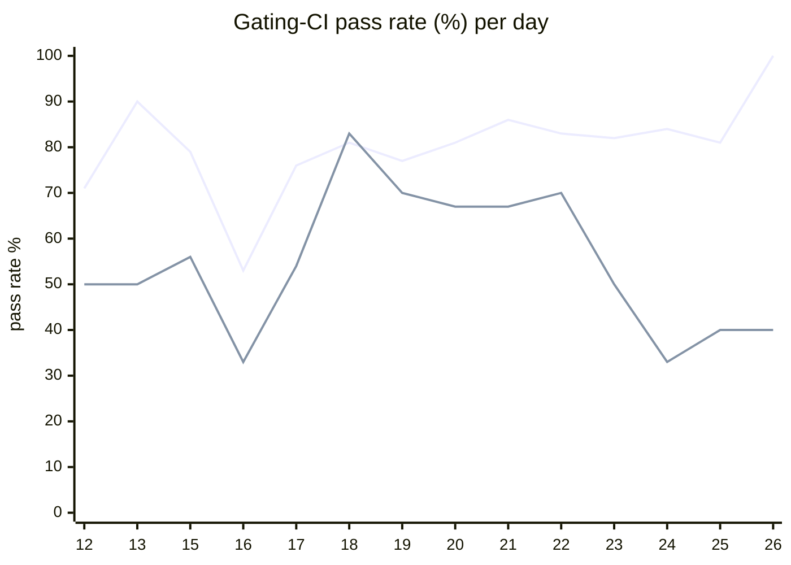

# CI Health Dashboard

_Window: last 14 days (trend + pass rate) · tables: last 24h · updated 2026-06-26T07:06:21Z · auto-generated, do not edit by hand._

**Gating-CI pass rate** — PR: 77% (1469/1902) · main: 58% (76/130)

## Gating-CI pass-rate trend

_X-axis = day of month (Jun 12 → Jun 26). Two lines: **CI** (PR gating-CI runs, generally the upper line) and **main** (post-merge main runs, lower). Y-axis = % of that day's gating-CI runs that passed._

## Top 10 failing jobs (last 24h)

| # | job | workflow | fails | recovered | runs | fail rate | flaky? | scope | cause |
| --- | --- | --- | --- | --- | --- | --- | --- | --- | --- |
| 1 | `generate` | test | 22 | 0 | 40 | 55% | flaky | main + PR | **infra/CI** — generate job typecheck/codegen drift fails check-for-diff |
| 2 | `load-pgbouncer` | test | 11 | 1 | 40 | 28% | flaky | main + PR | **flaky test** — load-pgbouncer TestLoadCLI suite setup/teardown instability |
| 3 | `integration` | test | 10 | 1 | 40 | 25% | flaky | PR | **flaky test** — integration TestConcurrency_GroupRoundRobin ordering flake |
| 4 | `e2e-pgmq` | test | 10 | 0 | 40 | 25% | flaky | PR | **flaky test** — e2e-pgmq TestDAGPayloadFreshRunConcurrent race/timing flake |
| 5 | `e2e` | test | 9 | 1 | 40 | 22% | flaky | PR | **flaky test** — e2e TestDAGPayloadFreshRunConcurrent race/timing flake |
| 6 | `unit` | test | 8 | 0 | 40 | 20% | flaky | main + PR | **flaky test** — TestMsgIdBufferMemoryLeak timing-sensitive unit test |
| 7 | `rampup` | test | 5 | 0 | 40 | 12% | flaky | PR | **flaky test** — rampup cancel-in-progress concurrency timing flake |
| 8 | `cypress` | frontend / app | 4 | 0 | 11 | 36% | flaky | PR | **flaky test** — Cypress auth/08-tenant-invite-decline UI element timeout |
| 9 | `lint` | frontend / app | 4 | 0 | 11 | 36% | flaky | PR | **infra/CI** — ESLint curly-brace rule violations on frontend PRs |
| 10 | `lint` | lint all | 3 | 0 | 39 | 8% | flaky | PR | **infra/CI** — pre-commit hook failures on lint all workflow |

## Top 10 failing tests (last 24h)

| # | test | job | fails | runs | fail rate | flaky? | scope | cause |
| --- | --- | --- | --- | --- | --- | --- | --- | --- |
| 1 | `TestLoadCLI` | `load-pgbouncer` | 20 | 40 | 50% | flaky | main + PR | **flaky test** — load-pgbouncer TestLoadCLI suite setup/teardown instability |
| 2 | `TestLoadCLI/test_with_DAG` | `load-pgbouncer` | 20 | 40 | 50% | flaky | main + PR | **timeout** — TestLoadCLI/test_with_DAG hits 400s job time budget |
| 3 | `(unparsed)` | `generate` | 20 | 40 | 50% | flaky | main + PR | **infra/CI** — generate job typecheck/codegen drift fails check-for-diff |
| 4 | `TestLoadCLI/test_with_rate_limits` | `load-pgbouncer` | 5 | 40 | 12% | flaky | main + PR | **timeout** — TestLoadCLI/test_with_rate_limits hits 400s job time budget |
| 5 | `(unparsed)` | `cypress` | 4 | 11 | 36% | flaky | PR | **flaky test** — Cypress auth/08-tenant-invite-decline UI element timeout |
| 6 | `examples/dependency_injection/test_dependency_injection.py::test_di_workflows` | `test` | 4 | 35 | 11% | flaky | PR | **flaky test** — Python DI example test_di_workflows assertion count mismatch |
| 7 | `examples/concurrency_cancel_newest/test_concurrency_cancel_newest.py::test_run` | `test` | 4 | 35 | 11% | flaky | PR | **flaky test** — Python concurrency_cancel_newest example workflow runs fail intermittently |
| 8 | `examples/fanout/test_fanout.py::test_run` | `test` | 4 | 35 | 11% | flaky | PR | **flaky test** — Python fanout example workflow runs fail intermittently |
| 9 | `examples/durable/test_durable.py::test_dag_spawn_returns_full_output` | `test` | 4 | 35 | 11% | flaky | PR | **flaky test** — Python durable DAG spawn example workflow flake |
| 10 | `examples/fanout/test_fanout.py::test_additional_metadata_propagation` | `test` | 4 | 35 | 11% | flaky | PR | **flaky test** — Python fanout metadata propagation workflow flake |

## Recent CI-health wins (`ci-health`)

**Recently merged**

- https://github.com/hatchet-dev/hatchet/pull/4239
- https://github.com/hatchet-dev/hatchet/pull/4238
- https://github.com/hatchet-dev/hatchet/pull/4218
- https://github.com/hatchet-dev/hatchet/pull/4213
- https://github.com/hatchet-dev/hatchet/pull/4165

**Open**

_No open `ci-health` PRs yet._

---
_Trend and pass-rate totals cover the last 14 days; job/test tables cover the last 24h._ **fails** = gating runs where the job/test failed · **recovered** = failed on a first attempt but passed on re-run (a flakiness signal) · **runs** = total gating runs of that workflow · **fail rate** = fails ÷ runs · **flaky** = recovered on re-run or intermittent across runs; **deterministic** = fails every time it runs · **scope** = whether failures were seen on PR, main, or main + PR.
