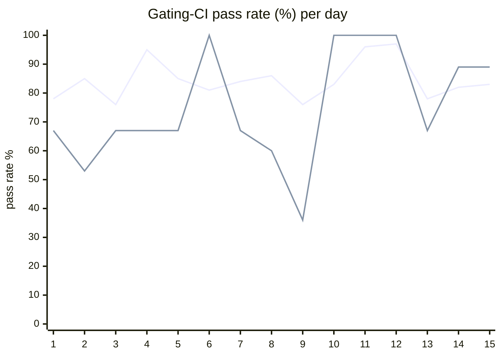

# CI Health Dashboard

_Window: last 14 days (trend + pass rate) · tables: last 24h · updated 2026-07-15T07:09:20Z · auto-generated, do not edit by hand._

**Gating-CI pass rate** — PR: 82% (2087/2549) · main: 68% (76/112)

## Gating-CI pass-rate trend

_X-axis = day of month (Jul 01 → Jul 15). Two lines: **CI** (PR gating-CI runs, generally the upper line) and **main** (post-merge main runs, lower). Y-axis = % of that day's gating-CI runs that passed._

## Top 10 failing jobs (last 24h)

| # | job | workflow | fails | recovered | runs | fail rate | flaky? | scope | cause |
| --- | --- | --- | --- | --- | --- | --- | --- | --- | --- |
| 1 | `unit` | test | 12 | 0 | 54 | 22% | flaky | main + PR | **flaky test** — scheduler latency assertion exceeds 2.1s threshold intermittently on CI (observed 2.19s) |
| 2 | `old-engine-new-sdk` | ruby | 10 | 0 | 19 | 53% | flaky | PR | **infra/CI** — Ruby bundle install fails in frozen mode when gemspecs change without Gemfile.lock update on PR branches |
| 3 | `integration` | test | 7 | 0 | 54 | 13% | flaky | PR | **data/env** — integration test setup uses invalid SERVER_AUTH_COOKIE_SECRETS key size (9 bytes) |
| 4 | `generate` | test | 6 | 0 | 54 | 11% | flaky | PR | **infra/CI** — generate job Check for diff fails: openapi.gen.go drift from idempotency_keys changes |
| 5 | `e2e-pgmq` | test | 6 | 0 | 54 | 11% | flaky | PR | **infra/CI** — e2e-pgmq job times out waiting for Hatchet engine/API readiness |
| 6 | `rampup` | test | 6 | 0 | 54 | 11% | flaky | PR | **product bug** — rampup tests fail to compile: workflow_runs transformer references unknown IdempotencyKey field |
| 7 | `e2e` | test | 6 | 0 | 54 | 11% | flaky | PR | **infra/CI** — e2e job times out waiting for Hatchet engine/API readiness |
| 8 | `cypress` | frontend / app | 5 | 0 | 34 | 15% | flaky | PR | **infra/CI** — Cypress cannot connect to local engine on 127.0.0.1:8733 during startup wait |
| 9 | `load` | test | 5 | 0 | 54 | 9% | flaky | PR | **product bug** — load tests fail to compile: workflow_runs transformer references unknown IdempotencyKey field |
| 10 | `lite-amd` | build | 4 | 0 | 49 | 8% | flaky | PR | **infra/CI** — lite-amd Docker build fails on Alpine apk mirror TLS errors and missing local image |

## Top 10 failing tests (last 24h)

| # | test | job | fails | runs | fail rate | flaky? | scope | cause |
| --- | --- | --- | --- | --- | --- | --- | --- | --- |
| 1 | `(unparsed)` | `old-engine-new-sdk` | 9 | 19 | 47% | flaky | PR | **infra/CI** — Ruby bundle install fails in frozen mode when gemspecs change without Gemfile.lock update on PR branches |
| 2 | `(unparsed)` | `test` | 9 | 19 | 47% | flaky | PR | **infra/CI** — Ruby examples bundle install fails in frozen mode after gemspec changes without lockfile update |
| 3 | `TestScheduler_TryAssign_NotStarvedByRepeatedReplenishTimeouts` | `unit` | 7 | 54 | 13% | flaky | main + PR | **flaky test** — scheduler latency assertion exceeds 2.1s threshold intermittently on CI (observed 2.19s) |
| 4 | `(unparsed)` | `lint` | 6 | 40 | 15% | flaky | PR | **infra/CI** — TypeScript lint fails on prettier formatting drift in generated SDK types |
| 5 | `(unparsed)` | `generate` | 6 | 54 | 11% | flaky | PR | **infra/CI** — generate job Check for diff fails: openapi.gen.go drift from idempotency_keys changes |
| 6 | `(unparsed)` | `cypress` | 5 | 34 | 15% | flaky | PR | **infra/CI** — Cypress cannot connect to local engine on 127.0.0.1:8733 during startup wait |
| 7 | `(unparsed)` | `e2e` | 5 | 54 | 9% | flaky | PR | **infra/CI** — e2e job times out waiting for Hatchet engine/API readiness |
| 8 | `(unparsed)` | `rampup` | 5 | 54 | 9% | flaky | PR | **product bug** — rampup tests fail to compile: workflow_runs transformer references unknown IdempotencyKey field |
| 9 | `(unparsed)` | `load` | 5 | 54 | 9% | flaky | PR | **product bug** — load tests fail to compile: workflow_runs transformer references unknown IdempotencyKey field |
| 10 | `(unparsed)` | `e2e-pgmq` | 5 | 54 | 9% | flaky | PR | **infra/CI** — e2e-pgmq job times out waiting for Hatchet engine/API readiness |

## Recent CI-health wins (`ci-health`)

**Recently merged**

- https://github.com/hatchet-dev/hatchet/pull/4239
- https://github.com/hatchet-dev/hatchet/pull/4238
- https://github.com/hatchet-dev/hatchet/pull/4218
- https://github.com/hatchet-dev/hatchet/pull/4213
- https://github.com/hatchet-dev/hatchet/pull/4165

**Open**

_No open `ci-health` PRs yet._

---
_Trend and pass-rate totals cover the last 14 days; job/test tables cover the last 24h._ **fails** = gating runs where the job/test failed · **recovered** = failed on a first attempt but passed on re-run (a flakiness signal) · **runs** = total gating runs of that workflow · **fail rate** = fails ÷ runs · **flaky** = recovered on re-run or intermittent across runs; **deterministic** = fails every time it runs · **scope** = whether failures were seen on PR, main, or main + PR.
