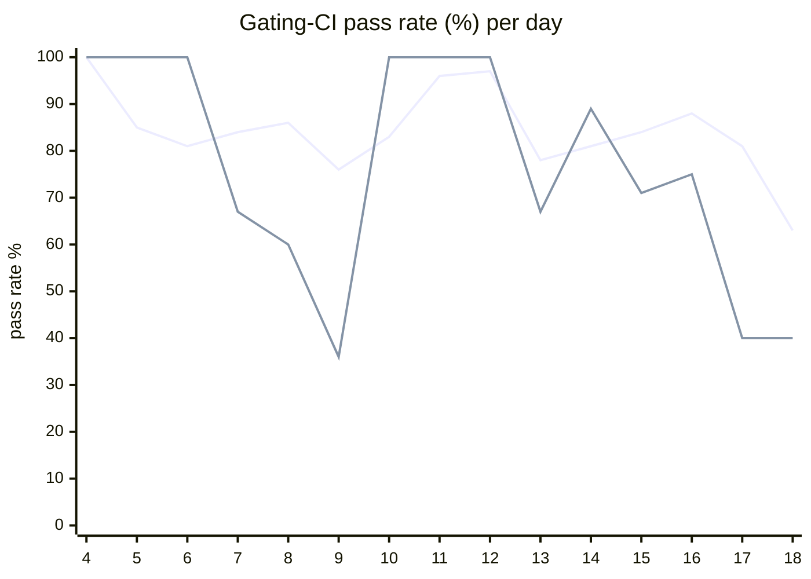

# CI Health Dashboard

_Window: last 14 days (trend + pass rate) · tables: last 24h · updated 2026-07-18T07:07:16Z · auto-generated, do not edit by hand._

**Gating-CI pass rate** — PR: 82% (2180/2646) · main: 70% (88/126)

## Gating-CI pass-rate trend

_X-axis = day of month (Jul 04 → Jul 18). Two lines: **CI** (PR gating-CI runs, generally the upper line) and **main** (post-merge main runs, lower). Y-axis = % of that day's gating-CI runs that passed._

## Top 10 failing jobs (last 24h)

| # | job | workflow | fails | recovered | runs | fail rate | flaky? | scope | cause |
| --- | --- | --- | --- | --- | --- | --- | --- | --- | --- |
| 1 | `unit` | test | 8 | 1 | 32 | 25% | flaky | main + PR | **flaky test** — TestMsgIdBufferMemoryLeak: timeout sending message to msgqueue sub-buffer under CI load |
| 2 | `lite-arm` | build | 7 | 0 | 27 | 26% | flaky | PR | **product bug** — Docker lite-arm build fails on frontend org-invites TypeScript compile errors |
| 3 | `authdisabled` | build | 7 | 0 | 27 | 26% | flaky | PR | **product bug** — Docker authdisabled build fails on frontend org-invites TypeScript compile errors |
| 4 | `dashboard-amd` | build | 7 | 0 | 27 | 26% | flaky | PR | **product bug** — Docker dashboard-amd build fails on frontend org-invites TypeScript compile errors |
| 5 | `dashboard-arm` | build | 7 | 0 | 27 | 26% | flaky | PR | **product bug** — Docker dashboard-arm build fails on frontend org-invites TypeScript compile errors |
| 6 | `lite-amd` | build | 7 | 0 | 27 | 26% | flaky | PR | **product bug** — Docker lite-amd build fails on frontend org-invites TypeScript errors (Alpine apk line is log noise) |
| 7 | `build` | frontend / app | 6 | 0 | 18 | 33% | flaky | PR | **product bug** — Frontend org-invites: control-plane vs cloud Organization type mismatch breaks npm build |
| 8 | `frontend` | build | 6 | 0 | 27 | 22% | flaky | PR | **product bug** — Frontend org-invites TS compile errors fail Docker frontend build (parser noise from passing subtest name) |
| 9 | `integration` | test | 6 | 0 | 32 | 19% | flaky | PR | **product bug** — Scheduling integration: v1_task is_dag_orchestrator NOT NULL constraint violation |
| 10 | `test-templates` | cli-e2e-tests | 5 | 0 | 9 | 56% | flaky | PR | **flaky test** — TestQuickstartTemplates fails when simple_go_go subtest workflow trigger is killed |

## Top 10 failing tests (last 24h)

| # | test | job | fails | runs | fail rate | flaky? | scope | cause |
| --- | --- | --- | --- | --- | --- | --- | --- | --- |
| 1 | `(unparsed)` | `dashboard-amd` | 7 | 27 | 26% | flaky | PR | **product bug** — Docker dashboard-amd build fails on frontend org-invites TypeScript compile errors |
| 2 | `(unparsed)` | `dashboard-arm` | 7 | 27 | 26% | flaky | PR | **product bug** — Docker dashboard-arm build fails on frontend org-invites TypeScript compile errors |
| 3 | `(unparsed)` | `build` | 6 | 18 | 33% | flaky | PR | **product bug** — Frontend org-invites: control-plane vs cloud Organization type mismatch breaks npm build |
| 4 | `(unparsed)` | `frontend` | 6 | 27 | 22% | flaky | PR | **product bug** — Frontend org-invites TS compile errors fail Docker frontend build (parser noise from passing subtest name) |
| 5 | `(unparsed)` | `authdisabled` | 6 | 27 | 22% | flaky | PR | **product bug** — Docker authdisabled build fails on frontend org-invites TypeScript compile errors |
| 6 | `(unparsed)` | `lite-amd` | 6 | 27 | 22% | flaky | PR | **product bug** — Docker lite-amd build fails on frontend org-invites TypeScript errors (Alpine apk line is log noise) |
| 7 | `TestQuickstartTemplates` | `test-templates` | 5 | 9 | 56% | flaky | PR | **flaky test** — TestQuickstartTemplates fails when simple_go_go subtest workflow trigger is killed |
| 8 | `TestQuickstartTemplates/simple_go_go` | `test-templates` | 5 | 9 | 56% | flaky | PR | **flaky test** — CLI quickstart simple_go_go: workflow trigger killed (signal) after ~5min worker heartbeat loop |
| 9 | `examples/run_details/test_run_detail_getter.py::test_run` | `test` | 4 | 24 | 17% | flaky | PR | **flaky test** — Python run_details test_run: expected 2 runs, got empty list (timing/race on py3.14) |
| 10 | `TestConcurrency_GroupRoundRobin` | `integration` | 4 | 32 | 12% | flaky | PR | **product bug** — Scheduling integration: v1_task is_dag_orchestrator NOT NULL constraint violation |

## Recent CI-health wins (`ci-health`)

**Recently merged**

- https://github.com/hatchet-dev/hatchet/pull/4239
- https://github.com/hatchet-dev/hatchet/pull/4238
- https://github.com/hatchet-dev/hatchet/pull/4218
- https://github.com/hatchet-dev/hatchet/pull/4213
- https://github.com/hatchet-dev/hatchet/pull/4165

**Open**

_No open `ci-health` PRs yet._

---
_Trend and pass-rate totals cover the last 14 days; job/test tables cover the last 24h._ **fails** = gating runs where the job/test failed · **recovered** = failed on a first attempt but passed on re-run (a flakiness signal) · **runs** = total gating runs of that workflow · **fail rate** = fails ÷ runs · **flaky** = recovered on re-run or intermittent across runs; **deterministic** = fails every time it runs · **scope** = whether failures were seen on PR, main, or main + PR.
