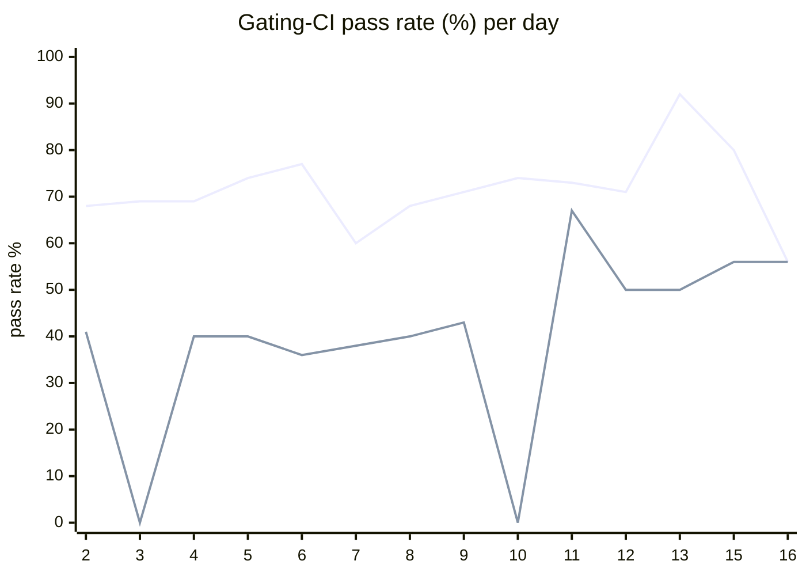

# CI Health Dashboard

_Window: last 14 days (trend + pass rate) · tables: last 24h · updated 2026-06-16T08:48:30Z · auto-generated, do not edit by hand._

**Gating-CI pass rate** — PR: 72% (1529/2128) · main: 44% (71/163)

## Gating-CI pass-rate trend

_X-axis = day of month (Jun 02 → Jun 16). Two lines: **CI** (PR gating-CI runs, generally the upper line) and **main** (post-merge main runs, lower). Y-axis = % of that day's gating-CI runs that passed._

## Top 10 failing jobs (last 24h)

| # | job | workflow | fails | recovered | runs | fail rate | flaky? | scope | cause |
| --- | --- | --- | --- | --- | --- | --- | --- | --- | --- |
| 1 | `e2e-pgmq` | test | 17 | 0 | 48 | 35% | flaky | main + PR | **product bug** — PGMQ e2e TestDurableErrorOnErrorInChild failing deterministically |
| 2 | `e2e` | test | 12 | 2 | 48 | 25% | flaky | main + PR | **product bug** — e2e TestDurableErrorOnErrorInChild failing deterministically |
| 3 | `load-pgbouncer` | test | 8 | 2 | 48 | 17% | flaky | main + PR | **timeout** — TestLoadCLI parent failed after DAG subtest timed out |
| 4 | `old-engine-new-sdk` | typescript | 8 | 0 | 26 | 31% | flaky | main + PR | **product bug** — old-engine-new-sdk durable e2e parent/child error handling failure |
| 5 | `generate` | test | 6 | 0 | 48 | 12% | flaky | main + PR | **infra/CI** — generate job Check for diff caught unstaged codegen output |
| 6 | `cypress` | frontend / app | 5 | 0 | 12 | 42% | flaky | PR | **flaky test** — Cypress frontend e2e tests intermittently fail in PR runs |
| 7 | `old-engine-new-sdk` | python | 4 | 0 | 25 | 16% | flaky | PR | **product bug** — old-engine-new-sdk bulk_replay pytest RetryError |
| 8 | `integration` | test | 4 | 0 | 48 | 8% | flaky | PR | **infra/CI** — RabbitMQ queue declare failed: invalid x-consumer-timeout on classic queue |
| 9 | `test` | python | 3 | 0 | 25 | 12% | flaky | PR | **flaky test** — bulk_replay pytest exhausts tenacity retries waiting for run state |
| 10 | `publish` | typescript | 3 | 0 | 26 | 12% | flaky | main | **infra/CI** — TypeScript publish job missing dist/package.json build output |

## Top 10 failing tests (last 24h)

| # | test | job | fails | runs | fail rate | flaky? | scope | cause |
| --- | --- | --- | --- | --- | --- | --- | --- | --- |
| 1 | `TestDurableErrorOnErrorInChild` | `e2e-pgmq` | 15 | 48 | 31% | flaky | main + PR | **product bug** — PGMQ e2e TestDurableErrorOnErrorInChild failing deterministically |
| 2 | `TestLoadCLI` | `load-pgbouncer` | 8 | 48 | 17% | flaky | main + PR | **timeout** — TestLoadCLI parent failed after DAG subtest timed out |
| 3 | `TestLoadCLI/test_with_DAG` | `load-pgbouncer` | 7 | 48 | 15% | flaky | main + PR | **timeout** — TestLoadCLI/test_with_DAG exceeded 340s CI test budget |
| 4 | `durable-e2e › durable parent catches error from failed child run` | `old-engine-new-sdk` | 6 | 26 | 23% | flaky | main + PR | **product bug** — old-engine-new-sdk durable e2e parent/child error handling failure |
| 5 | `TestDurableErrorOnErrorInChild` | `e2e` | 6 | 48 | 12% | flaky | main + PR | **product bug** — e2e TestDurableErrorOnErrorInChild failing deterministically |
| 6 | `(unparsed)` | `generate` | 6 | 48 | 12% | flaky | main + PR | **infra/CI** — generate job Check for diff caught unstaged codegen output |
| 7 | `(unparsed)` | `load-pgbouncer` | 5 | 48 | 10% | flaky | main + PR | **flaky test** — goleak detected unexpected goroutines in load-pgbouncer load tests |
| 8 | `(unparsed)` | `cypress` | 4 | 12 | 33% | flaky | PR | **flaky test** — Cypress frontend e2e tests intermittently fail in PR runs |
| 9 | `examples/bulk_operations/test_bulk_replay.py::test_bulk_replay` | `test` | 4 | 25 | 16% | flaky | main + PR | **flaky test** — bulk_replay pytest exhausts tenacity retries waiting for run state |
| 10 | `(unparsed)` | `e2e` | 4 | 48 | 8% | flaky | PR | **infra/CI** — e2e engine startup failed (RabbitMQ queue declare / readiness timeout) |

## Recent CI-health wins (`ci-health`)

**Recently merged**

- https://github.com/hatchet-dev/hatchet/pull/4165
- https://github.com/hatchet-dev/hatchet/pull/4159
- https://github.com/hatchet-dev/hatchet/pull/4156
- https://github.com/hatchet-dev/hatchet/pull/4146
- https://github.com/hatchet-dev/hatchet/pull/4145

**Open**

_No open `ci-health` PRs yet._

---
_Trend and pass-rate totals cover the last 14 days; job/test tables cover the last 24h._ **fails** = gating runs where the job/test failed · **recovered** = failed on a first attempt but passed on re-run (a flakiness signal) · **runs** = total gating runs of that workflow · **fail rate** = fails ÷ runs · **flaky** = recovered on re-run or intermittent across runs; **deterministic** = fails every time it runs · **scope** = whether failures were seen on PR, main, or main + PR.
