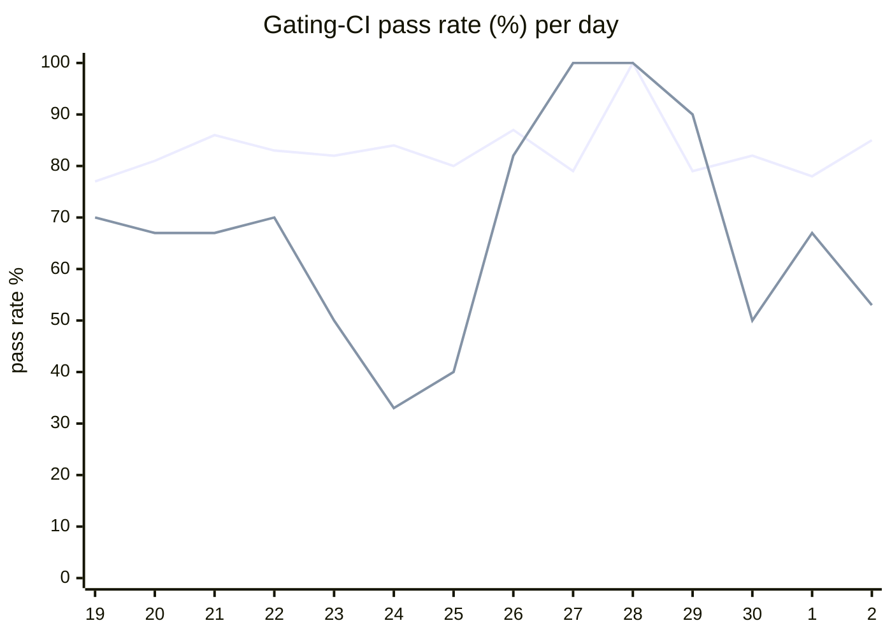

# CI Health Dashboard

_Window: last 14 days (trend + pass rate) · tables: last 24h · updated 2026-07-03T07:07:10Z · auto-generated, do not edit by hand._

**Gating-CI pass rate** — PR: 82% (1518/1849) · main: 64% (76/119)

## Gating-CI pass-rate trend

_X-axis = day of month (Jun 19 → Jul 02). Two lines: **CI** (PR gating-CI runs, generally the upper line) and **main** (post-merge main runs, lower). Y-axis = % of that day's gating-CI runs that passed._

## Top 10 failing jobs (last 24h)

| # | job | workflow | fails | recovered | runs | fail rate | flaky? | scope | cause |
| --- | --- | --- | --- | --- | --- | --- | --- | --- | --- |
| 1 | `load-pgbouncer` | test | 9 | 0 | 43 | 21% | flaky | main + PR | **flaky test** — TestLoadCLI parent fails fast when any load subtest times out in CI |
| 2 | `cypress` | frontend / app | 5 | 0 | 18 | 28% | flaky | PR | **flaky test** — Cypress tenant-invite-acceptance redirect assertion intermittently fails |
| 3 | `unit` | test | 5 | 0 | 43 | 12% | flaky | main + PR | **flaky test** — TestMsgIdBufferMemoryLeak: mq sub-buffer send timeouts under race detector |
| 4 | `old-engine-new-sdk` | python | 4 | 0 | 33 | 12% | flaky | main + PR | **infra/CI** — Python old-engine-new-sdk: poetry.lock out of sync with pyproject.toml |
| 5 | `test-templates` | cli-e2e-tests | 3 | 0 | 7 | 43% | flaky | PR | **timeout** — CLI quickstart go template: workflow trigger killed after 5min wait |
| 6 | `old-engine-new-sdk` | ruby | 3 | 0 | 8 | 38% | flaky | PR | **infra/CI** — Ruby old-engine-new-sdk: bundle install failed exit 16, Gemfile.lock frozen |
| 7 | `integration` | test | 3 | 0 | 43 | 7% | flaky | main + PR | **flaky test** — Concurrency cold-strategy integration: pool start state assertion races with cleanup |
| 8 | `generate` | test | 3 | 0 | 43 | 7% | flaky | PR | **infra/CI** — Generate job: committed codegen/docs output drift on git diff check |
| 9 | `e2e` | test | 2 | 0 | 43 | 5% | flaky | main + PR | **flaky test** — E2E durable eviction: second eviction cycle assertion intermittently fails |
| 10 | `test` | ruby | 1 | 0 | 8 | 12% | flaky | PR | **infra/CI** — Ruby examples job: bundle install failed exit 16 in Set up Ruby step |

## Top 10 failing tests (last 24h)

| # | test | job | fails | runs | fail rate | flaky? | scope | cause |
| --- | --- | --- | --- | --- | --- | --- | --- | --- |
| 1 | `TestLoadCLI` | `load-pgbouncer` | 15 | 43 | 35% | flaky | main + PR | **flaky test** — TestLoadCLI parent fails fast when any load subtest times out in CI |
| 2 | `TestLoadCLI/test_with_DAG` | `load-pgbouncer` | 15 | 43 | 35% | flaky | main + PR | **timeout** — Load CLI test_with_DAG hit 400s subtest timeout under CI load |
| 3 | `TestLoadCLI/test_with_global_concurrency_key` | `load-pgbouncer` | 8 | 43 | 19% | flaky | main + PR | **timeout** — Load CLI test_with_global_concurrency_key hit 400s subtest timeout |
| 4 | `(unparsed)` | `cypress` | 5 | 18 | 28% | flaky | PR | **flaky test** — Cypress tenant-invite-acceptance redirect assertion intermittently fails |
| 5 | `(unparsed)` | `load-pgbouncer` | 5 | 43 | 12% | flaky | main + PR | **timeout** — Load-pgbouncer job: load test suite timing out under CI resource limits |
| 6 | `TestLoadCLI/test_with_rate_limits` | `load-pgbouncer` | 5 | 43 | 12% | flaky | main + PR | **timeout** — Load CLI test_with_rate_limits hit 400s subtest timeout under CI load |
| 7 | `TestLoadCLI/test_simple_workflow` | `load-pgbouncer` | 5 | 43 | 12% | flaky | main + PR | **timeout** — Load CLI test_simple_workflow hit 400s subtest timeout under CI load |
| 8 | `TestLoadCLI/test_with_event_fanout` | `load-pgbouncer` | 5 | 43 | 12% | flaky | main + PR | **timeout** — Load CLI test_with_event_fanout hit 400s subtest timeout under CI load |
| 9 | `TestMsgIdBufferMemoryLeak` | `unit` | 4 | 43 | 9% | flaky | main + PR | **flaky test** — TestMsgIdBufferMemoryLeak: mq sub-buffer send timeouts under race detector |
| 10 | `TestQuickstartTemplates` | `test-templates` | 3 | 7 | 43% | flaky | PR | **timeout** — CLI quickstart go template: workflow trigger killed after 5min wait |

## Recent CI-health wins (`ci-health`)

**Recently merged**

- https://github.com/hatchet-dev/hatchet/pull/4239
- https://github.com/hatchet-dev/hatchet/pull/4238
- https://github.com/hatchet-dev/hatchet/pull/4218
- https://github.com/hatchet-dev/hatchet/pull/4213
- https://github.com/hatchet-dev/hatchet/pull/4165

**Open**

_No open `ci-health` PRs yet._

---
_Trend and pass-rate totals cover the last 14 days; job/test tables cover the last 24h._ **fails** = gating runs where the job/test failed · **recovered** = failed on a first attempt but passed on re-run (a flakiness signal) · **runs** = total gating runs of that workflow · **fail rate** = fails ÷ runs · **flaky** = recovered on re-run or intermittent across runs; **deterministic** = fails every time it runs · **scope** = whether failures were seen on PR, main, or main + PR.
