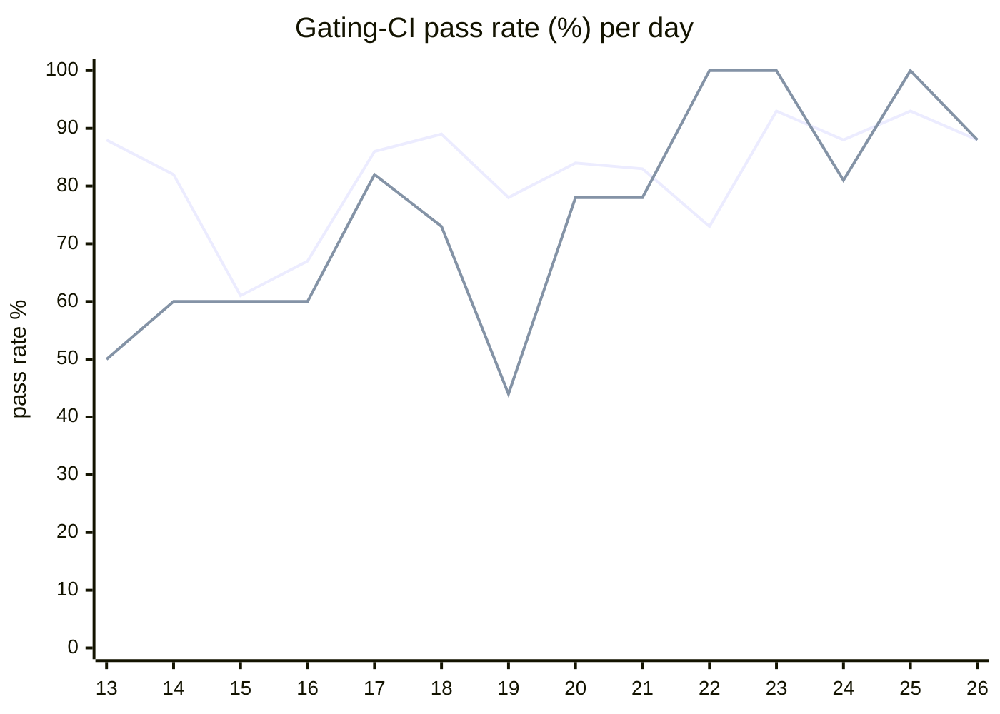

# CI Health Dashboard

_Window: last 14 days (trend + pass rate) · tables: last 24h · updated 2026-08-27T07:10:18Z · auto-generated, do not edit by hand._

**Gating-CI pass rate** — PR: 84% (2082/2476) · main: 73% (101/139)

## Gating-CI pass-rate trend

```mermaid
xychart-beta
  title "Gating-CI pass rate (%) per day"
  x-axis [13, 14, 15, 16, 17, 18, 19, 20, 21, 22, 23, 24, 25, 26]
  y-axis "pass rate %" 0 --> 100
  line "CI" [88, 82, 61, 67, 86, 89, 78, 84, 83, 73, 93, 88, 93, 88]
  line "main" [50, 60, 60, 60, 82, 73, 44, 78, 78, 100, 100, 81, 100, 88]
```

_X-axis = day of month (Aug 13 → Aug 26). Two lines: **CI** (PR gating-CI runs, generally the upper line) and **main** (post-merge main runs, lower). Y-axis = % of that day's gating-CI runs that passed._

## Top 10 failing jobs (last 24h)

| # | job | workflow | fails | recovered | runs | fail rate | flaky? | scope | cause |
| --- | --- | --- | --- | --- | --- | --- | --- | --- | --- |
| 1 | `lint` | frontend / docs | 3 | 0 | 12 | 25% | flaky | PR | **infra/CI** — frontend/docs lint: prettier drift on new flow/flow-animations components (docs-animations PR) |
| 2 | `test` | ruby | 3 | 0 | 22 | 14% | flaky | PR | **flaky test** — Ruby CancelWorkflow: runs.poll timeout after 60s waiting for terminal status |
| 3 | `generate` | test | 3 | 0 | 30 | 10% | flaky | PR | **infra/CI** — test/generate Check for diff: Go examples codegen drift (prettier unchanged lines are noise) |
| 4 | `test` | python | 2 | 0 | 24 | 8% | flaky | PR | **flaky test** — Python non_retryable test_no_retry: retry event count timing race (assert 4 == 3) |
| 5 | `admin` | build | 2 | 0 | 24 | 8% | flaky | PR | **infra/CI** — Docker build admin servers: go module proxy INTERNAL_ERROR fetching pgoutbox |
| 6 | `integration` | test | 2 | 0 | 30 | 7% | flaky | PR | **product bug** — Cold concurrency strategy not scheduled within 2s; on-demand manager not created (new_concurrency_strats) |
| 7 | `test-e2e` | typescript | 1 | 0 | 22 | 4% | flaky | PR | **infra/CI** — hatchet-embedded action fails during engine Go build on embedded-ci PR branch |
| 8 | `loadtest` | build | 1 | 0 | 24 | 4% | flaky | PR | **infra/CI** — Docker build loadtest: go module proxy INTERNAL_ERROR fetching sentry-go |
| 9 | `dashboard-amd` | build | 1 | 0 | 24 | 4% | flaky | PR | **infra/CI** — Docker build dashboard-amd: go module proxy INTERNAL_ERROR (Alpine apk lines are noise) |
| 10 | `migrate` | build | 1 | 0 | 24 | 4% | flaky | PR | **infra/CI** — Docker build migrate image: go module proxy/sumdb INTERNAL_ERROR during oapi-codegen install |

## Top 10 failing tests (last 24h)

| # | test | job | fails | runs | fail rate | flaky? | scope | cause |
| --- | --- | --- | --- | --- | --- | --- | --- | --- |
| 1 | `(unparsed)` | `lint` | 3 | 12 | 25% | flaky | PR | **infra/CI** — frontend/docs lint: prettier drift on new flow/flow-animations components (docs-animations PR) |
| 2 | `examples/bug_tests/payload_bug_on_replay/test_payload_replay_bug.py::test_payload_replay_bug` | `test` | 3 | 24 | 12% | flaky | PR | **product bug** — Python payload replay bug: task stays QUEUED instead of CANCELLED on replay |
| 3 | `examples/non_retryable/test_no_retry.py::test_no_retry` | `test` | 3 | 24 | 12% | flaky | PR | **flaky test** — Python non_retryable test_no_retry: retry event count timing race (assert 4 == 3) |
| 4 | `./cancellation/test_cancellation_spec.rb:7` | `test` | 2 | 22 | 9% | flaky | PR | **flaky test** — Ruby CancelWorkflow: runs.poll timeout after 60s waiting for terminal status |
| 5 | `(unparsed)` | `admin` | 2 | 24 | 8% | flaky | PR | **infra/CI** — Docker build admin servers: go module proxy INTERNAL_ERROR fetching pgoutbox |
| 6 | `(unparsed)` | `test` | 1 | 22 | 4% | flaky | PR | **infra/CI** — hatchet-embedded action fails during engine Go build on embedded-ci PR branch |
| 7 | `(unparsed)` | `test-e2e` | 1 | 22 | 4% | flaky | PR | **infra/CI** — hatchet-embedded action fails during engine Go build on embedded-ci PR branch |
| 8 | `(unparsed)` | `lint` | 1 | 22 | 4% | flaky | PR | **infra/CI** — TypeScript lint: prettier/prettier formatting drift on missedHeartbeats field |
| 9 | `tests/zombie_worker/test_zombie_worker.py::test_zombie_worker[on_demand_worker0]` | `test` | 1 | 24 | 4% | flaky | PR | **flaky test** — Python zombie_worker on_demand_worker: heartbeat timing race (assert None is not None) |
| 10 | `tests/test_rest_api.py::test_list_runs` | `test` | 1 | 24 | 4% | flaky | PR | **flaky test** — Python test_list_runs: tenacity RetryError polling REST API for runs |

## Recent CI-health wins (`ci-health`)

**Recently merged**

- https://github.com/hatchet-dev/hatchet/pull/4239
- https://github.com/hatchet-dev/hatchet/pull/4238
- https://github.com/hatchet-dev/hatchet/pull/4218
- https://github.com/hatchet-dev/hatchet/pull/4213
- https://github.com/hatchet-dev/hatchet/pull/4165

**Open**

_No open `ci-health` PRs yet._

---
_Trend and pass-rate totals cover the last 14 days; job/test tables cover the last 24h._ **fails** = gating runs where the job/test failed · **recovered** = failed on a first attempt but passed on re-run (a flakiness signal) · **runs** = total gating runs of that workflow · **fail rate** = fails ÷ runs · **flaky** = recovered on re-run or intermittent across runs; **deterministic** = fails every time it runs · **scope** = whether failures were seen on PR, main, or main + PR.
