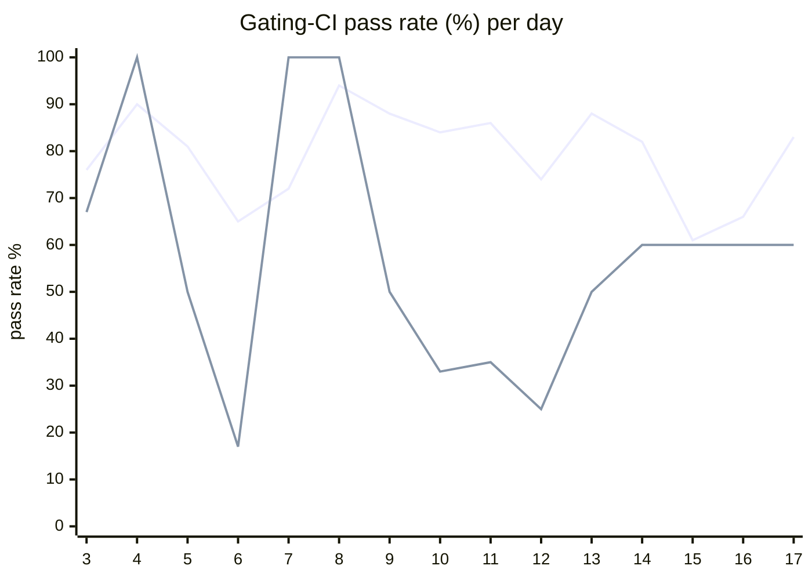

# CI Health Dashboard

_Window: last 14 days (trend + pass rate) · tables: last 24h · updated 2026-08-17T07:07:52Z · auto-generated, do not edit by hand._

**Gating-CI pass rate** — PR: 80% (1527/1913) · main: 48% (42/87)

## Gating-CI pass-rate trend

```mermaid
xychart-beta
  title "Gating-CI pass rate (%) per day"
  x-axis [3, 4, 5, 6, 7, 8, 9, 10, 11, 12, 13, 14, 15, 16, 17]
  y-axis "pass rate %" 0 --> 100
  line "CI" [76, 90, 81, 65, 72, 94, 88, 84, 86, 74, 88, 82, 61, 66, 83]
  line "main" [67, 100, 50, 17, 100, 100, 50, 33, 35, 25, 50, 60, 60, 60, 60]
```

_X-axis = day of month (Aug 03 → Aug 17). Two lines: **CI** (PR gating-CI runs, generally the upper line) and **main** (post-merge main runs, lower). Y-axis = % of that day's gating-CI runs that passed._

## Top 10 failing jobs (last 24h)

| # | job | workflow | fails | recovered | runs | fail rate | flaky? | scope | cause |
| --- | --- | --- | --- | --- | --- | --- | --- | --- | --- |
| 1 | `unit` | test | 5 | 0 | 8 | 62% | flaky | PR | **product bug** — TestGetTaskStats fails on task stats SQL UNION column mismatch |
| 2 | `lint` | ruby | 4 | 0 | 7 | 57% | flaky | PR | **infra/CI** — Ruby SDK generated bindings or rubocop check drift in lint job |
| 3 | `lint` | typescript | 4 | 0 | 8 | 50% | flaky | PR | **infra/CI** — TypeScript generated protobuf/REST bindings out of date (check-for-diff step) |
| 4 | `e2e` | test | 4 | 0 | 8 | 50% | flaky | PR | **infra/CI** — e2e job timed out waiting for Hatchet engine/API readiness |
| 5 | `e2e-pgmq` | test | 4 | 0 | 8 | 50% | flaky | PR | **infra/CI** — e2e-pgmq job timed out waiting for Hatchet engine/API readiness |
| 6 | `test-templates` | cli-e2e-tests | 3 | 0 | 3 | 100% | deterministic | PR | **timeout** — TestQuickstartTemplates exceeded ~733s CLI template E2E budget |
| 7 | `cypress` | frontend / app | 1 | 0 | 6 | 17% | flaky | PR | **flaky test** — Cypress tenant-switcher/onboarding selectors timing out (auth redirect flake) |
| 8 | `build` | frontend / app | 1 | 0 | 6 | 17% | flaky | PR | **product bug** — Frontend TS2339: use-runs.tsx accesses rows on timeout\|V1TaskSummaryList union |
| 9 | `rampup` | test | 1 | 0 | 8 | 12% | flaky | PR | **infra/CI** — TestRampUp: engine connection refused during workflow registration (service not ready) |
| 10 | `engine` | build | 1 | 0 | 10 | 10% | flaky | PR | **infra/CI** — Alpine APK index TLS error during Docker engine build (transient registry/network) |

## Top 10 failing tests (last 24h)

| # | test | job | fails | runs | fail rate | flaky? | scope | cause |
| --- | --- | --- | --- | --- | --- | --- | --- | --- |
| 1 | `(unparsed)` | `lint` | 4 | 7 | 57% | flaky | PR | **infra/CI** — Ruby SDK generated bindings or rubocop check drift in lint job |
| 2 | `(unparsed)` | `lint` | 4 | 8 | 50% | flaky | PR | **infra/CI** — TypeScript generated protobuf/REST bindings out of date (check-for-diff step) |
| 3 | `(unparsed)` | `e2e` | 4 | 8 | 50% | flaky | PR | **infra/CI** — e2e job timed out waiting for Hatchet engine/API readiness |
| 4 | `(unparsed)` | `e2e-pgmq` | 4 | 8 | 50% | flaky | PR | **infra/CI** — e2e-pgmq job timed out waiting for Hatchet engine/API readiness |
| 5 | `TestQuickstartTemplates` | `test-templates` | 3 | 3 | 100% | deterministic | PR | **timeout** — TestQuickstartTemplates exceeded ~733s CLI template E2E budget |
| 6 | `TestQuickstartTemplates/simple_go_go` | `test-templates` | 3 | 3 | 100% | deterministic | PR | **timeout** — TestQuickstartTemplates/simple_go_go exceeded ~321s CLI template E2E budget |
| 7 | `(unparsed)` | `lint` | 2 | 8 | 25% | flaky | PR | **infra/CI** — Python SDK black/format or generated bindings drift in lint check |
| 8 | `TestGetTaskStats` | `unit` | 2 | 8 | 25% | flaky | PR | **product bug** — TestGetTaskStats fails on task stats SQL UNION column mismatch |
| 9 | `TestGetTaskStats/duplicate_strategies_count_one_running_attempt` | `unit` | 2 | 8 | 25% | flaky | PR | **product bug** — TestGetTaskStats SQL UNION column mismatch in task stats repository query |
| 10 | `(unparsed)` | `cypress` | 1 | 6 | 17% | flaky | PR | **flaky test** — Cypress tenant-switcher/onboarding selectors timing out (auth redirect flake) |

## Recent CI-health wins (`ci-health`)

**Recently merged**

- https://github.com/hatchet-dev/hatchet/pull/4239
- https://github.com/hatchet-dev/hatchet/pull/4238
- https://github.com/hatchet-dev/hatchet/pull/4218
- https://github.com/hatchet-dev/hatchet/pull/4213
- https://github.com/hatchet-dev/hatchet/pull/4165

**Open**

_No open `ci-health` PRs yet._

---
_Trend and pass-rate totals cover the last 14 days; job/test tables cover the last 24h._ **fails** = gating runs where the job/test failed · **recovered** = failed on a first attempt but passed on re-run (a flakiness signal) · **runs** = total gating runs of that workflow · **fail rate** = fails ÷ runs · **flaky** = recovered on re-run or intermittent across runs; **deterministic** = fails every time it runs · **scope** = whether failures were seen on PR, main, or main + PR.
