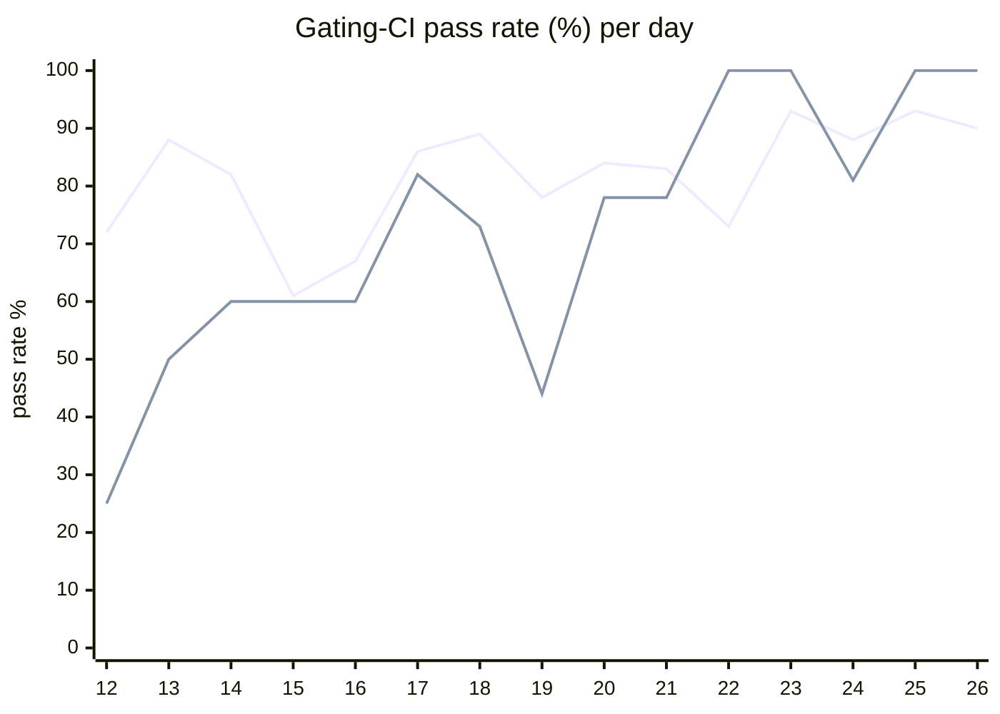

# CI Health Dashboard

_Window: last 14 days (trend + pass rate) · tables: last 24h · updated 2026-08-26T07:07:33Z · auto-generated, do not edit by hand._

**Gating-CI pass rate** — PR: 83% (2055/2479) · main: 70% (95/135)

## Gating-CI pass-rate trend

```mermaid
xychart-beta
  title "Gating-CI pass rate (%) per day"
  x-axis [12, 13, 14, 15, 16, 17, 18, 19, 20, 21, 22, 23, 24, 25, 26]
  y-axis "pass rate %" 0 --> 100
  line "CI" [72, 88, 82, 61, 67, 86, 89, 78, 84, 83, 73, 93, 88, 93, 90]
  line "main" [25, 50, 60, 60, 60, 82, 73, 44, 78, 78, 100, 100, 81, 100, 100]
```

_X-axis = day of month (Aug 12 → Aug 26). Two lines: **CI** (PR gating-CI runs, generally the upper line) and **main** (post-merge main runs, lower). Y-axis = % of that day's gating-CI runs that passed._

## Top 10 failing jobs (last 24h)

| # | job | workflow | fails | recovered | runs | fail rate | flaky? | scope | cause |
| --- | --- | --- | --- | --- | --- | --- | --- | --- | --- |
| 1 | `generate` | test | 9 | 0 | 43 | 21% | flaky | PR | **infra/CI** — test/generate pre-commit or codegen drift during generate-all |
| 2 | `unit` | test | 4 | 1 | 43 | 9% | flaky | PR | **product bug** — pkg/repository unit compile: olap_operator_dag_test out of sync with CreateTaskEvents API |
| 3 | `test` | ruby | 2 | 0 | 30 | 7% | flaky | PR | **flaky test** — Ruby on_failure callback timing (failed_count 0 vs expected 1) |
| 4 | `test` | python | 2 | 0 | 37 | 5% | flaky | PR | **product bug** — Python SDK payload replay leaves task QUEUED instead of CANCELLED |
| 5 | `lint` | lint all | 2 | 0 | 45 | 4% | flaky | PR | **product bug** — golangci-lint: olap_operator_dag_test out of sync with repository API on PR |
| 6 | `test-templates` | cli-e2e-tests | 1 | 0 | 6 | 17% | flaky | - | **timeout** — TestQuickstartTemplates suite exceeds cli-e2e time budget (~772s) |
| 7 | `lint` | typescript | 1 | 0 | 37 | 3% | flaky | PR | **infra/CI** — TypeScript legacy examples use GROUP_ROUND_ROBIN not in generated bindings |
| 8 | `e2e-pgmq` | test | 1 | 0 | 43 | 2% | flaky | PR | **timeout** — TestEvictableTaskRestoreCompletes hits ~306s e2e-pgmq cap |
| 9 | `e2e` | test | 1 | 0 | 43 | 2% | flaky | PR | **timeout** — TestEvictableTaskRestoreCompletes hits ~307s e2e cap |

## Top 10 failing tests (last 24h)

| # | test | job | fails | runs | fail rate | flaky? | scope | cause |
| --- | --- | --- | --- | --- | --- | --- | --- | --- |
| 1 | `(unparsed)` | `generate` | 5 | 43 | 12% | flaky | PR | **infra/CI** — test/generate pre-commit or codegen drift during generate-all |
| 2 | `examples/bug_tests/payload_bug_on_replay/test_payload_replay_bug.py::test_payload_replay_bug` | `test` | 4 | 37 | 11% | flaky | PR | **product bug** — Python SDK payload replay leaves task QUEUED instead of CANCELLED |
| 3 | `(unparsed)` | `generate` | 4 | 43 | 9% | flaky | PR | **infra/CI** — test/generate Check-for-diff codegen or prettier drift |
| 4 | `(unparsed)` | `lint` | 3 | 37 | 8% | flaky | PR | **infra/CI** — TypeScript legacy examples use GROUP_ROUND_ROBIN not in generated bindings |
| 5 | `examples/concurrency_cancel_in_progress/test_concurrency_cancel_in_progress.py::test_run` | `test` | 2 | 37 | 5% | flaky | PR | **flaky test** — Python concurrency cancel_in_progress gRPC race/timing |
| 6 | `examples/concurrency_cancel_newest/test_concurrency_cancel_newest.py::test_run` | `test` | 2 | 37 | 5% | flaky | PR | **flaky test** — Python concurrency cancel_newest gRPC race/timing |
| 7 | `(unparsed)` | `unit` | 2 | 43 | 5% | flaky | PR | **product bug** — pkg/repository unit compile: olap_operator_dag_test out of sync with CreateTaskEvents API |
| 8 | `(unparsed)` | `lint` | 2 | 45 | 4% | flaky | PR | **product bug** — golangci-lint: olap_operator_dag_test out of sync with repository API on PR |
| 9 | `TestQuickstartTemplates` | `test-templates` | 1 | 6 | 17% | flaky | - | **timeout** — TestQuickstartTemplates suite exceeds cli-e2e time budget (~772s) |
| 10 | `TestQuickstartTemplates/simple_go_go` | `test-templates` | 1 | 6 | 17% | flaky | - | **timeout** — TestQuickstartTemplates/simple_go_go exceeds ~300s cli-e2e budget |

## Recent CI-health wins (`ci-health`)

**Recently merged**

- https://github.com/hatchet-dev/hatchet/pull/4239
- https://github.com/hatchet-dev/hatchet/pull/4238
- https://github.com/hatchet-dev/hatchet/pull/4218
- https://github.com/hatchet-dev/hatchet/pull/4213
- https://github.com/hatchet-dev/hatchet/pull/4165

**Open**

_No open `ci-health` PRs yet._

---
_Trend and pass-rate totals cover the last 14 days; job/test tables cover the last 24h._ **fails** = gating runs where the job/test failed · **recovered** = failed on a first attempt but passed on re-run (a flakiness signal) · **runs** = total gating runs of that workflow · **fail rate** = fails ÷ runs · **flaky** = recovered on re-run or intermittent across runs; **deterministic** = fails every time it runs · **scope** = whether failures were seen on PR, main, or main + PR.
