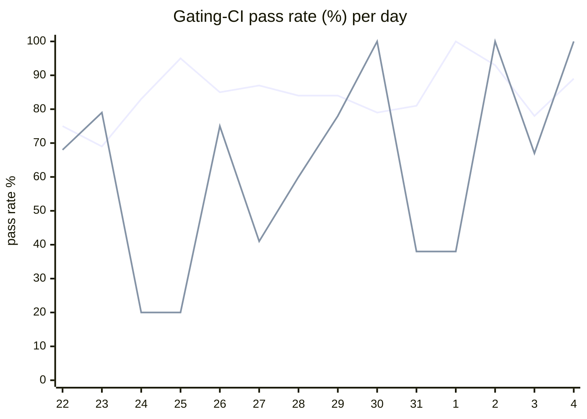

# CI Health Dashboard

_Window: last 14 days (trend + pass rate) · tables: last 24h · updated 2026-08-05T07:05:20Z · auto-generated, do not edit by hand._

**Gating-CI pass rate** — PR: 81% (1818/2239) · main: 66% (85/128)

## Gating-CI pass-rate trend

```mermaid
xychart-beta
  title "Gating-CI pass rate (%) per day"
  x-axis [22, 23, 24, 25, 26, 27, 28, 29, 30, 31, 1, 2, 3, 4]
  y-axis "pass rate %" 0 --> 100
  line "CI" [75, 69, 83, 95, 85, 87, 84, 84, 79, 81, 100, 93, 78, 89]
  line "main" [68, 79, 20, 20, 75, 41, 60, 78, 100, 38, 38, 100, 67, 100]
```

_X-axis = day of month (Jul 22 → Aug 04). Two lines: **CI** (PR gating-CI runs, generally the upper line) and **main** (post-merge main runs, lower). Y-axis = % of that day's gating-CI runs that passed._

## Top 10 failing jobs (last 24h)

| # | job | workflow | fails | recovered | runs | fail rate | flaky? | scope | cause |
| --- | --- | --- | --- | --- | --- | --- | --- | --- | --- |
| 1 | `load` | test | 5 | 0 | 35 | 14% | flaky | PR | **timeout** — TestLoadCLI parent test failed after subtest timeouts |
| 2 | `loadtest-arm` | build | 4 | 0 | 33 | 12% | flaky | PR | **product bug** — loadtest Docker build: missing cmd/hatchet-loadtest/eventkeys module |
| 3 | `loadtest` | build | 4 | 0 | 33 | 12% | flaky | PR | **product bug** — loadtest Docker build: missing cmd/hatchet-loadtest/eventkeys module |
| 4 | `lint` | frontend / docs | 1 | 0 | 8 | 12% | flaky | PR | **infra/CI** — Docs prettier: prometheus-metrics.mdx not formatted |
| 5 | `lint` | ruby | 1 | 0 | 24 | 4% | flaky | PR | **infra/CI** — Ruby generated bindings out of date vs source |
| 6 | `e2e-pgmq` | test | 1 | 0 | 35 | 3% | flaky | PR | **flaky test** — TestMultipleEvictionCycle intermittent in e2e-pgmq |
| 7 | `generate` | test | 1 | 0 | 35 | 3% | flaky | PR | **infra/CI** — Prettier check-for-diff failed on generated frontend files |
| 8 | `integration` | test | 1 | 0 | 35 | 3% | flaky | PR | **product bug** — Go compile: v1 and v1alpha package clash in pkg/scheduling/v1alpha |

## Top 10 failing tests (last 24h)

| # | test | job | fails | runs | fail rate | flaky? | scope | cause |
| --- | --- | --- | --- | --- | --- | --- | --- | --- |
| 1 | `TestLoadCLI` | `load` | 8 | 35 | 23% | flaky | PR | **timeout** — TestLoadCLI parent test failed after subtest timeouts |
| 2 | `TestLoadCLI/test_with_DAG` | `load` | 8 | 35 | 23% | flaky | PR | **timeout** — TestLoadCLI/test_with_DAG exceeded load test time budget |
| 3 | `TestLoadCLI/test_simple_workflow` | `load` | 6 | 35 | 17% | flaky | PR | **timeout** — TestLoadCLI/test_simple_workflow hit 60s subtest timeout |
| 4 | `TestLoadCLI/test_with_rate_limits` | `load` | 6 | 35 | 17% | flaky | PR | **timeout** — TestLoadCLI/test_with_rate_limits hit 60s subtest timeout |
| 5 | `TestLoadCLI/test_with_event_fanout` | `load` | 6 | 35 | 17% | flaky | PR | **timeout** — TestLoadCLI/event_fanout hit 60s subtest timeout |
| 6 | `TestLoadCLI/test_for_many_queued_events_and_little_worker_throughput` | `load` | 6 | 35 | 17% | flaky | PR | **timeout** — TestLoadCLI throughput subtest hit 60s timeout |
| 7 | `TestLoadCLI/test_with_global_concurrency_key` | `load` | 6 | 35 | 17% | flaky | PR | **timeout** — TestLoadCLI concurrency subtest hit 60s timeout |
| 8 | `(unparsed)` | `loadtest-arm` | 4 | 33 | 12% | flaky | PR | **product bug** — loadtest Docker build: missing cmd/hatchet-loadtest/eventkeys module |
| 9 | `(unparsed)` | `loadtest` | 4 | 33 | 12% | flaky | PR | **product bug** — loadtest Docker build: missing cmd/hatchet-loadtest/eventkeys module |
| 10 | `examples/opentelemetry_instrumentation/test_otel_traces.py::test_otel_spans_created_on_task_run` | `test` | 2 | 24 | 8% | flaky | PR | **product bug** — Python OTel example expects 6 spans but engine emits different trace set |

## Recent CI-health wins (`ci-health`)

**Recently merged**

- https://github.com/hatchet-dev/hatchet/pull/4239
- https://github.com/hatchet-dev/hatchet/pull/4238
- https://github.com/hatchet-dev/hatchet/pull/4218
- https://github.com/hatchet-dev/hatchet/pull/4213
- https://github.com/hatchet-dev/hatchet/pull/4165

**Open**

_No open `ci-health` PRs yet._

---
_Trend and pass-rate totals cover the last 14 days; job/test tables cover the last 24h._ **fails** = gating runs where the job/test failed · **recovered** = failed on a first attempt but passed on re-run (a flakiness signal) · **runs** = total gating runs of that workflow · **fail rate** = fails ÷ runs · **flaky** = recovered on re-run or intermittent across runs; **deterministic** = fails every time it runs · **scope** = whether failures were seen on PR, main, or main + PR.
