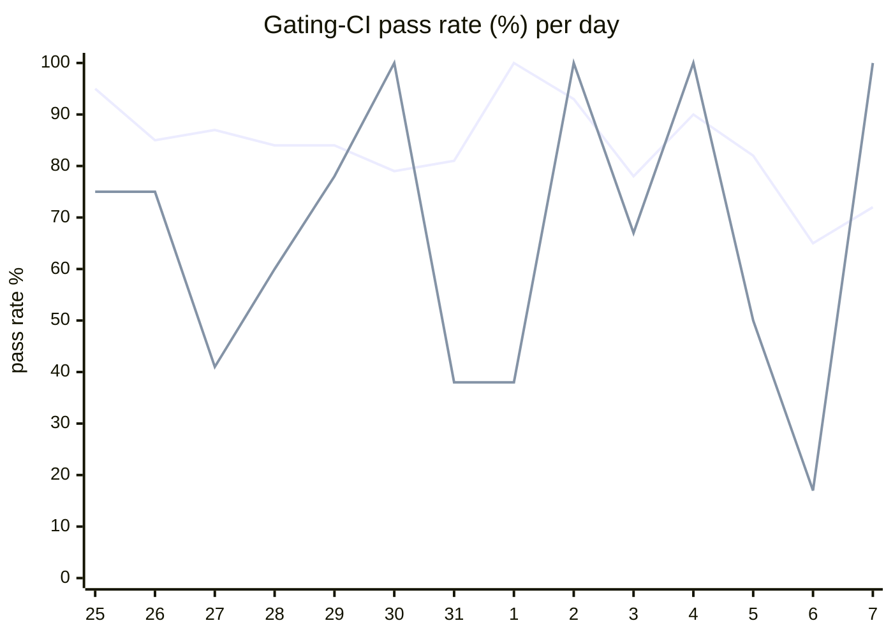

# CI Health Dashboard

_Window: last 14 days (trend + pass rate) · tables: last 24h · updated 2026-08-08T07:04:37Z · auto-generated, do not edit by hand._

**Gating-CI pass rate** — PR: 82% (1704/2080) · main: 63% (58/92)

## Gating-CI pass-rate trend

```mermaid
xychart-beta
  title "Gating-CI pass rate (%) per day"
  x-axis [25, 26, 27, 28, 29, 30, 31, 1, 2, 3, 4, 5, 6, 7]
  y-axis "pass rate %" 0 --> 100
  line "CI" [95, 85, 87, 84, 84, 79, 81, 100, 93, 78, 90, 82, 65, 72]
  line "main" [75, 75, 41, 60, 78, 100, 38, 38, 100, 67, 100, 50, 17, 100]
```

_X-axis = day of month (Jul 25 → Aug 07). Two lines: **CI** (PR gating-CI runs, generally the upper line) and **main** (post-merge main runs, lower). Y-axis = % of that day's gating-CI runs that passed._

## Top 10 failing jobs (last 24h)

| # | job | workflow | fails | recovered | runs | fail rate | flaky? | scope | cause |
| --- | --- | --- | --- | --- | --- | --- | --- | --- | --- |
| 1 | `build` | frontend / app | 4 | 0 | 7 | 57% | flaky | PR | **product bug** — Frontend TS2345 Organization union type mismatch in new-organization-saver-form |
| 2 | `lite-arm` | build | 4 | 0 | 17 | 24% | flaky | PR | **infra/CI** — Docker lite-arm build fails on frontend TS compile; Alpine apk line is log noise |
| 3 | `dashboard-arm` | build | 4 | 0 | 17 | 24% | flaky | PR | **infra/CI** — Docker dashboard-arm build fails on frontend TS compile; Alpine apk line is log noise |
| 4 | `frontend` | build | 4 | 0 | 17 | 24% | flaky | PR | **product bug** — Frontend Docker build fails on TS2339 (API client missing v1 types); subtest line is passing-test noise |
| 5 | `lite-amd` | build | 4 | 0 | 17 | 24% | flaky | PR | **infra/CI** — Docker lite-amd build fails on frontend TS compile; Alpine apk line is log noise |
| 6 | `authdisabled` | build | 4 | 0 | 17 | 24% | flaky | PR | **infra/CI** — Docker authdisabled build fails on frontend TS compile; Alpine apk line is log noise |
| 7 | `dashboard-amd` | build | 4 | 0 | 17 | 24% | flaky | PR | **infra/CI** — Docker dashboard-amd build fails on frontend TS compile; Alpine apk line is log noise |
| 8 | `integration` | test | 4 | 0 | 19 | 21% | flaky | PR | **flaky test** — TestConcurrency_GroupRoundRobin ordering/race flake |
| 9 | `lint` | ruby | 3 | 0 | 16 | 19% | flaky | PR | **infra/CI** — Ruby generated SDK bindings out of date |
| 10 | `test` | ruby | 3 | 0 | 16 | 19% | flaky | PR | **flaky test** — Ruby non_retryable e2e spec intermittently fails |

## Top 10 failing tests (last 24h)

| # | test | job | fails | runs | fail rate | flaky? | scope | cause |
| --- | --- | --- | --- | --- | --- | --- | --- | --- |
| 1 | `(unparsed)` | `dashboard-arm` | 4 | 17 | 24% | flaky | PR | **infra/CI** — Docker dashboard-arm build fails on frontend TS compile; Alpine apk line is log noise |
| 2 | `(unparsed)` | `frontend` | 4 | 17 | 24% | flaky | PR | **product bug** — Frontend Docker build fails on TS2339 (API client missing v1 types); subtest line is passing-test noise |
| 3 | `(unparsed)` | `authdisabled` | 4 | 17 | 24% | flaky | PR | **infra/CI** — Docker authdisabled build fails on frontend TS compile; Alpine apk line is log noise |
| 4 | `(unparsed)` | `dashboard-amd` | 4 | 17 | 24% | flaky | PR | **infra/CI** — Docker dashboard-amd build fails on frontend TS compile; Alpine apk line is log noise |
| 5 | `(unparsed)` | `build` | 3 | 7 | 43% | flaky | PR | **product bug** — Frontend TS2345 Organization union type mismatch in new-organization-saver-form |
| 6 | `(unparsed)` | `lint` | 3 | 16 | 19% | flaky | PR | **infra/CI** — TypeScript generated SDK bindings out of date |
| 7 | `(unparsed)` | `lint` | 3 | 16 | 19% | flaky | PR | **infra/CI** — Python generated bindings/format check drift; ruff success line is noise |
| 8 | `(unparsed)` | `lint` | 3 | 16 | 19% | flaky | PR | **infra/CI** — Ruby generated SDK bindings out of date |
| 9 | `(unparsed)` | `compile` | 3 | 16 | 19% | flaky | PR | **infra/CI** — go.sum missing github.com/doyensec/safeurl entry after operator safeclient import |
| 10 | `(unparsed)` | `cypress` | 2 | 7 | 29% | flaky | PR | **flaky test** — Cypress UI flakes (tenant-switching, sidebar resize, rows-per-page) |

## Recent CI-health wins (`ci-health`)

**Recently merged**

- https://github.com/hatchet-dev/hatchet/pull/4239
- https://github.com/hatchet-dev/hatchet/pull/4238
- https://github.com/hatchet-dev/hatchet/pull/4218
- https://github.com/hatchet-dev/hatchet/pull/4213
- https://github.com/hatchet-dev/hatchet/pull/4165

**Open**

_No open `ci-health` PRs yet._

---
_Trend and pass-rate totals cover the last 14 days; job/test tables cover the last 24h._ **fails** = gating runs where the job/test failed · **recovered** = failed on a first attempt but passed on re-run (a flakiness signal) · **runs** = total gating runs of that workflow · **fail rate** = fails ÷ runs · **flaky** = recovered on re-run or intermittent across runs; **deterministic** = fails every time it runs · **scope** = whether failures were seen on PR, main, or main + PR.
