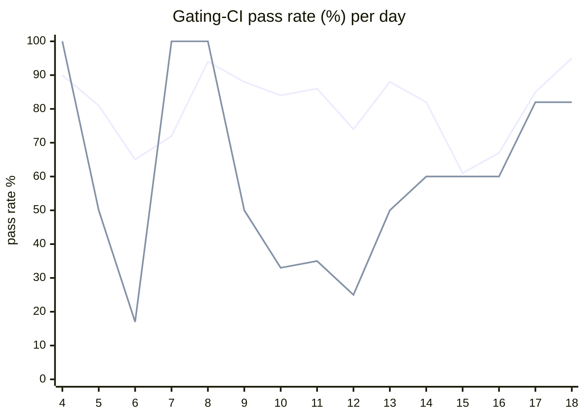

# CI Health Dashboard

_Window: last 14 days (trend + pass rate) · tables: last 24h · updated 2026-08-18T07:07:33Z · auto-generated, do not edit by hand._

**Gating-CI pass rate** — PR: 81% (1626/2007) · main: 52% (46/89)

## Gating-CI pass-rate trend

```mermaid
xychart-beta
  title "Gating-CI pass rate (%) per day"
  x-axis [4, 5, 6, 7, 8, 9, 10, 11, 12, 13, 14, 15, 16, 17, 18]
  y-axis "pass rate %" 0 --> 100
  line "CI" [90, 81, 65, 72, 94, 88, 84, 86, 74, 88, 82, 61, 67, 85, 95]
  line "main" [100, 50, 17, 100, 100, 50, 33, 35, 25, 50, 60, 60, 60, 82, 82]
```

_X-axis = day of month (Aug 04 → Aug 18). Two lines: **CI** (PR gating-CI runs, generally the upper line) and **main** (post-merge main runs, lower). Y-axis = % of that day's gating-CI runs that passed._

## Top 10 failing jobs (last 24h)

| # | job | workflow | fails | recovered | runs | fail rate | flaky? | scope | cause |
| --- | --- | --- | --- | --- | --- | --- | --- | --- | --- |
| 1 | `e2e` | test | 5 | 0 | 43 | 12% | flaky | PR | **infra/CI** — e2e engine/API readiness timeout waiting for Hatchet to start in CI |
| 2 | `load-online-migrate` | test | 5 | 0 | 43 | 12% | flaky | PR | **infra/CI** — load-online-migrate engine gRPC port 7077 readiness timeout in CI |
| 3 | `unit` | test | 5 | 0 | 43 | 12% | flaky | main + PR | **flaky test** — TestMsgIdBufferMemoryLeak intermittently fails in unit job |
| 4 | `e2e-pgmq` | test | 5 | 0 | 43 | 12% | flaky | PR | **infra/CI** — e2e-pgmq engine/API readiness timeout waiting for Hatchet to start in CI |
| 5 | `lint` | ruby | 4 | 0 | 28 | 14% | flaky | PR | **infra/CI** — Ruby SDK generated bindings out of date (check-for-diff step) |
| 6 | `generate` | test | 3 | 0 | 43 | 7% | flaky | PR | **infra/CI** — GitHub 429 rate limit downloading setup-protoc action during generate job setup |
| 7 | `rampup` | test | 2 | 0 | 43 | 5% | flaky | PR | **infra/CI** — GitHub 429 rate limit downloading setup-task action during rampup job setup |
| 8 | `cypress` | frontend / app | 1 | 0 | 18 | 6% | flaky | PR | **infra/CI** — GitHub 429 rate limit downloading setup-go action during cypress job setup |
| 9 | `lint` | frontend / app | 1 | 0 | 18 | 6% | flaky | PR | **infra/CI** — Frontend prettier drift on taskRun.additionalMetadata formatting in lint job |
| 10 | `test-e2e` | typescript | 1 | 0 | 28 | 4% | flaky | PR | **infra/CI** — GitHub 429 rate limit downloading setup-protoc action during test-e2e job setup |

## Top 10 failing tests (last 24h)

| # | test | job | fails | runs | fail rate | flaky? | scope | cause |
| --- | --- | --- | --- | --- | --- | --- | --- | --- |
| 1 | `(unparsed)` | `load-online-migrate` | 4 | 43 | 9% | flaky | PR | **infra/CI** — load-online-migrate engine gRPC port 7077 readiness timeout in CI |
| 2 | `(unparsed)` | `e2e` | 4 | 43 | 9% | flaky | PR | **infra/CI** — e2e engine/API readiness timeout waiting for Hatchet to start in CI |
| 3 | `(unparsed)` | `e2e-pgmq` | 4 | 43 | 9% | flaky | PR | **infra/CI** — e2e-pgmq engine/API readiness timeout waiting for Hatchet to start in CI |
| 4 | `(unparsed)` | `lint` | 3 | 28 | 11% | flaky | PR | **infra/CI** — Ruby SDK generated bindings out of date (check-for-diff step) |
| 5 | `(unparsed)` | `lint` | 2 | 28 | 7% | flaky | PR | **infra/CI** — TypeScript SDK generated bindings out of date (check-for-diff step) |
| 6 | `(unparsed)` | `lint` | 2 | 29 | 7% | flaky | PR | **infra/CI** — Python SDK generated bindings out of date (check-for-diff step) |
| 7 | `TestMsgIdBufferMemoryLeak` | `unit` | 2 | 43 | 5% | flaky | main | **flaky test** — TestMsgIdBufferMemoryLeak intermittently fails in unit job |
| 8 | `(unparsed)` | `cypress` | 1 | 18 | 6% | flaky | PR | **infra/CI** — GitHub 429 rate limit downloading setup-go action during cypress job setup |
| 9 | `(unparsed)` | `lint` | 1 | 18 | 6% | flaky | PR | **infra/CI** — Frontend prettier drift on taskRun.additionalMetadata formatting in lint job |
| 10 | `(unparsed)` | `test-unit` | 1 | 28 | 4% | flaky | PR | **infra/CI** — GitHub 429 rate limit downloading setup-bun action during job setup |

## Recent CI-health wins (`ci-health`)

**Recently merged**

- https://github.com/hatchet-dev/hatchet/pull/4239
- https://github.com/hatchet-dev/hatchet/pull/4238
- https://github.com/hatchet-dev/hatchet/pull/4218
- https://github.com/hatchet-dev/hatchet/pull/4213
- https://github.com/hatchet-dev/hatchet/pull/4165

**Open**

_No open `ci-health` PRs yet._

---
_Trend and pass-rate totals cover the last 14 days; job/test tables cover the last 24h._ **fails** = gating runs where the job/test failed · **recovered** = failed on a first attempt but passed on re-run (a flakiness signal) · **runs** = total gating runs of that workflow · **fail rate** = fails ÷ runs · **flaky** = recovered on re-run or intermittent across runs; **deterministic** = fails every time it runs · **scope** = whether failures were seen on PR, main, or main + PR.
