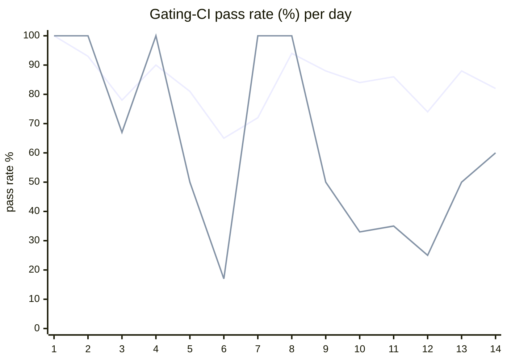

# CI Health Dashboard

_Window: last 14 days (trend + pass rate) · tables: last 24h · updated 2026-08-15T07:07:21Z · auto-generated, do not edit by hand._

**Gating-CI pass rate** — PR: 81% (1534/1891) · main: 49% (43/88)

## Gating-CI pass-rate trend

```mermaid
xychart-beta
  title "Gating-CI pass rate (%) per day"
  x-axis [1, 2, 3, 4, 5, 6, 7, 8, 9, 10, 11, 12, 13, 14]
  y-axis "pass rate %" 0 --> 100
  line "CI" [100, 93, 78, 90, 81, 65, 72, 94, 88, 84, 86, 74, 88, 82]
  line "main" [100, 100, 67, 100, 50, 17, 100, 100, 50, 33, 35, 25, 50, 60]
```

_X-axis = day of month (Aug 01 → Aug 14). Two lines: **CI** (PR gating-CI runs, generally the upper line) and **main** (post-merge main runs, lower). Y-axis = % of that day's gating-CI runs that passed._

## Top 10 failing jobs (last 24h)

| # | job | workflow | fails | recovered | runs | fail rate | flaky? | scope | cause |
| --- | --- | --- | --- | --- | --- | --- | --- | --- | --- |
| 1 | `rampup` | test | 13 | 0 | 45 | 29% | flaky | main + PR | **timeout** — TestRampUp exceeded the ~300s job budget (311s). |
| 2 | `e2e-pgmq` | test | 5 | 0 | 45 | 11% | flaky | PR | **flaky test** — e2e-pgmq TestMultipleEvictionCycle: second eviction failed intermittently. |
| 3 | `lint` | ruby | 4 | 0 | 30 | 13% | flaky | PR | **infra/CI** — Ruby generated bindings check failed (codegen drift). |
| 4 | `build` | frontend / app | 3 | 0 | 8 | 38% | flaky | PR | **product bug** — frontend/app TypeScript build error in new-organization-saver-form.tsx. |
| 5 | `test` | ruby | 3 | 0 | 30 | 10% | flaky | PR | **product bug** — Ruby SDK e2e: NonRetryableWorkflow retrying_events count assertion failed. |
| 6 | `frontend` | build | 3 | 0 | 36 | 8% | flaky | PR | **product bug** — Frontend Docker build fails on TypeScript errors in organization/invite UI (sample subtest line is noise). |
| 7 | `lite-amd` | build | 3 | 0 | 36 | 8% | flaky | PR | **product bug** — lite-amd Docker build fails at npm run build due to frontend TypeScript errors. |
| 8 | `authdisabled` | build | 3 | 0 | 36 | 8% | flaky | PR | **product bug** — authdisabled dashboard Docker build fails at npm run build (frontend TS errors). |
| 9 | `dashboard-arm` | build | 3 | 0 | 36 | 8% | flaky | PR | **product bug** — dashboard-arm Docker build fails at npm run build (frontend TS errors). |
| 10 | `dashboard-amd` | build | 3 | 0 | 36 | 8% | flaky | PR | **product bug** — dashboard-amd Docker build fails at npm run build (frontend TS errors). |

## Top 10 failing tests (last 24h)

| # | test | job | fails | runs | fail rate | flaky? | scope | cause |
| --- | --- | --- | --- | --- | --- | --- | --- | --- |
| 1 | `TestRampUp` | `rampup` | 11 | 45 | 24% | flaky | main + PR | **timeout** — TestRampUp exceeded the ~300s job budget (311s). |
| 2 | `TestRampUp/normal_test` | `rampup` | 11 | 45 | 24% | flaky | main + PR | **timeout** — TestRampUp/normal_test exceeded the ~300s job budget (310s). |
| 3 | `(unparsed)` | `lint` | 4 | 30 | 13% | flaky | PR | **infra/CI** — Ruby generated bindings check failed (codegen drift). |
| 4 | `(unparsed)` | `lint` | 4 | 30 | 13% | flaky | PR | **infra/CI** — TypeScript generated bindings check failed (codegen drift). |
| 5 | `(unparsed)` | `build` | 3 | 8 | 38% | flaky | PR | **product bug** — frontend/app TypeScript build error in new-organization-saver-form.tsx. |
| 6 | `(unparsed)` | `frontend` | 3 | 36 | 8% | flaky | PR | **product bug** — Frontend Docker build fails on TypeScript errors in organization/invite UI (sample subtest line is noise). |
| 7 | `(unparsed)` | `authdisabled` | 3 | 36 | 8% | flaky | PR | **product bug** — authdisabled dashboard Docker build fails at npm run build (frontend TS errors). |
| 8 | `(unparsed)` | `dashboard-arm` | 3 | 36 | 8% | flaky | PR | **product bug** — dashboard-arm Docker build fails at npm run build (frontend TS errors). |
| 9 | `(unparsed)` | `dashboard-amd` | 3 | 36 | 8% | flaky | PR | **product bug** — dashboard-amd Docker build fails at npm run build (frontend TS errors). |
| 10 | `./non_retryable/test_no_retry_spec.rb:7` | `test` | 2 | 30 | 7% | flaky | PR | **product bug** — Ruby SDK e2e: NonRetryableWorkflow retrying_events count assertion failed. |

## Recent CI-health wins (`ci-health`)

**Recently merged**

- https://github.com/hatchet-dev/hatchet/pull/4239
- https://github.com/hatchet-dev/hatchet/pull/4238
- https://github.com/hatchet-dev/hatchet/pull/4218
- https://github.com/hatchet-dev/hatchet/pull/4213
- https://github.com/hatchet-dev/hatchet/pull/4165

**Open**

_No open `ci-health` PRs yet._

---
_Trend and pass-rate totals cover the last 14 days; job/test tables cover the last 24h._ **fails** = gating runs where the job/test failed · **recovered** = failed on a first attempt but passed on re-run (a flakiness signal) · **runs** = total gating runs of that workflow · **fail rate** = fails ÷ runs · **flaky** = recovered on re-run or intermittent across runs; **deterministic** = fails every time it runs · **scope** = whether failures were seen on PR, main, or main + PR.
