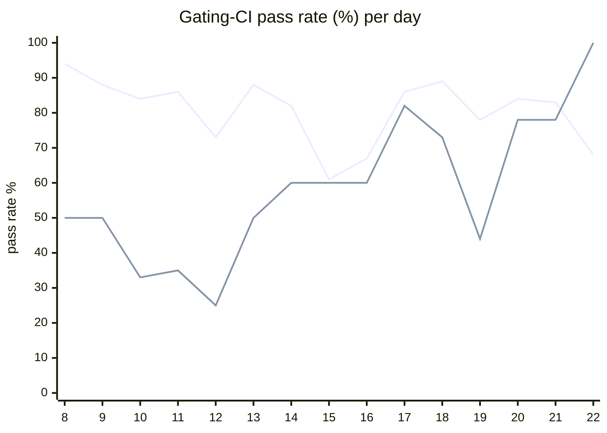

# CI Health Dashboard

_Window: last 14 days (trend + pass rate) · tables: last 24h · updated 2026-08-22T07:11:30Z · auto-generated, do not edit by hand._

**Gating-CI pass rate** — PR: 82% (2005/2446) · main: 59% (86/146)

## Gating-CI pass-rate trend

```mermaid
xychart-beta
  title "Gating-CI pass rate (%) per day"
  x-axis [8, 9, 10, 11, 12, 13, 14, 15, 16, 17, 18, 19, 20, 21, 22]
  y-axis "pass rate %" 0 --> 100
  line "CI" [94, 88, 84, 86, 73, 88, 82, 61, 67, 86, 89, 78, 84, 83, 68]
  line "main" [50, 50, 33, 35, 25, 50, 60, 60, 60, 82, 73, 44, 78, 78, 100]
```

_X-axis = day of month (Aug 08 → Aug 22). Two lines: **CI** (PR gating-CI runs, generally the upper line) and **main** (post-merge main runs, lower). Y-axis = % of that day's gating-CI runs that passed._

## Top 10 failing jobs (last 24h)

| # | job | workflow | fails | recovered | runs | fail rate | flaky? | scope | cause |
| --- | --- | --- | --- | --- | --- | --- | --- | --- | --- |
| 1 | `generate` | test | 7 | 0 | 27 | 26% | flaky | PR | **infra/CI** — test/generate: codegen drift — examples/python/worker.py not regenerated |
| 2 | `test` | python | 5 | 0 | 28 | 18% | flaky | PR | **flaky test** — Python conditions cancel_if: race — task completes before cancel event processed |
| 3 | `unit` | test | 4 | 0 | 27 | 15% | flaky | PR | **flaky test** — TestRandomTicker: tick duration jitter exceeds threshold on shared CI runners |
| 4 | `build` | frontend / docs | 1 | 0 | 3 | 33% | flaky | PR | **product bug** — Docs build: invalid MDX frontmatter (missing title) in migration-guide-python-v2.mdx |
| 5 | `test-templates` | cli-e2e-tests | 1 | 0 | 4 | 25% | flaky | PR | **timeout** — cli-e2e TestQuickstartTemplates parent test exceeded ~765s budget |
| 6 | `lint` | frontend / app | 1 | 0 | 5 | 20% | flaky | PR | **infra/CI** — frontend/app lint: prettier drift on event-utils imports |
| 7 | `test` | ruby | 1 | 0 | 19 | 5% | flaky | PR | **flaky test** — Ruby non_retryable: retry event count assertion is timing-sensitive |
| 8 | `publish` | typescript | 1 | 0 | 19 | 5% | flaky | main | **infra/CI** — TypeScript publish: dist/package.json missing — SDK build step did not produce output |
| 9 | `lint` | lint all | 1 | 0 | 24 | 4% | flaky | PR | **infra/CI** — lint all: pre-commit whitespace drift in sdk-python.yml |
| 10 | `rampup` | test | 1 | 0 | 27 | 4% | flaky | main | **infra/CI** — TestRampUp: engine not ready — connection refused during workflow registration |

## Top 10 failing tests (last 24h)

| # | test | job | fails | runs | fail rate | flaky? | scope | cause |
| --- | --- | --- | --- | --- | --- | --- | --- | --- |
| 1 | `examples/conditions/test_conditions.py::test_cancel_if_user_event` | `test` | 11 | 28 | 39% | flaky | main + PR | **flaky test** — Python conditions cancel_if: race — task completes before cancel event processed |
| 2 | `(unparsed)` | `generate` | 7 | 27 | 26% | flaky | PR | **infra/CI** — test/generate: codegen drift — examples/python/worker.py not regenerated |
| 3 | `examples/conditions/test_conditions.py::test_skip_if_sleep_runs_when_event_wins` | `test` | 6 | 28 | 21% | flaky | main + PR | **flaky test** — Python conditions skip_if_sleep: race between sleep and event delivery |
| 4 | `(unparsed)` | `lint` | 3 | 28 | 11% | flaky | PR | **infra/CI** — Python lint: Black formatting drift on PR (eviction timeout example) |
| 5 | `./non_retryable/test_no_retry_spec.rb:7` | `test` | 2 | 19 | 10% | flaky | PR | **flaky test** — Ruby non_retryable: retry event count assertion is timing-sensitive |
| 6 | `TestRandomTicker` | `unit` | 2 | 27 | 7% | flaky | PR | **flaky test** — TestRandomTicker: tick duration jitter exceeds threshold on shared CI runners |
| 7 | `(unparsed)` | `build` | 1 | 3 | 33% | flaky | PR | **product bug** — Docs build: invalid MDX frontmatter (missing title) in migration-guide-python-v2.mdx |
| 8 | `TestQuickstartTemplates` | `test-templates` | 1 | 4 | 25% | flaky | PR | **timeout** — cli-e2e TestQuickstartTemplates parent test exceeded ~765s budget |
| 9 | `TestQuickstartTemplates/simple_go_go` | `test-templates` | 1 | 4 | 25% | flaky | PR | **timeout** — cli-e2e TestQuickstartTemplates/simple_go_go exceeded ~320s budget |
| 10 | `(unparsed)` | `lint` | 1 | 5 | 20% | flaky | PR | **infra/CI** — frontend/app lint: prettier drift on event-utils imports |

## Recent CI-health wins (`ci-health`)

**Recently merged**

- https://github.com/hatchet-dev/hatchet/pull/4239
- https://github.com/hatchet-dev/hatchet/pull/4238
- https://github.com/hatchet-dev/hatchet/pull/4218
- https://github.com/hatchet-dev/hatchet/pull/4213
- https://github.com/hatchet-dev/hatchet/pull/4165

**Open**

_No open `ci-health` PRs yet._

---
_Trend and pass-rate totals cover the last 14 days; job/test tables cover the last 24h._ **fails** = gating runs where the job/test failed · **recovered** = failed on a first attempt but passed on re-run (a flakiness signal) · **runs** = total gating runs of that workflow · **fail rate** = fails ÷ runs · **flaky** = recovered on re-run or intermittent across runs; **deterministic** = fails every time it runs · **scope** = whether failures were seen on PR, main, or main + PR.
