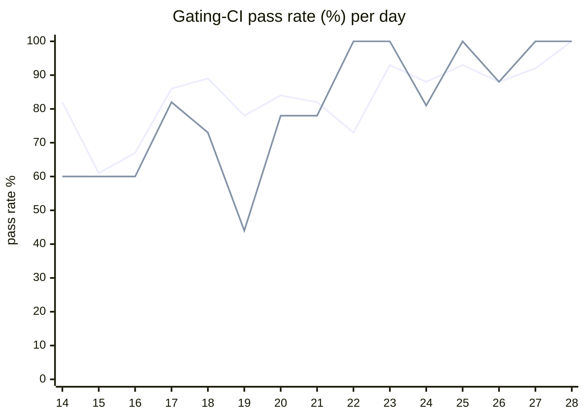

# CI Health Dashboard

_Window: last 14 days (trend + pass rate) · tables: last 24h · updated 2026-08-28T07:08:16Z · auto-generated, do not edit by hand._

**Gating-CI pass rate** — PR: 84% (2157/2556) · main: 75% (107/142)

## Gating-CI pass-rate trend

```mermaid
xychart-beta
  title "Gating-CI pass rate (%) per day"
  x-axis [14, 15, 16, 17, 18, 19, 20, 21, 22, 23, 24, 25, 26, 27, 28]
  y-axis "pass rate %" 0 --> 100
  line "CI" [82, 61, 67, 86, 89, 78, 84, 82, 73, 93, 88, 93, 88, 92, 100]
  line "main" [60, 60, 60, 82, 73, 44, 78, 78, 100, 100, 81, 100, 88, 100, 100]
```

_X-axis = day of month (Aug 14 → Aug 28). Two lines: **CI** (PR gating-CI runs, generally the upper line) and **main** (post-merge main runs, lower). Y-axis = % of that day's gating-CI runs that passed._

## Top 10 failing jobs (last 24h)

| # | job | workflow | fails | recovered | runs | fail rate | flaky? | scope | cause |
| --- | --- | --- | --- | --- | --- | --- | --- | --- | --- |
| 1 | `test` | ruby | 3 | 0 | 20 | 15% | flaky | PR | **flaky test** — Ruby CancelWorkflow poll/cancel timing race |
| 2 | `authdisabled` | build | 1 | 2 | 25 | 4% | flaky | PR | **infra/CI** — Docker build go module proxy INTERNAL_ERROR (apk line is noise) |
| 3 | `engine` | build | 2 | 0 | 25 | 8% | flaky | PR | **infra/CI** — Docker build go module proxy INTERNAL_ERROR (apk line is noise) |
| 4 | `admin` | build | 1 | 1 | 25 | 4% | flaky | PR | **infra/CI** — Docker build go module proxy INTERNAL_ERROR (apk line is noise) |
| 5 | `migrate` | build | 1 | 0 | 25 | 4% | flaky | PR | **infra/CI** — Docker build go module proxy INTERNAL_ERROR (apk line is noise) |
| 6 | `api-arm` | build | 1 | 0 | 25 | 4% | flaky | PR | **infra/CI** — Docker build go module proxy INTERNAL_ERROR (apk line is noise) |
| 7 | `engine-arm` | build | 1 | 0 | 25 | 4% | flaky | PR | **infra/CI** — Docker build go module proxy INTERNAL_ERROR (apk line is noise) |
| 8 | `unit` | test | 1 | 0 | 28 | 4% | flaky | PR | **product bug** — TestCountAllocatedResourcesByTenant FK violation on Worker.dispatcherId |
| 9 | `integration` | test | 0 | 1 | 28 | 0% | flaky | - | **flaky test** — TestInterval_GetNextTrigger_FirstTriggerUsesFullWindowPhase timing jitter |
| 10 | `api` | build | 0 | 1 | 25 | 0% | flaky | - | **infra/CI** — Docker build go module proxy INTERNAL_ERROR (apk line is noise) |

## Top 10 failing tests (last 24h)

| # | test | job | fails | runs | fail rate | flaky? | scope | cause |
| --- | --- | --- | --- | --- | --- | --- | --- | --- |
| 1 | `examples/durable/test_durable.py::test_durable_child_key_dedup_replay` | `test` | 4 | 28 | 14% | flaky | PR | **product bug** — Durable child-key dedup replay returns FailedTaskRunExceptionGroup |
| 2 | `examples/bug_tests/durable_spawn_index_collision/test_durable_spawn_index_collision.py::test_spawn_index_self_dedupe_returns_cached_result` | `test` | 4 | 28 | 14% | flaky | PR | **product bug** — Durable spawn-index self-dedupe returns FailedTaskRunExceptionGroup |
| 3 | `examples/bug_tests/durable_child_key_duplicate_child/test_durable_child_key_duped_child.py::test_durable_child_key_duplicate_bug_all_duped` | `test` | 4 | 28 | 14% | flaky | PR | **product bug** — Durable execution child-key dedup allows duplicate child spawns (bug_tests) |
| 4 | `examples/bug_tests/durable_child_key_duplicate_child/test_durable_child_key_duped_child.py::test_durable_child_key_duplicate_bug_second_unique` | `test` | 4 | 28 | 14% | flaky | PR | **product bug** — Durable execution child-key dedup allows duplicate child spawns (bug_tests) |
| 5 | `examples/bug_tests/durable_child_key_duplicate_child/test_durable_child_key_duped_child.py::test_durable_child_key_duplicate_bug_third_unique` | `test` | 4 | 28 | 14% | flaky | PR | **product bug** — Durable execution child-key dedup allows duplicate child spawns (bug_tests) |
| 6 | `./cancellation/test_cancellation_spec.rb:7` | `test` | 3 | 20 | 15% | flaky | PR | **flaky test** — Ruby CancelWorkflow poll/cancel timing race |
| 7 | `(unparsed)` | `authdisabled` | 3 | 25 | 12% | flaky | PR | **infra/CI** — Docker build go module proxy INTERNAL_ERROR (apk line is noise) |
| 8 | `(unparsed)` | `engine` | 2 | 25 | 8% | flaky | PR | **infra/CI** — Docker build go module proxy INTERNAL_ERROR (apk line is noise) |
| 9 | `(unparsed)` | `admin` | 2 | 25 | 8% | flaky | PR | **infra/CI** — Docker build go module proxy INTERNAL_ERROR (apk line is noise) |
| 10 | `(unparsed)` | `publish` | 1 | 21 | 5% | flaky | main | **infra/CI** — TypeScript publish step missing dist/ build output |

## Recent CI-health wins (`ci-health`)

**Recently merged**

- https://github.com/hatchet-dev/hatchet/pull/4239
- https://github.com/hatchet-dev/hatchet/pull/4238
- https://github.com/hatchet-dev/hatchet/pull/4218
- https://github.com/hatchet-dev/hatchet/pull/4213
- https://github.com/hatchet-dev/hatchet/pull/4165

**Open**

_No open `ci-health` PRs yet._

---
_Trend and pass-rate totals cover the last 14 days; job/test tables cover the last 24h._ **fails** = gating runs where the job/test failed · **recovered** = failed on a first attempt but passed on re-run (a flakiness signal) · **runs** = total gating runs of that workflow · **fail rate** = fails ÷ runs · **flaky** = recovered on re-run or intermittent across runs; **deterministic** = fails every time it runs · **scope** = whether failures were seen on PR, main, or main + PR.
