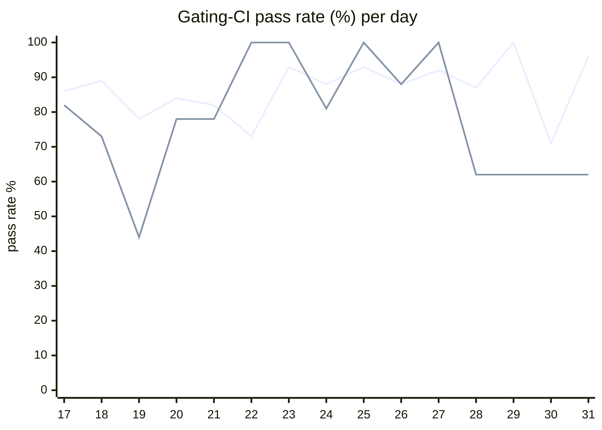

# CI Health Dashboard

_Window: last 14 days (trend + pass rate) · tables: last 24h · updated 2026-08-31T07:07:12Z · auto-generated, do not edit by hand._

**Gating-CI pass rate** — PR: 86% (2185/2554) · main: 76% (106/140)

## Gating-CI pass-rate trend

```mermaid
xychart-beta
  title "Gating-CI pass rate (%) per day"
  x-axis [17, 18, 19, 20, 21, 22, 23, 24, 25, 26, 27, 28, 29, 30, 31]
  y-axis "pass rate %" 0 --> 100
  line "CI" [86, 89, 78, 84, 82, 73, 93, 88, 93, 88, 92, 87, 100, 71, 96]
  line "main" [82, 73, 44, 78, 78, 100, 100, 81, 100, 88, 100, 62, 62, 62, 62]
```

_X-axis = day of month (Aug 17 → Aug 31). Two lines: **CI** (PR gating-CI runs, generally the upper line) and **main** (post-merge main runs, lower). Y-axis = % of that day's gating-CI runs that passed._

## Top 10 failing jobs (last 24h)

| # | job | workflow | fails | recovered | runs | fail rate | flaky? | scope | cause |
| --- | --- | --- | --- | --- | --- | --- | --- | --- | --- |
| 1 | `generate` | test | 2 | 0 | 4 | 50% | flaky | PR | **product bug** — Go SDK go127 codegen emits type-parameter methods invalid under current Go toolchain (test/generate fmt-go) |
| 2 | `cypress` | frontend / app | 1 | 0 | 2 | 50% | flaky | PR | **flaky test** — Cypress E2E tenant-switcher/click timing flakes on dependabot frontend npm bump PRs |
| 3 | `compile` | go | 1 | 0 | 3 | 33% | flaky | PR | **product bug** — Go SDK go127 branch leaves examples go.mod out of sync (go mod tidy needed during compile job) |
| 4 | `admin` | build | 1 | 0 | 5 | 20% | flaky | PR | **product bug** — Docker build matrix fails on go-sdk-go127 PR: sdks/go/go.mod missing in build context |
| 5 | `engine` | build | 1 | 0 | 5 | 20% | flaky | PR | **product bug** — Docker build matrix fails on go-sdk-go127 PR: sdks/go/go.mod missing in build context |
| 6 | `loadtest` | build | 1 | 0 | 5 | 20% | flaky | PR | **product bug** — Docker loadtest build fails on go-sdk-go127 PR: sdks/go/go.mod missing in build context |
| 7 | `api` | build | 1 | 0 | 5 | 20% | flaky | PR | **product bug** — Docker build matrix fails on go-sdk-go127 PR: sdks/go/go.mod missing in build context |
| 8 | `dashboard-arm` | build | 1 | 0 | 5 | 20% | flaky | PR | **product bug** — Docker build matrix fails on go-sdk-go127 PR: sdks/go/go.mod missing in build context |
| 9 | `api-arm` | build | 1 | 0 | 5 | 20% | flaky | PR | **product bug** — Docker build matrix fails on go-sdk-go127 PR: sdks/go/go.mod missing in build context |
| 10 | `dashboard-amd` | build | 1 | 0 | 5 | 20% | flaky | PR | **product bug** — Docker build matrix fails on go-sdk-go127 PR: sdks/go/go.mod missing in build context |

## Top 10 failing tests (last 24h)

| # | test | job | fails | runs | fail rate | flaky? | scope | cause |
| --- | --- | --- | --- | --- | --- | --- | --- | --- |
| 1 | `(unparsed)` | `generate` | 2 | 4 | 50% | flaky | PR | **product bug** — Go SDK go127 codegen emits type-parameter methods invalid under current Go toolchain (test/generate fmt-go) |
| 2 | `(unparsed)` | `cypress` | 1 | 2 | 50% | flaky | PR | **flaky test** — Cypress E2E tenant-switcher/click timing flakes on dependabot frontend npm bump PRs |
| 3 | `(unparsed)` | `compile` | 1 | 3 | 33% | flaky | PR | **product bug** — Go SDK go127 branch leaves examples go.mod out of sync (go mod tidy needed during compile job) |
| 4 | `(unparsed)` | `admin` | 1 | 5 | 20% | flaky | PR | **product bug** — Docker build matrix fails on go-sdk-go127 PR: sdks/go/go.mod missing in build context |
| 5 | `(unparsed)` | `engine` | 1 | 5 | 20% | flaky | PR | **product bug** — Docker build matrix fails on go-sdk-go127 PR: sdks/go/go.mod missing in build context |
| 6 | `(unparsed)` | `loadtest` | 1 | 5 | 20% | flaky | PR | **product bug** — Docker loadtest build fails on go-sdk-go127 PR: sdks/go/go.mod missing in build context |
| 7 | `(unparsed)` | `api` | 1 | 5 | 20% | flaky | PR | **product bug** — Docker build matrix fails on go-sdk-go127 PR: sdks/go/go.mod missing in build context |
| 8 | `(unparsed)` | `dashboard-arm` | 1 | 5 | 20% | flaky | PR | **product bug** — Docker build matrix fails on go-sdk-go127 PR: sdks/go/go.mod missing in build context |
| 9 | `(unparsed)` | `api-arm` | 1 | 5 | 20% | flaky | PR | **product bug** — Docker build matrix fails on go-sdk-go127 PR: sdks/go/go.mod missing in build context |
| 10 | `(unparsed)` | `dashboard-amd` | 1 | 5 | 20% | flaky | PR | **product bug** — Docker build matrix fails on go-sdk-go127 PR: sdks/go/go.mod missing in build context |

## Recent CI-health wins (`ci-health`)

**Recently merged**

- https://github.com/hatchet-dev/hatchet/pull/4239
- https://github.com/hatchet-dev/hatchet/pull/4238
- https://github.com/hatchet-dev/hatchet/pull/4218
- https://github.com/hatchet-dev/hatchet/pull/4213
- https://github.com/hatchet-dev/hatchet/pull/4165

**Open**

_No open `ci-health` PRs yet._

---
_Trend and pass-rate totals cover the last 14 days; job/test tables cover the last 24h._ **fails** = gating runs where the job/test failed · **recovered** = failed on a first attempt but passed on re-run (a flakiness signal) · **runs** = total gating runs of that workflow · **fail rate** = fails ÷ runs · **flaky** = recovered on re-run or intermittent across runs; **deterministic** = fails every time it runs · **scope** = whether failures were seen on PR, main, or main + PR.
