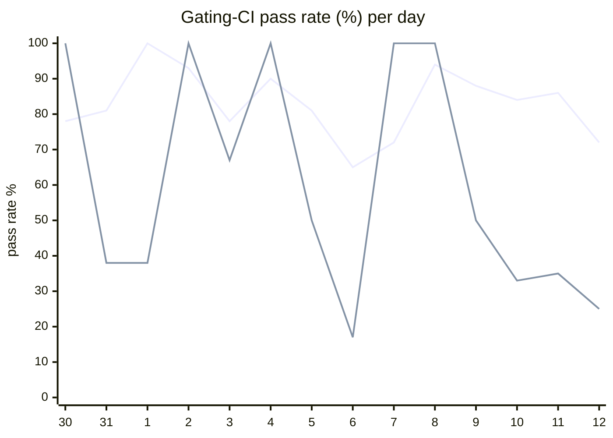

# CI Health Dashboard

_Window: last 14 days (trend + pass rate) · tables: last 24h · updated 2026-08-13T07:06:00Z · auto-generated, do not edit by hand._

**Gating-CI pass rate** — PR: 80% (1560/1944) · main: 51% (45/88)

## Gating-CI pass-rate trend

```mermaid
xychart-beta
  title "Gating-CI pass rate (%) per day"
  x-axis [30, 31, 1, 2, 3, 4, 5, 6, 7, 8, 9, 10, 11, 12]
  y-axis "pass rate %" 0 --> 100
  line "CI" [78, 81, 100, 93, 78, 90, 81, 65, 72, 94, 88, 84, 86, 72]
  line "main" [100, 38, 38, 100, 67, 100, 50, 17, 100, 100, 50, 33, 35, 25]
```

_X-axis = day of month (Jul 30 → Aug 12). Two lines: **CI** (PR gating-CI runs, generally the upper line) and **main** (post-merge main runs, lower). Y-axis = % of that day's gating-CI runs that passed._

## Top 10 failing jobs (last 24h)

| # | job | workflow | fails | recovered | runs | fail rate | flaky? | scope | cause |
| --- | --- | --- | --- | --- | --- | --- | --- | --- | --- |
| 1 | `rampup` | test | 26 | 0 | 33 | 79% | flaky | main + PR | **timeout** — TestRampUp parent test exceeds ~300s job budget (311s) |
| 2 | `generate` | test | 10 | 0 | 33 | 30% | flaky | PR | **infra/CI** — GitHub Actions socket hang up downloading protoc in test/generate job |
| 3 | `e2e` | test | 8 | 0 | 33 | 24% | flaky | PR | **flaky test** — TestMultipleEvictionCycle intermittently fails in e2e job |
| 4 | `e2e-pgmq` | test | 8 | 0 | 33 | 24% | flaky | PR | **flaky test** — TestMultipleEvictionCycle intermittently fails in e2e-pgmq job |
| 5 | `integration` | test | 7 | 0 | 33 | 21% | flaky | main + PR | **infra/CI** — GitHub Actions socket hang up downloading Task installer in test/integration job |
| 6 | `test` | ruby | 6 | 0 | 19 | 32% | flaky | PR | **infra/CI** — GitHub Actions socket hang up downloading Task installer in ruby/test job |
| 7 | `load-deadlock` | test | 4 | 1 | 33 | 12% | flaky | main + PR | **infra/CI** — GitHub Actions socket hang up downloading Task installer in load-deadlock job |
| 8 | `build` | frontend / docs | 3 | 0 | 16 | 19% | flaky | PR | **product bug** — Docs internal link checker found 6 broken /llms/ markdown routes |
| 9 | `test-e2e` | typescript | 3 | 0 | 19 | 16% | flaky | PR | **infra/CI** — GitHub Actions socket hang up downloading protoc in typescript/test-e2e job |
| 10 | `load` | test | 3 | 0 | 33 | 9% | flaky | PR | **infra/CI** — GitHub Actions socket hang up downloading Task installer in load job |

## Top 10 failing tests (last 24h)

| # | test | job | fails | runs | fail rate | flaky? | scope | cause |
| --- | --- | --- | --- | --- | --- | --- | --- | --- |
| 1 | `TestRampUp` | `rampup` | 24 | 33 | 73% | flaky | main + PR | **timeout** — TestRampUp parent test exceeds ~300s job budget (311s) |
| 2 | `TestRampUp/normal_test` | `rampup` | 23 | 33 | 70% | flaky | main + PR | **timeout** — TestRampUp/normal_test exceeds ~300s job budget (310s) |
| 3 | `(unparsed)` | `load-deadlock` | 10 | 33 | 30% | flaky | main + PR | **infra/CI** — GitHub Actions socket hang up downloading Task installer in load-deadlock job |
| 4 | `TestMultipleEvictionCycle` | `e2e-pgmq` | 7 | 33 | 21% | flaky | PR | **flaky test** — TestMultipleEvictionCycle intermittently fails in e2e-pgmq job |
| 5 | `(unparsed)` | `load` | 7 | 33 | 21% | flaky | PR | **infra/CI** — GitHub Actions socket hang up downloading Task installer in load job |
| 6 | `(unparsed)` | `test` | 5 | 19 | 26% | flaky | PR | **infra/CI** — GitHub Actions socket hang up downloading Task installer in ruby/test job |
| 7 | `(unparsed)` | `test` | 5 | 20 | 25% | flaky | PR | **infra/CI** — GitHub Actions socket hang up downloading protoc in python/test job |
| 8 | `(unparsed)` | `test` | 5 | 20 | 25% | flaky | PR | **infra/CI** — GitHub Actions socket hang up downloading Task installer in python/test job |
| 9 | `(unparsed)` | `generate` | 5 | 33 | 15% | flaky | PR | **infra/CI** — GitHub Actions socket hang up downloading protoc in test/generate job |
| 10 | `(unparsed)` | `integration` | 5 | 33 | 15% | flaky | main + PR | **infra/CI** — GitHub Actions socket hang up downloading Task installer in test/integration job |

## Recent CI-health wins (`ci-health`)

**Recently merged**

- https://github.com/hatchet-dev/hatchet/pull/4239
- https://github.com/hatchet-dev/hatchet/pull/4238
- https://github.com/hatchet-dev/hatchet/pull/4218
- https://github.com/hatchet-dev/hatchet/pull/4213
- https://github.com/hatchet-dev/hatchet/pull/4165

**Open**

_No open `ci-health` PRs yet._

---
_Trend and pass-rate totals cover the last 14 days; job/test tables cover the last 24h._ **fails** = gating runs where the job/test failed · **recovered** = failed on a first attempt but passed on re-run (a flakiness signal) · **runs** = total gating runs of that workflow · **fail rate** = fails ÷ runs · **flaky** = recovered on re-run or intermittent across runs; **deterministic** = fails every time it runs · **scope** = whether failures were seen on PR, main, or main + PR.
