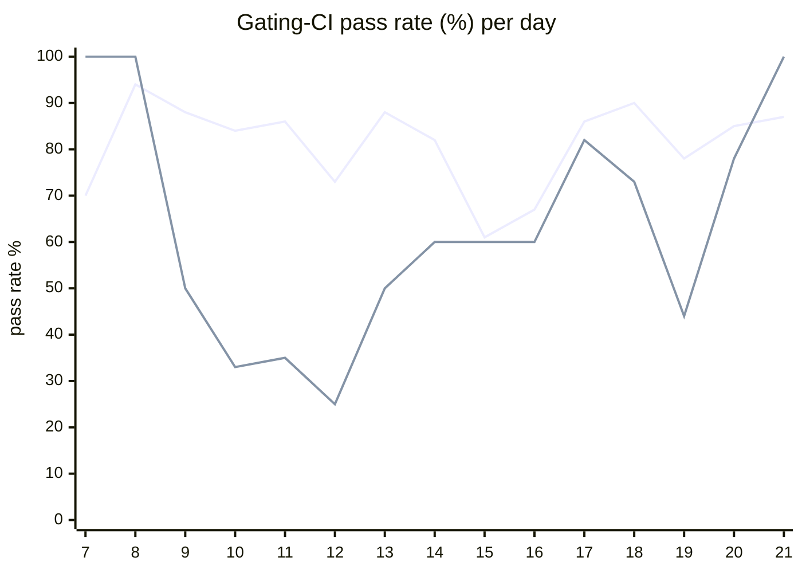

# CI Health Dashboard

_Window: last 14 days (trend + pass rate) · tables: last 24h · updated 2026-08-21T07:09:58Z · auto-generated, do not edit by hand._

**Gating-CI pass rate** — PR: 82% (1994/2438) · main: 57% (73/129)

## Gating-CI pass-rate trend

```mermaid
xychart-beta
  title "Gating-CI pass rate (%) per day"
  x-axis [7, 8, 9, 10, 11, 12, 13, 14, 15, 16, 17, 18, 19, 20, 21]
  y-axis "pass rate %" 0 --> 100
  line "CI" [70, 94, 88, 84, 86, 73, 88, 82, 61, 67, 86, 90, 78, 85, 87]
  line "main" [100, 100, 50, 33, 35, 25, 50, 60, 60, 60, 82, 73, 44, 78, 100]
```

_X-axis = day of month (Aug 07 → Aug 21). Two lines: **CI** (PR gating-CI runs, generally the upper line) and **main** (post-merge main runs, lower). Y-axis = % of that day's gating-CI runs that passed._

## Top 10 failing jobs (last 24h)

| # | job | workflow | fails | recovered | runs | fail rate | flaky? | scope | cause |
| --- | --- | --- | --- | --- | --- | --- | --- | --- | --- |
| 1 | `test-templates` | cli-e2e-tests | 3 | 0 | 10 | 30% | flaky | PR | **timeout** — TestQuickstartTemplates suite exceeds cli-e2e time budget (~754s) |
| 2 | `unit` | test | 3 | 0 | 43 | 7% | flaky | main + PR | **flaky test** — TestMsgIdBufferMemoryLeak intermittently fails in unit job |
| 3 | `engine` | build | 2 | 0 | 29 | 7% | flaky | PR | **infra/CI** — Docker engine build fails fetching go modules (proxy.golang.org INTERNAL_ERROR) |
| 4 | `test` | ruby | 2 | 0 | 30 | 7% | flaky | PR | **flaky test** — Ruby non_retryable e2e intermittently reports wrong retry event count |
| 5 | `e2e` | test | 2 | 0 | 43 | 5% | flaky | PR | **infra/CI** — e2e job times out waiting for Hatchet engine/API readiness |
| 6 | `e2e-pgmq` | test | 2 | 0 | 43 | 5% | flaky | PR | **infra/CI** — e2e-pgmq job times out waiting for Hatchet engine/API readiness |
| 7 | `integration` | test | 2 | 0 | 43 | 5% | flaky | main + PR | **flaky test** — TestMsgIdBufferMemoryLeak intermittently fails in integration job |
| 8 | `build` | frontend / docs | 1 | 0 | 10 | 10% | flaky | PR | **product bug** — Docs build fails: invalid MDX frontmatter in v1/run-names.mdx |
| 9 | `authdisabled` | build | 1 | 0 | 29 | 3% | flaky | PR | **infra/CI** — Docker authdisabled image build fails (transient go module proxy/network errors) |
| 10 | `migrate` | build | 1 | 0 | 29 | 3% | flaky | PR | **infra/CI** — Docker migrate image build fails (transient go module proxy/network errors) |

## Top 10 failing tests (last 24h)

| # | test | job | fails | runs | fail rate | flaky? | scope | cause |
| --- | --- | --- | --- | --- | --- | --- | --- | --- |
| 1 | `examples/aws/s3/test_worker.py::test_pipeline_processes_and_deletes_all_objects[on_demand_worker0]` | `test` | 5 | 32 | 16% | flaky | main + PR | **timeout** — Python S3 worker example test exceeds pytest 60s timeout |
| 2 | `examples/conditions/test_conditions.py::test_skip_if_sleep_runs_when_event_wins` | `test` | 5 | 32 | 16% | flaky | PR | **flaky test** — Python conditions skip_if_sleep race: event vs sleep timing non-deterministic |
| 3 | `TestQuickstartTemplates` | `test-templates` | 3 | 10 | 30% | flaky | PR | **timeout** — TestQuickstartTemplates suite exceeds cli-e2e time budget (~754s) |
| 4 | `TestQuickstartTemplates/simple_go_go` | `test-templates` | 3 | 10 | 30% | flaky | PR | **timeout** — TestQuickstartTemplates/simple_go_go exceeds cli-e2e time budget (~319s) |
| 5 | `(unparsed)` | `test` | 3 | 32 | 9% | flaky | PR | **unknown** — Pytest step failure with only the command line captured in logs |
| 6 | `examples/conditions/test_conditions.py::test_cancel_if_user_event` | `test` | 3 | 32 | 9% | flaky | PR | **flaky test** — Python cancel_if_user_event race: run completes before cancel is observed |
| 7 | `(unparsed)` | `engine` | 2 | 29 | 7% | flaky | PR | **infra/CI** — Docker engine build fails fetching go modules (proxy.golang.org INTERNAL_ERROR) |
| 8 | `./non_retryable/test_no_retry_spec.rb:7` | `test` | 2 | 30 | 7% | flaky | PR | **flaky test** — Ruby non_retryable e2e intermittently reports wrong retry event count |
| 9 | `./spec/integration/events_integration_spec.rb:194` | `test` | 2 | 30 | 7% | flaky | PR | **flaky test** — Ruby events integration event-details assertion intermittently fails |
| 10 | `./spec/integration/events_integration_spec.rb:198` | `test` | 2 | 30 | 7% | flaky | PR | **flaky test** — Ruby events integration get-by-ID assertion intermittently fails |

## Recent CI-health wins (`ci-health`)

**Recently merged**

- https://github.com/hatchet-dev/hatchet/pull/4239
- https://github.com/hatchet-dev/hatchet/pull/4238
- https://github.com/hatchet-dev/hatchet/pull/4218
- https://github.com/hatchet-dev/hatchet/pull/4213
- https://github.com/hatchet-dev/hatchet/pull/4165

**Open**

_No open `ci-health` PRs yet._

---
_Trend and pass-rate totals cover the last 14 days; job/test tables cover the last 24h._ **fails** = gating runs where the job/test failed · **recovered** = failed on a first attempt but passed on re-run (a flakiness signal) · **runs** = total gating runs of that workflow · **fail rate** = fails ÷ runs · **flaky** = recovered on re-run or intermittent across runs; **deterministic** = fails every time it runs · **scope** = whether failures were seen on PR, main, or main + PR.
