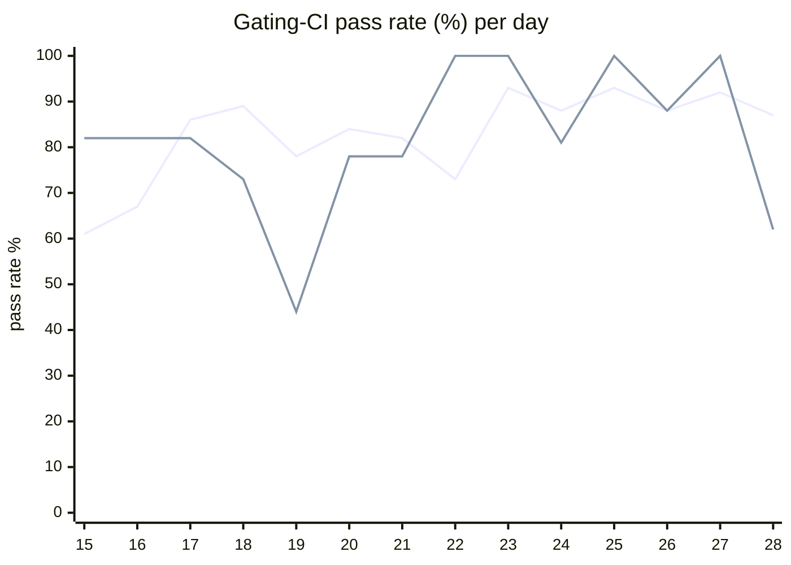

# CI Health Dashboard

_Window: last 14 days (trend + pass rate) · tables: last 24h · updated 2026-08-29T07:08:18Z · auto-generated, do not edit by hand._

**Gating-CI pass rate** — PR: 85% (2220/2618) · main: 76% (106/140)

## Gating-CI pass-rate trend

```mermaid
xychart-beta
  title "Gating-CI pass rate (%) per day"
  x-axis [15, 16, 17, 18, 19, 20, 21, 22, 23, 24, 25, 26, 27, 28]
  y-axis "pass rate %" 0 --> 100
  line "CI" [61, 67, 86, 89, 78, 84, 82, 73, 93, 88, 93, 88, 92, 87]
  line "main" [82, 82, 82, 73, 44, 78, 78, 100, 100, 81, 100, 88, 100, 62]
```

_X-axis = day of month (Aug 15 → Aug 28). Two lines: **CI** (PR gating-CI runs, generally the upper line) and **main** (post-merge main runs, lower). Y-axis = % of that day's gating-CI runs that passed._

## Top 10 failing jobs (last 24h)

| # | job | workflow | fails | recovered | runs | fail rate | flaky? | scope | cause |
| --- | --- | --- | --- | --- | --- | --- | --- | --- | --- |
| 1 | `generate` | test | 13 | 0 | 38 | 34% | flaky | PR | **infra/CI** — test/generate: examples/typescript/e2e-worker.ts codegen drift (check-for-diff) |
| 2 | `rampup` | test | 3 | 0 | 38 | 8% | flaky | PR | **flaky test** — TestListenReconnectingStreamHandlesEventsAndStopsOnEOF timing jitter in rampup job |
| 3 | `test` | python | 3 | 0 | 42 | 7% | flaky | PR | **product bug** — Python SDK payload replay bug: KeyError step2 in test_payload_replay_bug |
| 4 | `cypress` | frontend / app | 2 | 0 | 16 | 12% | flaky | PR | **flaky test** — Cypress E2E: tenant-switcher DOM elements not found (timing/selector race) |
| 5 | `test` | ruby | 2 | 0 | 33 | 6% | flaky | PR | **flaky test** — Ruby non_retryable e2e: retry/event-count timing race |
| 6 | `api` | build | 2 | 0 | 34 | 6% | flaky | PR | **infra/CI** — Docker build api job: Docker Hub golang manifest fetch i/o timeout |
| 7 | `dashboard-amd` | build | 2 | 0 | 34 | 6% | flaky | PR | **infra/CI** — build dashboard-amd: frontend use-runs.tsx TS2339 rows/pagination union in Docker build |
| 8 | `load` | test | 2 | 0 | 38 | 5% | flaky | PR | **flaky test** — TestMsgIdBufferMemoryLeak intermittently fails in load job goroutine accounting |
| 9 | `publish` | typescript | 2 | 0 | 43 | 5% | flaky | main | **infra/CI** — TypeScript publish job: dist/ missing after build failure or npm version already published |
| 10 | `lint` | frontend / docs | 1 | 0 | 16 | 6% | flaky | PR | **infra/CI** — frontend/docs lint: prettier drift on prometheus-metrics.mdx |

## Top 10 failing tests (last 24h)

| # | test | job | fails | runs | fail rate | flaky? | scope | cause |
| --- | --- | --- | --- | --- | --- | --- | --- | --- |
| 1 | `(unparsed)` | `generate` | 12 | 38 | 32% | flaky | PR | **infra/CI** — test/generate: examples/typescript/e2e-worker.ts codegen drift (check-for-diff) |
| 2 | `(unparsed)` | `lint` | 5 | 42 | 12% | flaky | PR | **infra/CI** — Python lint Black: test_workflow_pause_with_concurrency.py formatting drift on PR |
| 3 | `(unparsed)` | `cypress` | 2 | 16 | 12% | flaky | PR | **flaky test** — Cypress E2E: tenant-switcher DOM elements not found (timing/selector race) |
| 4 | `(unparsed)` | `dashboard-amd` | 2 | 34 | 6% | flaky | PR | **infra/CI** — build dashboard-amd: frontend use-runs.tsx TS2339 rows/pagination union in Docker build |
| 5 | `TestListenReconnectingStreamHandlesEventsAndStopsOnEOF` | `rampup` | 2 | 38 | 5% | flaky | PR | **flaky test** — TestListenReconnectingStreamHandlesEventsAndStopsOnEOF timing jitter in rampup job |
| 6 | `(unparsed)` | `lint` | 2 | 42 | 5% | flaky | PR | **infra/CI** — Python lint Black: test_workflow_pause_with_concurrency.py formatting drift on PR |
| 7 | `examples/bug_tests/payload_bug_on_replay/test_payload_replay_bug.py::test_payload_replay_bug` | `test` | 2 | 42 | 5% | flaky | PR | **product bug** — Python SDK payload replay bug: KeyError step2 in test_payload_replay_bug |
| 8 | `Console` | `test-unit` | 2 | 43 | 5% | flaky | PR | **infra/CI** — Jest console noise from AdminClient workflow-name unit test mock assertion failures |
| 9 | `AdminClient workflow name normalization › runWorkflow lowercases PascalCase workflow name` | `test-unit` | 2 | 43 | 5% | flaky | PR | **infra/CI** — TypeScript AdminClient unit tests: jest matchers don't handle gRPC onTrailer callback arg |
| 10 | `AdminClient workflow name normalization › runWorkflow lowercases camelCase workflow name` | `test-unit` | 2 | 43 | 5% | flaky | PR | **infra/CI** — TypeScript AdminClient unit tests: jest matchers don't handle gRPC onTrailer callback arg |

## Recent CI-health wins (`ci-health`)

**Recently merged**

- https://github.com/hatchet-dev/hatchet/pull/4239
- https://github.com/hatchet-dev/hatchet/pull/4238
- https://github.com/hatchet-dev/hatchet/pull/4218
- https://github.com/hatchet-dev/hatchet/pull/4213
- https://github.com/hatchet-dev/hatchet/pull/4165

**Open**

_No open `ci-health` PRs yet._

---
_Trend and pass-rate totals cover the last 14 days; job/test tables cover the last 24h._ **fails** = gating runs where the job/test failed · **recovered** = failed on a first attempt but passed on re-run (a flakiness signal) · **runs** = total gating runs of that workflow · **fail rate** = fails ÷ runs · **flaky** = recovered on re-run or intermittent across runs; **deterministic** = fails every time it runs · **scope** = whether failures were seen on PR, main, or main + PR.
