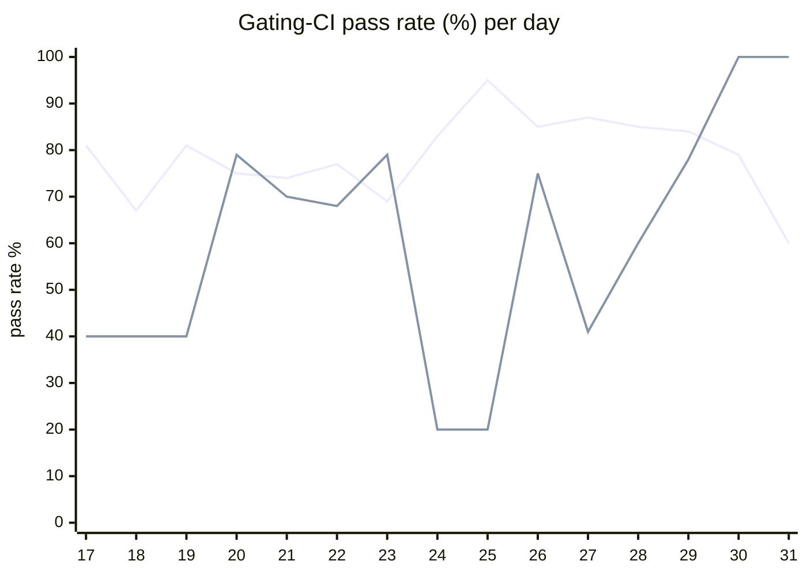

# CI Health Dashboard

_Window: last 14 days (trend + pass rate) · tables: last 24h · updated 2026-07-31T07:07:44Z · auto-generated, do not edit by hand._

**Gating-CI pass rate** — PR: 79% (1886/2395) · main: 69% (96/140)

## Gating-CI pass-rate trend

```mermaid
xychart-beta
  title "Gating-CI pass rate (%) per day"
  x-axis [17, 18, 19, 20, 21, 22, 23, 24, 25, 26, 27, 28, 29, 30, 31]
  y-axis "pass rate %" 0 --> 100
  line "CI" [81, 67, 81, 75, 74, 77, 69, 83, 95, 85, 87, 85, 84, 79, 60]
  line "main" [40, 40, 40, 79, 70, 68, 79, 20, 20, 75, 41, 60, 78, 100, 100]
```

_X-axis = day of month (Jul 17 → Jul 31). Two lines: **CI** (PR gating-CI runs, generally the upper line) and **main** (post-merge main runs, lower). Y-axis = % of that day's gating-CI runs that passed._

## Top 10 failing jobs (last 24h)

| # | job | workflow | fails | recovered | runs | fail rate | flaky? | scope | cause |
| --- | --- | --- | --- | --- | --- | --- | --- | --- | --- |
| 1 | `generate` | test | 6 | 1 | 17 | 35% | flaky | PR | **infra/CI** — Codegen check-for-diff: generated frontend files differ from committed |
| 2 | `lint` | frontend / docs | 5 | 0 | 14 | 36% | flaky | PR | **infra/CI** — Docs site prettier:check lists unformatted pages/components files |
| 3 | `unit` | test | 3 | 1 | 17 | 18% | flaky | PR | **dependency** — Missing go module github.com/exaring/otelpgx blocks test/unit |
| 4 | `compile` | go | 3 | 0 | 13 | 23% | flaky | PR | **infra/CI** — Go SDK example compile fails (missing safeurl go.sum entry) |
| 5 | `integration` | test | 2 | 1 | 17 | 12% | flaky | PR | **dependency** — Missing go module github.com/exaring/otelpgx blocks test/integration Generate |
| 6 | `lint` | lint all | 3 | 0 | 30 | 10% | flaky | PR | **infra/CI** — pre-commit fix end of files hook failed on trailing newlines |
| 7 | `e2e-pgmq` | test | 2 | 0 | 17 | 12% | flaky | PR | **dependency** — Missing go module github.com/exaring/otelpgx blocks e2e-pgmq Generate |
| 8 | `authdisabled` | build | 2 | 0 | 18 | 11% | flaky | PR | **infra/CI** — Docker authdisabled build fails on frontend TS compile (jsdom types) |
| 9 | `lite-amd` | build | 2 | 0 | 18 | 11% | flaky | PR | **infra/CI** — Docker frontend build fails: test file imports jsdom not in production deps |
| 10 | `dashboard-arm` | build | 2 | 0 | 18 | 11% | flaky | PR | **infra/CI** — Docker dashboard-arm build fails on frontend TS compile (jsdom types) |

## Top 10 failing tests (last 24h)

| # | test | job | fails | runs | fail rate | flaky? | scope | cause |
| --- | --- | --- | --- | --- | --- | --- | --- | --- |
| 1 | `(unparsed)` | `generate` | 5 | 17 | 29% | flaky | PR | **infra/CI** — Codegen check-for-diff: generated frontend files differ from committed |
| 2 | `(unparsed)` | `lint` | 4 | 14 | 29% | flaky | PR | **infra/CI** — Docs site prettier:check lists unformatted pages/components files |
| 3 | `(unparsed)` | `lint` | 3 | 30 | 10% | flaky | PR | **infra/CI** — pre-commit fix end of files hook failed on trailing newlines |
| 4 | `(unparsed)` | `compile` | 2 | 13 | 15% | flaky | PR | **infra/CI** — Go SDK example compile fails (missing safeurl go.sum entry) |
| 5 | `(unparsed)` | `dashboard-arm` | 2 | 18 | 11% | flaky | PR | **infra/CI** — Docker dashboard-arm build fails on frontend TS compile (jsdom types) |
| 6 | `(unparsed)` | `dashboard-amd` | 2 | 18 | 11% | flaky | PR | **infra/CI** — Docker dashboard-amd build fails on frontend TS compile (jsdom types) |
| 7 | `(unparsed)` | `lint` | 2 | 20 | 10% | flaky | PR | **infra/CI** — Prettier formatting drift (trailing carriage return) in TypeScript SDK |
| 8 | `(unparsed)` | `test` | 1 | 13 | 8% | flaky | PR | **dependency** — Missing go module github.com/exaring/otelpgx in go.mod/go.sum |
| 9 | `(unparsed)` | `compile` | 1 | 13 | 8% | flaky | PR | **infra/CI** — go.sum missing entry for github.com/doyensec/safeurl after import added |
| 10 | `(unparsed)` | `lint` | 1 | 13 | 8% | flaky | PR | **infra/CI** — Generated Ruby protobuf/REST bindings out of date vs generate.sh |

## Recent CI-health wins (`ci-health`)

**Recently merged**

- https://github.com/hatchet-dev/hatchet/pull/4239
- https://github.com/hatchet-dev/hatchet/pull/4238
- https://github.com/hatchet-dev/hatchet/pull/4218
- https://github.com/hatchet-dev/hatchet/pull/4213
- https://github.com/hatchet-dev/hatchet/pull/4165

**Open**

_No open `ci-health` PRs yet._

---
_Trend and pass-rate totals cover the last 14 days; job/test tables cover the last 24h._ **fails** = gating runs where the job/test failed · **recovered** = failed on a first attempt but passed on re-run (a flakiness signal) · **runs** = total gating runs of that workflow · **fail rate** = fails ÷ runs · **flaky** = recovered on re-run or intermittent across runs; **deterministic** = fails every time it runs · **scope** = whether failures were seen on PR, main, or main + PR.
