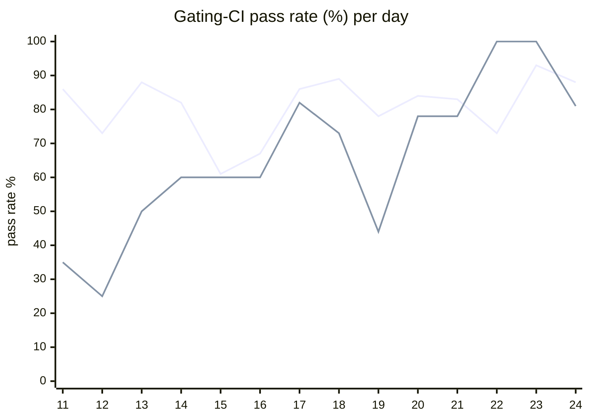

# CI Health Dashboard

_Window: last 14 days (trend + pass rate) · tables: last 24h · updated 2026-08-25T07:10:15Z · auto-generated, do not edit by hand._

**Gating-CI pass rate** — PR: 82% (1951/2380) · main: 65% (93/144)

## Gating-CI pass-rate trend

```mermaid
xychart-beta
  title "Gating-CI pass rate (%) per day"
  x-axis [11, 12, 13, 14, 15, 16, 17, 18, 19, 20, 21, 22, 23, 24]
  y-axis "pass rate %" 0 --> 100
  line "CI" [86, 73, 88, 82, 61, 67, 86, 89, 78, 84, 83, 73, 93, 88]
  line "main" [35, 25, 50, 60, 60, 60, 82, 73, 44, 78, 78, 100, 100, 81]
```

_X-axis = day of month (Aug 11 → Aug 24). Two lines: **CI** (PR gating-CI runs, generally the upper line) and **main** (post-merge main runs, lower). Y-axis = % of that day's gating-CI runs that passed._

## Top 10 failing jobs (last 24h)

| # | job | workflow | fails | recovered | runs | fail rate | flaky? | scope | cause |
| --- | --- | --- | --- | --- | --- | --- | --- | --- | --- |
| 1 | `test-templates` | cli-e2e-tests | 6 | 0 | 10 | 60% | flaky | main + PR | **timeout** — TestQuickstartTemplates suite exceeded cli-e2e time budget (~761s) |
| 2 | `test` | python | 4 | 0 | 21 | 19% | flaky | PR | **infra/CI** — Python poetry.lock drift: pyproject.toml changed since lock was generated (test install) |
| 3 | `build` | frontend / docs | 3 | 0 | 16 | 19% | flaky | PR | **product bug** — Docs MDX invalid frontmatter: missing title in migration-guide-python-v2.mdx |
| 4 | `generate` | test | 3 | 0 | 18 | 17% | flaky | PR | **infra/CI** — test/generate prettier drift on codegen output (inline-error.tsx formatting) |
| 5 | `unit` | test | 2 | 1 | 18 | 11% | flaky | main + PR | **flaky test** — TestMsgIdBufferMemoryLeak non-deterministic memory assertion in unit tests |
| 6 | `lint` | frontend / docs | 1 | 0 | 16 | 6% | flaky | PR | **infra/CI** — frontend/docs prettier:check drift on new MDX content |
| 7 | `publish` | typescript | 1 | 0 | 16 | 6% | flaky | main | **infra/CI** — TypeScript publish step missing dist/package.json from failed SDK build |
| 8 | `load` | test | 1 | 0 | 18 | 6% | flaky | PR | **infra/CI** — Go module proxy INTERNAL_ERROR fetching docker/docker zip from proxy.golang.org |

## Top 10 failing tests (last 24h)

| # | test | job | fails | runs | fail rate | flaky? | scope | cause |
| --- | --- | --- | --- | --- | --- | --- | --- | --- |
| 1 | `TestQuickstartTemplates` | `test-templates` | 6 | 10 | 60% | flaky | main + PR | **timeout** — TestQuickstartTemplates suite exceeded cli-e2e time budget (~761s) |
| 2 | `TestQuickstartTemplates/simple_go_go` | `test-templates` | 6 | 10 | 60% | flaky | main + PR | **timeout** — TestQuickstartTemplates/simple_go_go exceeded ~300s cli-e2e budget |
| 3 | `(unparsed)` | `build` | 3 | 16 | 19% | flaky | PR | **product bug** — Docs MDX invalid frontmatter: missing title in migration-guide-python-v2.mdx |
| 4 | `(unparsed)` | `generate` | 3 | 18 | 17% | flaky | PR | **infra/CI** — test/generate prettier drift on codegen output (inline-error.tsx formatting) |
| 5 | `TestMsgIdBufferMemoryLeak` | `unit` | 2 | 18 | 11% | flaky | PR | **flaky test** — TestMsgIdBufferMemoryLeak non-deterministic memory assertion in unit tests |
| 6 | `(unparsed)` | `lint` | 2 | 21 | 10% | flaky | PR | **infra/CI** — Python poetry.lock drift: pyproject.toml changed since lock was generated (lint install) |
| 7 | `(unparsed)` | `test` | 2 | 21 | 10% | flaky | PR | **infra/CI** — Python poetry.lock drift: pyproject.toml changed since lock was generated (test install) |
| 8 | `examples/bug_tests/payload_bug_on_replay/test_payload_replay_bug.py::test_payload_replay_bug` | `test` | 2 | 21 | 10% | flaky | PR | **product bug** — Python SDK closure bug: free variable 'run' not bound in payload replay example test |
| 9 | `examples/bug_tests/test_durable_event_wait_scopes/test_durable_event_scope.py::test_durable_event_only_satisfied_on_matching_scope_live_path` | `test` | 2 | 21 | 10% | flaky | PR | **product bug** — EventClient.aio_push() signature mismatch in durable event scope live-path test |
| 10 | `examples/bug_tests/test_durable_event_wait_scopes/test_durable_event_scope.py::test_durable_event_only_satisfied_on_matching_scope_lookback_path` | `test` | 2 | 21 | 10% | flaky | PR | **product bug** — EventClient.aio_push() signature mismatch in durable event scope lookback-path test |

## Recent CI-health wins (`ci-health`)

**Recently merged**

- https://github.com/hatchet-dev/hatchet/pull/4239
- https://github.com/hatchet-dev/hatchet/pull/4238
- https://github.com/hatchet-dev/hatchet/pull/4218
- https://github.com/hatchet-dev/hatchet/pull/4213
- https://github.com/hatchet-dev/hatchet/pull/4165

**Open**

_No open `ci-health` PRs yet._

---
_Trend and pass-rate totals cover the last 14 days; job/test tables cover the last 24h._ **fails** = gating runs where the job/test failed · **recovered** = failed on a first attempt but passed on re-run (a flakiness signal) · **runs** = total gating runs of that workflow · **fail rate** = fails ÷ runs · **flaky** = recovered on re-run or intermittent across runs; **deterministic** = fails every time it runs · **scope** = whether failures were seen on PR, main, or main + PR.
