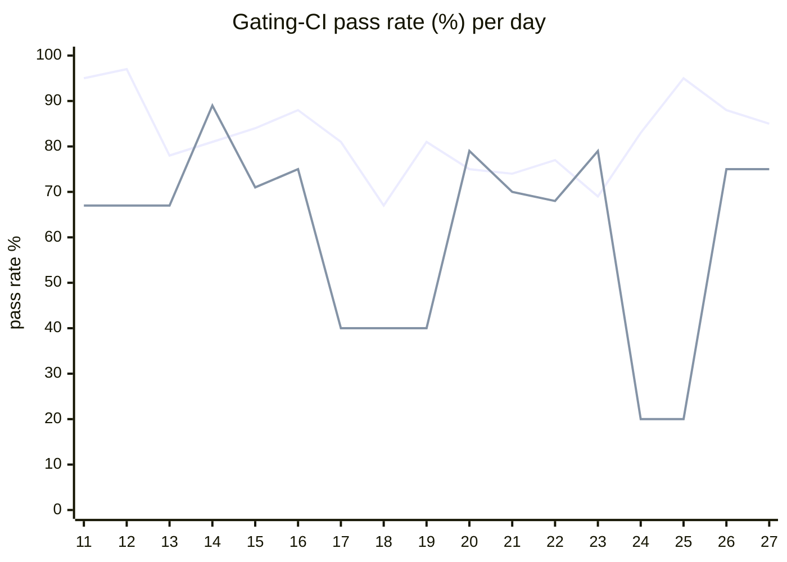

# CI Health Dashboard

_Window: last 14 days (trend + pass rate) · tables: last 24h · updated 2026-07-27T07:07:45Z · auto-generated, do not edit by hand._

**Gating-CI pass rate** — PR: 79% (2066/2617) · main: 72% (110/152)

## Gating-CI pass-rate trend

```mermaid
xychart-beta
  title "Gating-CI pass rate (%) per day"
  x-axis [11, 12, 13, 14, 15, 16, 17, 18, 19, 20, 21, 22, 23, 24, 25, 26, 27]
  y-axis "pass rate %" 0 --> 100
  line "CI" [95, 97, 78, 81, 84, 88, 81, 67, 81, 75, 74, 77, 69, 83, 95, 88, 85]
  line "main" [67, 67, 67, 89, 71, 75, 40, 40, 40, 79, 70, 68, 79, 20, 20, 75, 75]
```

_X-axis = day of month (Jul 11 → Jul 27). Two lines: **CI** (PR gating-CI runs, generally the upper line) and **main** (post-merge main runs, lower). Y-axis = % of that day's gating-CI runs that passed._

## Top 10 failing jobs (last 24h)

| # | job | workflow | fails | recovered | runs | fail rate | flaky? | scope | cause |
| --- | --- | --- | --- | --- | --- | --- | --- | --- | --- |
| 1 | `test-templates` | cli-e2e-tests | 1 | 0 | 2 | 50% | flaky | PR | **flaky test** — TestQuickstartTemplates parent fails when simple_go_go subtest times out |
| 2 | `cypress` | frontend / app | 1 | 0 | 4 | 25% | flaky | PR | **dependency** — Dependabot npm-deps bump caused Cypress UI element timeouts across all specs |
| 3 | `unit` | test | 1 | 0 | 12 | 8% | flaky | PR | **flaky test** — Scheduler replenish timeout starvation test races under repeated timeouts |
| 4 | `rampup` | test | 1 | 0 | 12 | 8% | flaky | PR | **flaky test** — msgIdBufferCh send timeout under concurrent load in rampup job |
| 5 | `load` | test | 1 | 0 | 12 | 8% | flaky | PR | **flaky test** — Interval jitter timing assertion exceeded 85ms cap under CI load (107ms observed) |
| 6 | `e2e-pgmq` | test | 1 | 0 | 12 | 8% | flaky | PR | **flaky test** — TestMultipleEvictionCycle intermittent eviction timing in e2e-pgmq |

## Top 10 failing tests (last 24h)

| # | test | job | fails | runs | fail rate | flaky? | scope | cause |
| --- | --- | --- | --- | --- | --- | --- | --- | --- |
| 1 | `examples/conditions/test_conditions.py::test_waits` | `test` | 3 | 6 | 50% | flaky | PR | **flaky test** — test_waits random_number vs skipped assertion is non-deterministic |
| 2 | `TestQuickstartTemplates` | `test-templates` | 1 | 2 | 50% | flaky | PR | **flaky test** — TestQuickstartTemplates parent fails when simple_go_go subtest times out |
| 3 | `TestQuickstartTemplates/simple_go_go` | `test-templates` | 1 | 2 | 50% | flaky | PR | **flaky test** — CLI quickstart simple_go_go template E2E times out or is killed (~325s) |
| 4 | `(unparsed)` | `cypress` | 1 | 4 | 25% | flaky | PR | **dependency** — Dependabot npm-deps bump caused Cypress UI element timeouts across all specs |
| 5 | `examples/concurrency_multiple_keys/test_multiple_concurrency_keys.py::test_multi_concurrency_key` | `test` | 1 | 6 | 17% | flaky | main | **product bug** — Python SDK example compares offset-naive and offset-aware datetimes in concurrency test |
| 6 | `TestScheduler_TryAssign_NotStarvedByRepeatedReplenishTimeouts` | `unit` | 1 | 12 | 8% | flaky | PR | **flaky test** — Scheduler replenish timeout starvation test races under repeated timeouts |
| 7 | `TestInterval_RunInterval_WithJitter` | `load` | 1 | 12 | 8% | flaky | PR | **flaky test** — Interval jitter timing assertion exceeded 85ms cap under CI load (107ms observed) |
| 8 | `TestMultipleEvictionCycle` | `e2e-pgmq` | 1 | 12 | 8% | flaky | PR | **flaky test** — TestMultipleEvictionCycle intermittent eviction timing in e2e-pgmq |
| 9 | `TestMsgIdBufferMemoryLeak` | `rampup` | 1 | 12 | 8% | flaky | PR | **flaky test** — msgIdBufferCh send timeout under concurrent load in rampup job |

## Recent CI-health wins (`ci-health`)

**Recently merged**

- https://github.com/hatchet-dev/hatchet/pull/4239
- https://github.com/hatchet-dev/hatchet/pull/4238
- https://github.com/hatchet-dev/hatchet/pull/4218
- https://github.com/hatchet-dev/hatchet/pull/4213
- https://github.com/hatchet-dev/hatchet/pull/4165

**Open**

_No open `ci-health` PRs yet._

---
_Trend and pass-rate totals cover the last 14 days; job/test tables cover the last 24h._ **fails** = gating runs where the job/test failed · **recovered** = failed on a first attempt but passed on re-run (a flakiness signal) · **runs** = total gating runs of that workflow · **fail rate** = fails ÷ runs · **flaky** = recovered on re-run or intermittent across runs; **deterministic** = fails every time it runs · **scope** = whether failures were seen on PR, main, or main + PR.
