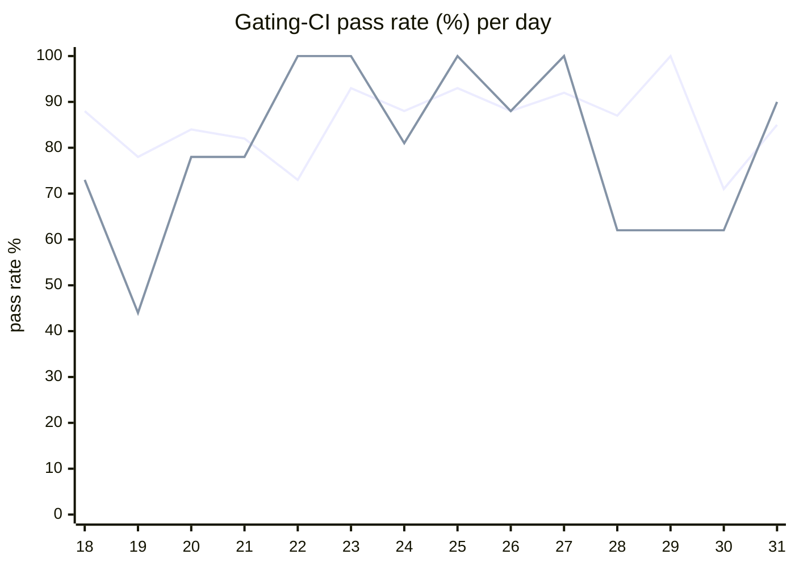

# CI Health Dashboard

_Window: last 14 days (trend + pass rate) · tables: last 24h · updated 2026-09-01T07:06:52Z · auto-generated, do not edit by hand._

**Gating-CI pass rate** — PR: 85% (2173/2549) · main: 78% (118/152)

## Gating-CI pass-rate trend

```mermaid
xychart-beta
  title "Gating-CI pass rate (%) per day"
  x-axis [18, 19, 20, 21, 22, 23, 24, 25, 26, 27, 28, 29, 30, 31]
  y-axis "pass rate %" 0 --> 100
  line "CI" [88, 78, 84, 82, 73, 93, 88, 93, 88, 92, 87, 100, 71, 85]
  line "main" [73, 44, 78, 78, 100, 100, 81, 100, 88, 100, 62, 62, 62, 90]
```

_X-axis = day of month (Aug 18 → Aug 31). Two lines: **CI** (PR gating-CI runs, generally the upper line) and **main** (post-merge main runs, lower). Y-axis = % of that day's gating-CI runs that passed._

## Top 10 failing jobs (last 24h)

| # | job | workflow | fails | recovered | runs | fail rate | flaky? | scope | cause |
| --- | --- | --- | --- | --- | --- | --- | --- | --- | --- |
| 1 | `generate` | test | 8 | 0 | 39 | 20% | flaky | PR | **infra/CI** — test/generate git diff on examples, proto, and SDK reference docs |
| 2 | `lint` | ruby | 5 | 0 | 26 | 19% | flaky | PR | **infra/CI** — Ruby generated protobuf/REST bindings out of date (run generate.sh) |
| 3 | `unit` | test | 4 | 1 | 39 | 10% | flaky | PR | **flaky test** — TestMsgIdBufferMemoryLeak non-deterministic memory assertion |
| 4 | `test-templates` | cli-e2e-tests | 3 | 0 | 5 | 60% | flaky | main + PR | **flaky test** — CLI template E2E TestQuickstartTemplates worker stream/timeouts |
| 5 | `lint` | frontend / docs | 3 | 0 | 21 | 14% | flaky | PR | **infra/CI** — frontend/docs prettier:check drift on MDX/TSX content |
| 6 | `rampup` | test | 3 | 0 | 39 | 8% | flaky | main + PR | **flaky test** — TestInterval_GetNextTrigger_FirstTriggerUsesFullWindowPhase timing jitter (179ms > 170ms threshold) |
| 7 | `test` | ruby | 2 | 1 | 26 | 8% | flaky | PR | **flaky test** — Ruby CancelWorkflow e2e poll/cancel timing race |
| 8 | `build` | frontend / docs | 2 | 0 | 21 | 10% | flaky | PR | **product bug** — Docs link check 404 on /reference/client (broken internal link) |
| 9 | `test` | python | 2 | 0 | 31 | 6% | flaky | PR | **product bug** — Python durable replay KeyError 'runtime' in test_durable_sleep_cancel_replay |
| 10 | `lite-amd` | build | 1 | 0 | 26 | 4% | flaky | PR | **infra/CI** — Docker build go mod download fails with proxy.golang.org INTERNAL_ERROR |

## Top 10 failing tests (last 24h)

| # | test | job | fails | runs | fail rate | flaky? | scope | cause |
| --- | --- | --- | --- | --- | --- | --- | --- | --- |
| 1 | `(unparsed)` | `generate` | 8 | 39 | 20% | flaky | PR | **infra/CI** — test/generate git diff on examples, proto, and SDK reference docs |
| 2 | `(unparsed)` | `lint` | 5 | 26 | 19% | flaky | PR | **infra/CI** — Ruby generated protobuf/REST bindings out of date (run generate.sh) |
| 3 | `(unparsed)` | `lint` | 5 | 31 | 16% | flaky | PR | **infra/CI** — Python Black would reformat concurrency_shared and SDK runnables |
| 4 | `examples/durable/test_durable.py::test_durable_sleep_cancel_replay` | `test` | 4 | 31 | 13% | flaky | PR | **product bug** — Python durable replay KeyError 'runtime' in test_durable_sleep_cancel_replay |
| 5 | `TestQuickstartTemplates` | `test-templates` | 3 | 5 | 60% | flaky | main + PR | **flaky test** — CLI template E2E TestQuickstartTemplates worker stream/timeouts |
| 6 | `TestQuickstartTemplates/simple_go_go` | `test-templates` | 3 | 5 | 60% | flaky | main + PR | **flaky test** — CLI template E2E simple_go_go worker lifecycle/timing failures |
| 7 | `(unparsed)` | `lint` | 3 | 21 | 14% | flaky | PR | **infra/CI** — frontend/docs prettier:check drift on MDX/TSX content |
| 8 | `TestMsgIdBufferMemoryLeak` | `unit` | 3 | 39 | 8% | flaky | main + PR | **flaky test** — TestMsgIdBufferMemoryLeak non-deterministic memory assertion |
| 9 | `(SSG)      prerendered as static HTML (uses generateStaticParams)` | `build` | 2 | 21 | 10% | flaky | PR | **product bug** — Docs link check 404 on /reference/client (broken internal link) |
| 10 | `./cancellation/test_cancellation_spec.rb:7` | `test` | 2 | 26 | 8% | flaky | PR | **flaky test** — Ruby CancelWorkflow e2e poll/cancel timing race |

## Recent CI-health wins (`ci-health`)

**Recently merged**

- https://github.com/hatchet-dev/hatchet/pull/4239
- https://github.com/hatchet-dev/hatchet/pull/4238
- https://github.com/hatchet-dev/hatchet/pull/4218
- https://github.com/hatchet-dev/hatchet/pull/4213
- https://github.com/hatchet-dev/hatchet/pull/4165

**Open**

_No open `ci-health` PRs yet._

---
_Trend and pass-rate totals cover the last 14 days; job/test tables cover the last 24h._ **fails** = gating runs where the job/test failed · **recovered** = failed on a first attempt but passed on re-run (a flakiness signal) · **runs** = total gating runs of that workflow · **fail rate** = fails ÷ runs · **flaky** = recovered on re-run or intermittent across runs; **deterministic** = fails every time it runs · **scope** = whether failures were seen on PR, main, or main + PR.
