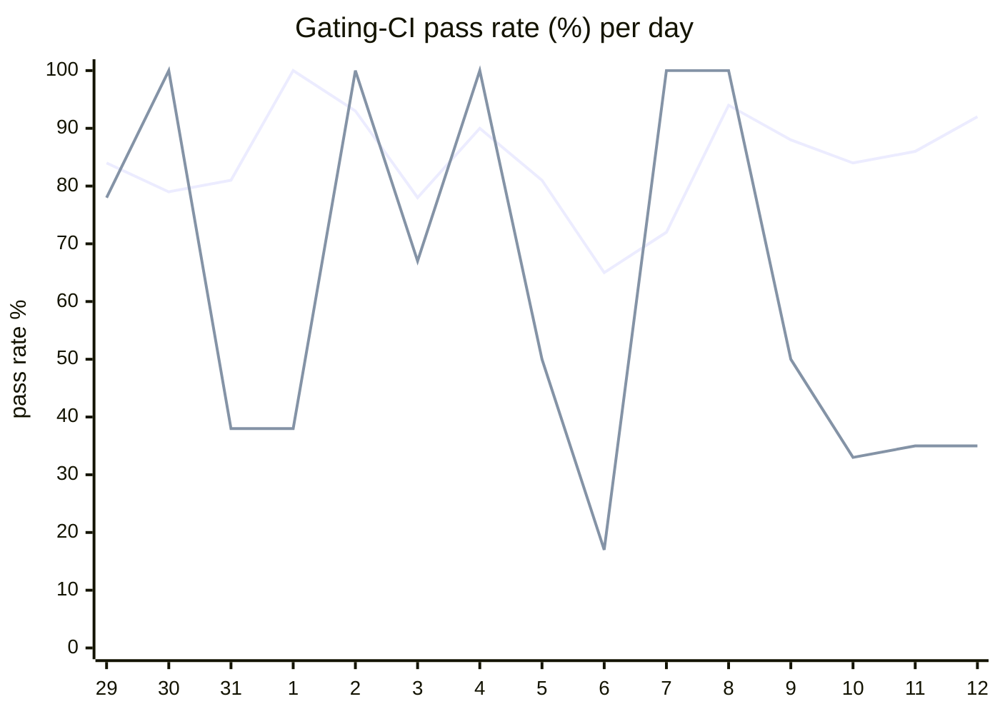

# CI Health Dashboard

_Window: last 14 days (trend + pass rate) · tables: last 24h · updated 2026-08-12T07:07:55Z · auto-generated, do not edit by hand._

**Gating-CI pass rate** — PR: 82% (1687/2060) · main: 57% (58/102)

## Gating-CI pass-rate trend

```mermaid
xychart-beta
  title "Gating-CI pass rate (%) per day"
  x-axis [29, 30, 31, 1, 2, 3, 4, 5, 6, 7, 8, 9, 10, 11, 12]
  y-axis "pass rate %" 0 --> 100
  line "CI" [84, 79, 81, 100, 93, 78, 90, 81, 65, 72, 94, 88, 84, 86, 92]
  line "main" [78, 100, 38, 38, 100, 67, 100, 50, 17, 100, 100, 50, 33, 35, 35]
```

_X-axis = day of month (Jul 29 → Aug 12). Two lines: **CI** (PR gating-CI runs, generally the upper line) and **main** (post-merge main runs, lower). Y-axis = % of that day's gating-CI runs that passed._

## Top 10 failing jobs (last 24h)

| # | job | workflow | fails | recovered | runs | fail rate | flaky? | scope | cause |
| --- | --- | --- | --- | --- | --- | --- | --- | --- | --- |
| 1 | `rampup` | test | 31 | 0 | 36 | 86% | flaky | main + PR | **timeout** — TestRampUp parent test exceeds ~311s CI time budget |
| 2 | `e2e-pgmq` | test | 9 | 0 | 36 | 25% | flaky | main + PR | **flaky test** — TestMultipleEvictionCycle non-deterministic in e2e-pgmq job |
| 3 | `e2e` | test | 5 | 0 | 36 | 14% | flaky | main + PR | **flaky test** — TestMultipleEvictionCycle non-deterministic in e2e job |
| 4 | `unit` | test | 4 | 0 | 36 | 11% | flaky | main + PR | **flaky test** — TestMsgIdBufferMemoryLeak intermittently fails memory/goroutine assertions |
| 5 | `load` | test | 3 | 0 | 36 | 8% | flaky | main + PR | **flaky test** — TestListenReconnectingStreamHandlesEventsAndStopsOnEOF: condition never satisfied under load |
| 6 | `integration` | test | 2 | 0 | 36 | 6% | flaky | PR | **product bug** — durable_events.go unused tenantId breaks Generate compile on buffered-ingest PR |
| 7 | `generate` | test | 2 | 0 | 36 | 6% | flaky | PR | **infra/CI** — test/generate: prettier or codegen drift in Generate check-for-diff |
| 8 | `test-templates` | cli-e2e-tests | 1 | 0 | 2 | 50% | flaky | PR | **timeout** — TestQuickstartTemplates exceeds ~770s aggregate cli-e2e budget |
| 9 | `search-quality` | frontend / docs | 1 | 0 | 8 | 12% | flaky | PR | **infra/CI** — frontend/docs search-quality: pnpm-lock.yaml out of sync with package.json |
| 10 | `lint` | frontend / docs | 1 | 0 | 8 | 12% | flaky | PR | **infra/CI** — frontend/docs lint: pnpm-lock.yaml out of sync with package.json |

## Top 10 failing tests (last 24h)

| # | test | job | fails | runs | fail rate | flaky? | scope | cause |
| --- | --- | --- | --- | --- | --- | --- | --- | --- |
| 1 | `TestRampUp` | `rampup` | 30 | 36 | 83% | flaky | main + PR | **timeout** — TestRampUp parent test exceeds ~311s CI time budget |
| 2 | `TestRampUp/normal_test` | `rampup` | 30 | 36 | 83% | flaky | main + PR | **timeout** — TestRampUp/normal_test exceeds ~310s CI time budget |
| 3 | `TestMultipleEvictionCycle` | `e2e-pgmq` | 6 | 36 | 17% | flaky | main + PR | **flaky test** — TestMultipleEvictionCycle non-deterministic in e2e-pgmq job |
| 4 | `TestMsgIdBufferMemoryLeak` | `unit` | 4 | 36 | 11% | flaky | main + PR | **flaky test** — TestMsgIdBufferMemoryLeak intermittently fails memory/goroutine assertions |
| 5 | `TestMultipleEvictionCycle` | `e2e` | 2 | 36 | 6% | flaky | main + PR | **flaky test** — TestMultipleEvictionCycle non-deterministic in e2e job |
| 6 | `TestListenReconnectingStreamHandlesEventsAndStopsOnEOF` | `load` | 2 | 36 | 6% | flaky | PR | **flaky test** — TestListenReconnectingStreamHandlesEventsAndStopsOnEOF: condition never satisfied under load |
| 7 | `TestEvictableChildSpawnRestoreCompletes` | `e2e-pgmq` | 2 | 36 | 6% | flaky | PR | **timeout** — TestEvictableChildSpawnRestoreCompletes exceeds ~306s in e2e-pgmq |
| 8 | `TestEvictableChildSpawnRestoreCompletes` | `e2e` | 2 | 36 | 6% | flaky | PR | **timeout** — TestEvictableChildSpawnRestoreCompletes exceeds ~306s in e2e |
| 9 | `TestQuickstartTemplates` | `test-templates` | 1 | 2 | 50% | flaky | PR | **timeout** — TestQuickstartTemplates exceeds ~770s aggregate cli-e2e budget |
| 10 | `TestQuickstartTemplates/simple_go_go` | `test-templates` | 1 | 2 | 50% | flaky | PR | **timeout** — TestQuickstartTemplates/simple_go_go exceeds ~320s in cli-e2e |

## Recent CI-health wins (`ci-health`)

**Recently merged**

- https://github.com/hatchet-dev/hatchet/pull/4239
- https://github.com/hatchet-dev/hatchet/pull/4238
- https://github.com/hatchet-dev/hatchet/pull/4218
- https://github.com/hatchet-dev/hatchet/pull/4213
- https://github.com/hatchet-dev/hatchet/pull/4165

**Open**

_No open `ci-health` PRs yet._

---
_Trend and pass-rate totals cover the last 14 days; job/test tables cover the last 24h._ **fails** = gating runs where the job/test failed · **recovered** = failed on a first attempt but passed on re-run (a flakiness signal) · **runs** = total gating runs of that workflow · **fail rate** = fails ÷ runs · **flaky** = recovered on re-run or intermittent across runs; **deterministic** = fails every time it runs · **scope** = whether failures were seen on PR, main, or main + PR.
