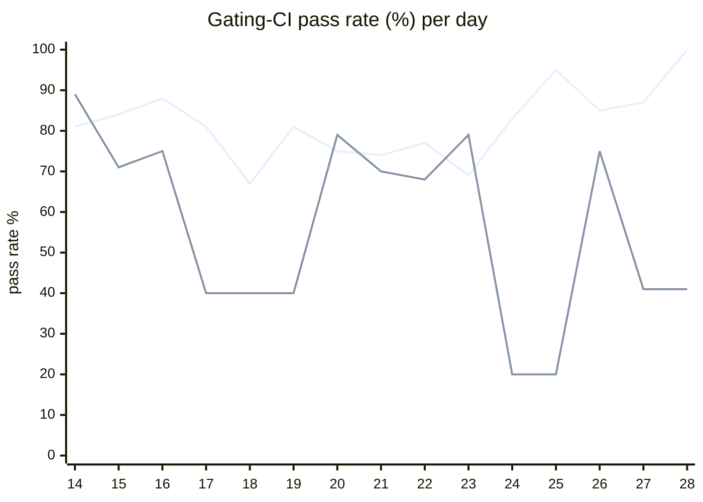

# CI Health Dashboard

_Window: last 14 days (trend + pass rate) · tables: last 24h · updated 2026-07-28T07:07:39Z · auto-generated, do not edit by hand._

**Gating-CI pass rate** — PR: 79% (1941/2452) · main: 69% (111/160)

## Gating-CI pass-rate trend

```mermaid
xychart-beta
  title "Gating-CI pass rate (%) per day"
  x-axis [14, 15, 16, 17, 18, 19, 20, 21, 22, 23, 24, 25, 26, 27, 28]
  y-axis "pass rate %" 0 --> 100
  line "CI" [81, 84, 88, 81, 67, 81, 75, 74, 77, 69, 83, 95, 85, 87, 100]
  line "main" [89, 71, 75, 40, 40, 40, 79, 70, 68, 79, 20, 20, 75, 41, 41]
```

_X-axis = day of month (Jul 14 → Jul 28). Two lines: **CI** (PR gating-CI runs, generally the upper line) and **main** (post-merge main runs, lower). Y-axis = % of that day's gating-CI runs that passed._

## Top 10 failing jobs (last 24h)

| # | job | workflow | fails | recovered | runs | fail rate | flaky? | scope | cause |
| --- | --- | --- | --- | --- | --- | --- | --- | --- | --- |
| 1 | `cypress` | frontend / app | 4 | 0 | 12 | 33% | flaky | PR | **dependency** — Dependabot npm-deps bump causes Cypress UI test timeouts (exit 28) |
| 2 | `e2e-pgmq` | test | 4 | 0 | 29 | 14% | flaky | main + PR | **flaky test** — TestMultipleEvictionCycle fails intermittently in e2e-pgmq job |
| 3 | `e2e` | test | 3 | 1 | 29 | 10% | flaky | main + PR | **flaky test** — TestMultipleEvictionCycle timing-sensitive eviction test fails intermittently in e2e |
| 4 | `unit` | test | 3 | 0 | 29 | 10% | flaky | main | **flaky test** — TestMsgIdBufferMemoryLeak fails intermittently under concurrent load in unit job |
| 5 | `integration` | test | 3 | 0 | 29 | 10% | flaky | main + PR | **flaky test** — TestCreateTenantToken hits duplicate Tenant_pkey from test isolation leak |
| 6 | `test` | python | 2 | 0 | 14 | 14% | flaky | PR | **flaky test** — test_waits asserts skipped vs random_number nondeterministically |
| 7 | `publish` | typescript | 2 | 0 | 17 | 12% | flaky | main | **product bug** — TypeScript SDK prepublish script recurses into dist/ and cp dist/package.json fails |
| 8 | `build` | frontend / app | 1 | 0 | 12 | 8% | flaky | PR | **product bug** — code-editor.tsx TS2322 false not assignable to Monaco showUnused type |
| 9 | `lint` | frontend / docs | 1 | 0 | 12 | 8% | flaky | PR | **dependency** — pnpm lockfile parse error during Install dependencies on frontend/docs lint |
| 10 | `build` | frontend / docs | 1 | 0 | 12 | 8% | flaky | PR | **dependency** — pnpm Cannot use in operator on directory in undefined during frozen install on frontend/docs |

## Top 10 failing tests (last 24h)

| # | test | job | fails | runs | fail rate | flaky? | scope | cause |
| --- | --- | --- | --- | --- | --- | --- | --- | --- |
| 1 | `examples/conditions/test_conditions.py::test_waits` | `test` | 7 | 14 | 50% | flaky | PR | **flaky test** — test_waits asserts skipped vs random_number nondeterministically |
| 2 | `(unparsed)` | `cypress` | 4 | 12 | 33% | flaky | PR | **dependency** — Dependabot npm-deps bump causes Cypress UI test timeouts (exit 28) |
| 3 | `TestMultipleEvictionCycle` | `e2e-pgmq` | 4 | 29 | 14% | flaky | main + PR | **flaky test** — TestMultipleEvictionCycle fails intermittently in e2e-pgmq job |
| 4 | `(unparsed)` | `publish` | 2 | 17 | 12% | flaky | main | **product bug** — TypeScript SDK prepublish script recurses into dist/ and cp dist/package.json fails |
| 5 | `TestMsgIdBufferMemoryLeak` | `unit` | 2 | 29 | 7% | flaky | main | **flaky test** — TestMsgIdBufferMemoryLeak fails intermittently under concurrent load in unit job |
| 6 | `TestMultipleEvictionCycle` | `e2e` | 2 | 29 | 7% | flaky | main + PR | **flaky test** — TestMultipleEvictionCycle timing-sensitive eviction test fails intermittently in e2e |
| 7 | `TestMsgIdBufferMemoryLeak` | `load` | 2 | 29 | 7% | flaky | main + PR | **flaky test** — TestMsgIdBufferMemoryLeak fails intermittently under concurrent load in load job |
| 8 | `(unparsed)` | `lint` | 1 | 12 | 8% | flaky | PR | **dependency** — pnpm lockfile parse error during Install dependencies on frontend/docs lint |
| 9 | `(unparsed)` | `build` | 1 | 12 | 8% | flaky | PR | **dependency** — pnpm Cannot use in operator on directory in undefined during frozen install on frontend/docs |
| 10 | `(unparsed)` | `search-quality` | 1 | 12 | 8% | flaky | PR | **dependency** — pnpm lockfile parse error during Install dependencies on frontend/docs search-quality |

## Recent CI-health wins (`ci-health`)

**Recently merged**

- https://github.com/hatchet-dev/hatchet/pull/4239
- https://github.com/hatchet-dev/hatchet/pull/4238
- https://github.com/hatchet-dev/hatchet/pull/4218
- https://github.com/hatchet-dev/hatchet/pull/4213
- https://github.com/hatchet-dev/hatchet/pull/4165

**Open**

_No open `ci-health` PRs yet._

---
_Trend and pass-rate totals cover the last 14 days; job/test tables cover the last 24h._ **fails** = gating runs where the job/test failed · **recovered** = failed on a first attempt but passed on re-run (a flakiness signal) · **runs** = total gating runs of that workflow · **fail rate** = fails ÷ runs · **flaky** = recovered on re-run or intermittent across runs; **deterministic** = fails every time it runs · **scope** = whether failures were seen on PR, main, or main + PR.
